# Curating Compounds

🧪 Every compound in the workspace carries a curation verdict from the moment it arrives. The check reads the structure, classifies it — clean, mixture, duplicate, atom-type error, and so on — and puts the answer on the row as a badge. The tools that fix what it finds act on the rows in place: a panel for one row, **One Step Cure** for the whole set.

Nothing has to be handed from one screen to another. Load, curate and evaluate happen on the same table.

---

## Where curation runs

| Where you are running QSAR Flex | What happens to your structures |
|---|---|
| **Web app** (qsarflex.multicase.com) | Your structures go to the QSAR Flex service at `qsarflex-be.multicase.com`. Each curation action is an authenticated HTTPS request to it: `POST /curate/analyze` to classify, `/curate/one-step-cure` to run One Step Cure, `/curate/tautomers` to generate a row's tautomers, `/curate/correct` for PubChem verification, `/curate/export` to build a download. Reading your files uses `/compound/batch` — or `/compound/batch/multi` when you load more than one — and structure pictures use `/compound/render` and `/curate/render`. |
| **Desktop** (Windows and macOS) | The app answers those same calls inside itself. The desktop shell intercepts them and runs the curation engine in-process, so curation happens on your machine. |

On the server, a curation request is handled in memory: the structures are written to a temporary file only so the engine can load them, that file is deleted as the request finishes, and nothing is written to a database.

PubChem is a separate matter, and is treated as one: nothing is ever sent to PubChem without the **Send data to PubChem?** dialog first. See [PubChem consent](#pubchem-consent) below.

Curation is not metered. It does not consume tests and does not need an active license — only evaluation and report generation do.

---

## The check

Loading is checking. Whichever way compounds come in — a file, the Type a compound dialog, a drop, a paste, the structure editor — they are added to the table and the whole set is checked at once, so a duplicate is found whether its twin arrived in the same file or a week ago. The toast says what came of it: *14 compounds added from mydata.smi. 6 have issues to look at.*

<figure><picture>
  <source media="(prefers-color-scheme: dark)" srcset=".gitbook/assets/workspace-table-dark.png">
  
</picture></figure>

While it works, an overlay names the phase — **Reading the files**, then **Checking the structures** — with a **Cancel** button. Canceling while the file is being read loads nothing: *Load canceled — nothing was added.* Canceling during the check keeps the rows and leaves them **Not checked** (see below), so a file that was already read is not thrown away.


If the compounds are read but the check itself fails, they are still added and you are told: *Compounds added, but the check did not run. Use Re-check to look at them.* They wear **Not checked** until you do.


### Verdicts

Every compound wears one status badge, plus a badge for each additional finding.

| Badge | What it means |
|---|---|
| **Clean** | The check found nothing. |
| **Not checked** | No check has looked at this structure since it last changed — it was just loaded and the check was canceled, it was edited, it was picked out of a mixture, or it came from an older saved set. It is not clean; **Re-check** to find out. |
| **Mixture** | The structure has more than one disconnected part — *It is a salt/mixture.* A salt counts: the counter-ion is a second part. |
| **Duplicate** | The same structure appears elsewhere in the set — *Duplicate of "Ibuprofen".* Rows are compared on the structure the check produced, not on the text you typed, so `c1ccccc1` and `C1=CC=CC=C1` are duplicates, and so are two stereoisomers. |
| **Atom type** | An atom with a valence or charge the engine does not accept — *Unrecognized atom type.* |
| **Aromaticity** | The ring system could not be de-aromatized as drawn — *Aromaticity detection problems.* |
| **Fatal** | The row has no readable structure — *SMILES string error* for a SMILES that does not parse. |
| **Misc** | *Less than two heavy atoms* or *Ring detection problems.* |
| **CAS mismatch** | The SMILES does not match the structure PubChem returns for the row's CAS number. |
| **Name mismatch** | The SMILES does not match the structure PubChem returns for the row's name. |

Under the badge, the **Detail** column carries the check's message and, in italics, what to do about it — *This chemical is a salt/mixture. Cure it with One Step Cure, or pick its components.* Hover the cell, or tab to it, for the full text.


**One check, one answer.** Every structure is loaded exactly as written and put through a single structural check, and that check's answer is the badge — nothing is layered on top of it. Duplicates are grouped on the checked structure, with stereo ignored, so how a SMILES was spelled never decides whether two rows match.



**CAS mismatch** and **Name mismatch** can only come from a PubChem check, and the check that runs on load never makes one — every analysis request asks for the PubChem step to be skipped, so nothing goes to PubChem unasked. The PubChem option in One Step Cure and the row's **PubChem** lookup correct the SMILES to the structure PubChem returns and mark the row **Not checked** for the next check.


### Views

Above the table, one chip per class present in the set — **All 14 · Clean 8 · Not checked 1 · All errors 5 · Duplicates 2 · Mixtures 1 · Atom type 1 …** — and **Reactions** when there are any. Click a chip to see only those rows. A row with two findings is counted under both; the **Duplicates** view shows both halves of each pair, so they can be compared. A view whose last member is fixed collapses back to **All**.

The chip row stays at the top of the window as the table scrolls, and the table header parks under it.

<figure><picture>
  <source media="(prefers-color-scheme: dark)" srcset=".gitbook/assets/workspace-not-checked-dark.png">
  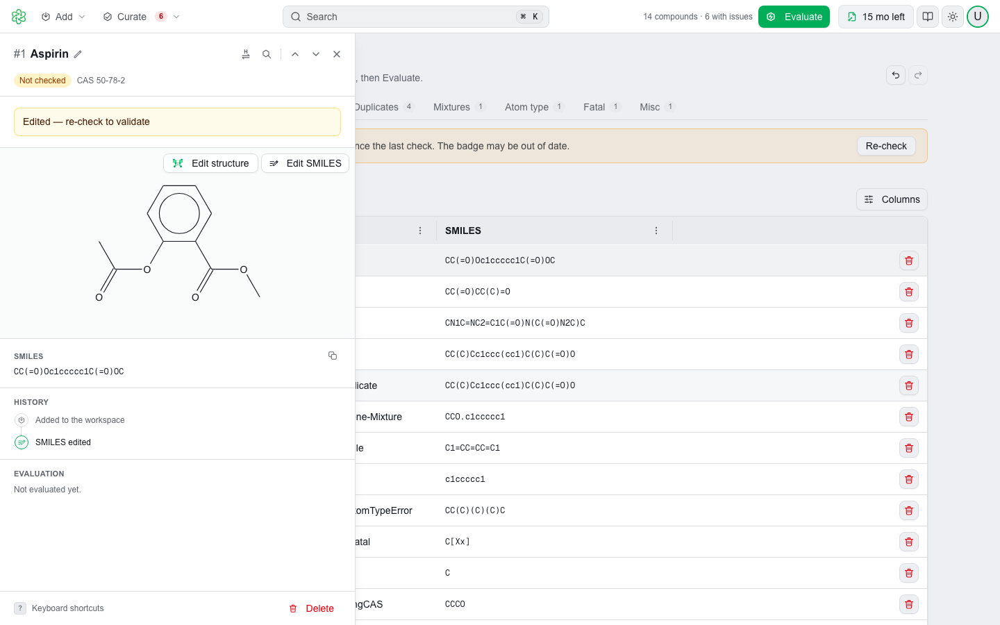
</picture></figure>

When any row is **Not checked**, an amber strip says how many and offers **Re-check** right there. When any row has a structural error, a line says how many **Evaluate** will skip until they are fixed.

---

## The table

Columns are **#**, **Status**, **Name**, **CAS** and **SMILES**, then a trash button — and, once an evaluation has run, **Results**. See [Evaluation](evaluation.md).

- The number is assigned when the row is added and stays with it; rows are not renumbered when others are deleted.
- The **Status** column carries the badge and, beside it, the check's detail: *copy of #4* on a duplicate, *copies: #5* on the row it duplicates.
- Rows produced by a mixture split are named *Part 1*, *Part 2* and so on, and each names its position in its detail.
- A reaction is a row too, with a **Reaction** badge and its step count in place of a SMILES.
- The trash button deletes the row after a confirmation. Deleting is a step you can undo.

Everything else you can do to a row happens in the panel, and each action has a single-key shortcut that works with the row selected:

| Key | Action |
|---|---|
| **Enter** | Open the focused row in the panel |
| **↑ ↓** | Previous / next row |
| **Esc** | Close the panel |
| **E** | Edit the structure in ChemiGraphy |
| **S** | Edit the SMILES |
| **F2** | Rename |
| **T** | Tautomers |
| **P** | Look up in PubChem |
| **X** | Pick components (mixtures) |
| **Delete** | Delete the row |

Press **?** anywhere for the full shortcut reference.

---

## The panel

Click a row — or press **Enter** on it — and it opens in a panel on the left. The table stays live beside it: click another row and the panel moves to it; **↑** and **↓** do the same from the keyboard; **Esc** closes it.

<figure><picture>
  <source media="(prefers-color-scheme: dark)" srcset=".gitbook/assets/workspace-panel-dark.png">
  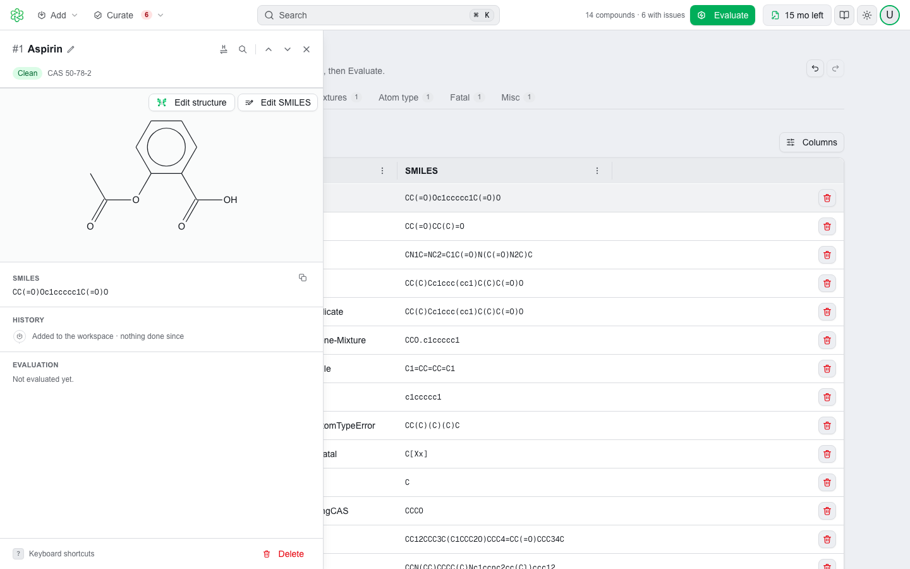
</picture></figure>

From top to bottom:

- The row's number and name, with **Rename** beside it, then the badge and CAS; on the header's right, **Tautomers**, **Look up in PubChem**, the previous and next arrows and **✕**.
- The check's message and the advice under it, with the button that acts on it — **Pick components** on a mixture, **Delete this copy** on a duplicate, **Draw the correction** on a structure the check could not read.
- The structure, drawn large by ChemiGraphy. Atoms the check objected to are orange. The magnifier opens it full size.
- **Edit structure** — opens ChemiGraphy on the compound — and **Edit SMILES**.
- **SMILES**, with a copy button; **From mixture**, the original mixture SMILES on a row that came from a split; and **History** — what has been done to this row, one line per action.
- **Evaluation** — the module outcomes for this row, each a row that opens its report; or *Not evaluated yet*; or, on a row with a structural error, *Evaluate skips this compound until the structure is fixed.*
- **Delete**, with the same confirmation as the table's trash button, and **Keyboard shortcuts**.

<figure><picture>
  <source media="(prefers-color-scheme: dark)" srcset=".gitbook/assets/workspace-structure-viewer-dark.png">
  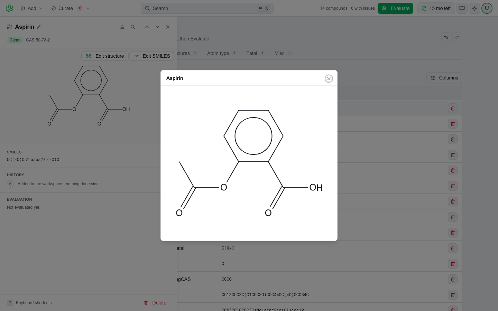
</picture></figure>

### Editing SMILES and names

**Edit SMILES** and **Rename** open a small dialog on the field. **Enter** saves, **Esc** cancels, and saving the same text you started with changes nothing.

<figure><picture>
  <source media="(prefers-color-scheme: dark)" srcset=".gitbook/assets/workspace-edit-smiles-dark.png">
  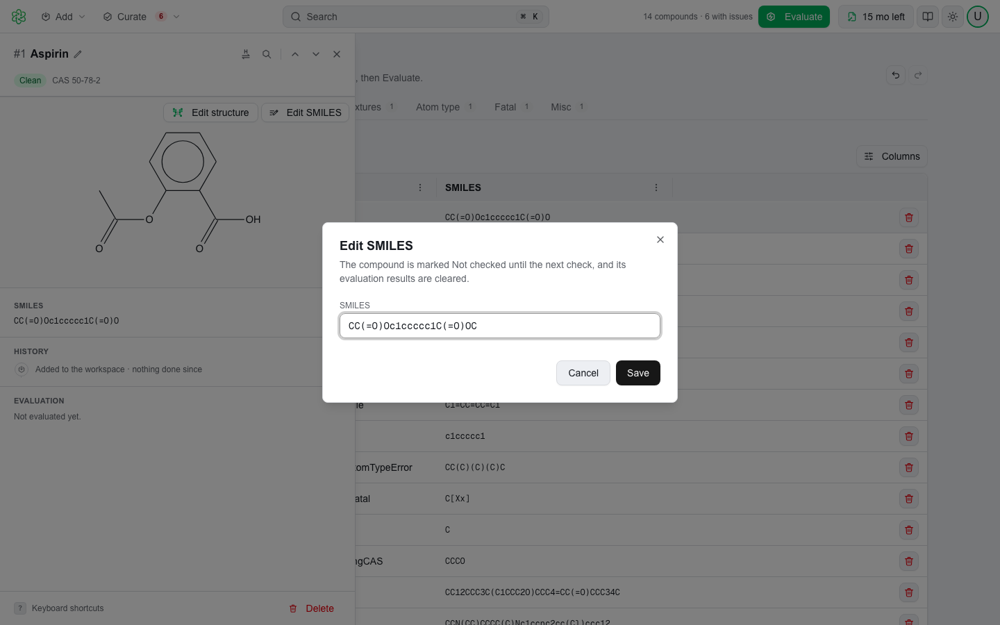
</picture></figure>

An edited SMILES makes the row **Not checked** — *Edited — re-check to validate* — and clears its evaluation results, which belonged to the old structure. A rename does the same only when the name was what the check objected to.

The SMILES field takes a SMILES; an InChI is refused with *Enter a SMILES string, not an InChI.*

### Splitting mixtures

**Pick components** on a Mixture row lists its components, each with a checkbox, and asks *Keep which components? Each becomes its own compound.*

<figure><picture>
  <source media="(prefers-color-scheme: dark)" srcset=".gitbook/assets/workspace-panel-picker-dark.png">
  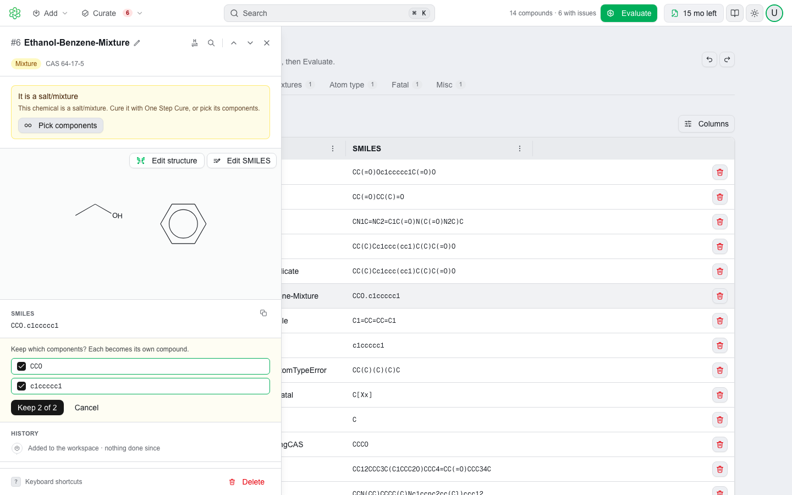
</picture></figure>

**Keep N of M** keeps the ticked components. The first keeps the row and its number; the others are new rows, indented under it. Splitting into more than one component names the results *&lt;name&gt; Part 1*, *Part 2* and so on, and each row's detail names its position — *Component 1 of 2 — re-check to validate*. Every component is **Not checked** until the next check.

<figure><picture>
  <source media="(prefers-color-scheme: dark)" srcset=".gitbook/assets/workspace-after-split-dark.png">
  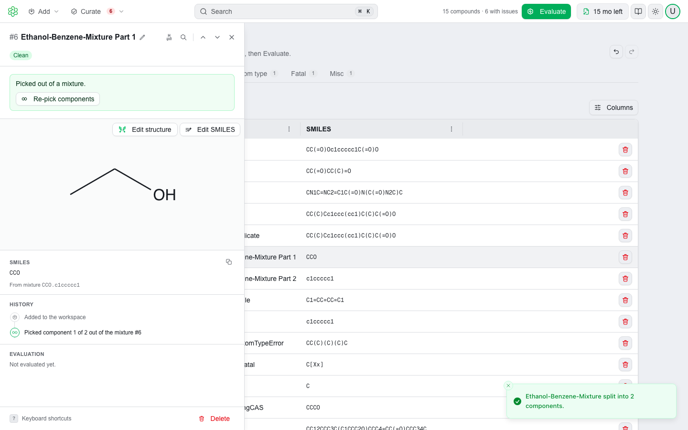
</picture></figure>

The original mixture SMILES is remembered, so **Re-pick components** always offers every component — not just the ones you kept last time. It puts the whole mixture back as one row, **Not checked**.

### Tautomers

Many structures can be written in more than one tautomeric form — the keto and enol forms of a β-diketone, the lactam and lactim forms of a pyridone — and a model sees only the form you gave it. **Tautomers** shows the alternatives the chemistry engine can derive from the row's structure and lets you swap the row over to one of them.

Choose it and the engine enumerates up to 200 tautomers. The parent is the structure as the check read it, so the list is derived from what the row was judged on, not from the raw text.

<figure><picture>
  <source media="(prefers-color-scheme: dark)" srcset=".gitbook/assets/workspace-tautomers-dialog-dark.png">
  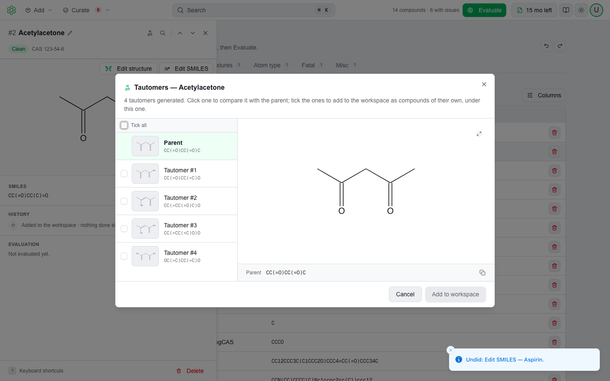
</picture></figure>

The dialog is titled **Tautomers — &lt;name&gt;** and says how many it found. Down the left, **Parent** comes first and the tautomers follow as **Tautomer #1**, **#2** and so on, each with a small structure and its SMILES. The selected entry is drawn large on the right. The parent is selected when the dialog opens, so **Use tautomer** starts disabled — using the parent would change nothing.

<figure><picture>
  <source media="(prefers-color-scheme: dark)" srcset=".gitbook/assets/workspace-tautomer-selected-dark.png">
  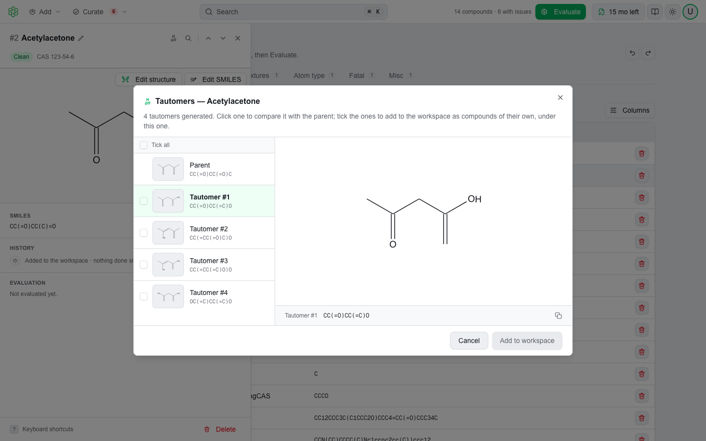
</picture></figure>

Click a tautomer to compare it with the parent. Acetylacetone, for instance, arrives as the diketone `CC(=O)CC(C)=O` and offers its enol forms. **Use tautomer** replaces the row's SMILES with the selection — an edit like any other, so the row becomes **Not checked** and a toast confirms *Tautomer applied. Re-check to validate.* **Cancel** closes the dialog with nothing changed. A structure with no tautomers opens the dialog with *No tautomers were found for this structure.*


Tautomers are generated from the structure, on the same engine that curates it — in the web app on the QSAR Flex service, on the desktop inside the app. Nothing goes to PubChem or anywhere else.


---

## ⚡ One Step Cure

**Curate ▾ → One Step Cure…** corrects the whole set in one run. The dialog counts what it is about to act on, so you can see the size of each decision before you make it.

<figure><picture>
  <source media="(prefers-color-scheme: dark)" srcset=".gitbook/assets/workspace-osc-dialog-dark.png">
  
</picture></figure>

Four counted choices:

| Group | Options |
|---|---|
| **Mixtures/Salts — N** | Remove · Separate parts, assign equal activity · Keep the largest part · Leave as it is |
| **Duplicates — N** | Remove all copies · Keep one with highest activity · Keep one with lowest activity · Keep first but average the activity · Leave as it is |
| **Atom type errors — N** | Fix manually · Remove |
| **Other errors — N** | Fix manually · Remove — *Aromaticity, fatal and miscellaneous* |

Then **More curation steps**, a set of checkboxes:

- **Verify structures against PubChem** — off by default, with the note *Sends names, CAS numbers and SMILES to PubChem. You will be asked to confirm.*
- **Remove chiral tags from SMILES** — on by default.
- **Neutralize negative charges (O- to OH, S- to SH etc.)**
- **Neutralize positive charge on nitrogen (ammonium and pyridinium)**

<figure><picture>
  <source media="(prefers-color-scheme: dark)" srcset=".gitbook/assets/workspace-pubchem-option-dark.png">
  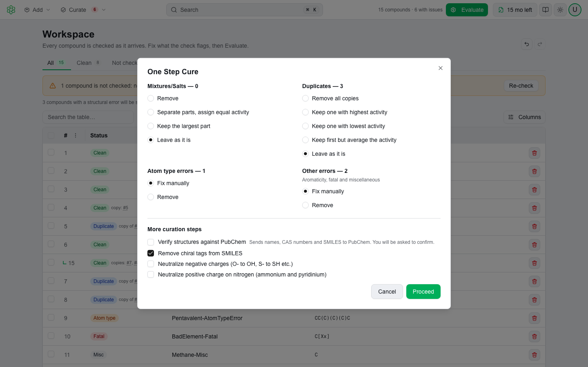
</picture></figure>

**Cancel** closes the dialog; **Proceed** runs it.

What each choice does:

- **Remove** drops the matching rows from the set.
- **Keep the largest part** keeps the component of a mixture with the most heavy atoms, deletes the others together with their hydrogens, and re-checks what is left. It works on the molecule, not on the text, so a short fragment with more atoms wins over a longer-spelled one.
- **Separate parts, assign equal activity** makes one new row per distinct component, named *&lt;name&gt;_&lt;ID&gt;_mixture_comp_1*, *_2* and so on, each checked as it is created; a component that appears twice in the same mixture becomes one row, and the original mixture row is removed.
- **Remove all copies** deletes every row in a duplicate group, the first one included. The three **Keep** options keep the first row of each group and delete the rest — activity is not tracked here, so they behave alike.
- **Fix manually** leaves those rows alone, and the summary reminds you how many are waiting for you.
- **Remove chiral tags from SMILES** strips `@`, `@@`, `/` and `\` from each row's SMILES text. A row whose SMILES could not be read is read again afterwards, since the tags may have been the problem.
- **Neutralize negative charges** sets a negative charge to zero and adds the hydrogen that balances it, leaving alone an atom whose neighbor carries a positive charge (an internal salt is not a mistake). **Neutralize positive charge on nitrogen** removes one hydrogen from a positive nitrogen that has one; a quaternary nitrogen has none to give and is left as it is.
- The transforms are applied to every row, not only the flagged ones.

The passes run in a fixed order: mixtures, duplicates, atom type errors, other errors, chiral tags, negative charges, positive nitrogen — and then duplicates once more, so two rows that became identical when their charges were neutralized are collapsed too. A PubChem lookup, if you asked for one, goes first and covers only the rows with a structural error; a clean row is not sent.


After a cure, every surviving row carries the SMILES the engine writes for its checked structure, not the text it came in with. That form has no stereo marks, so `C[C@H](N)C(=O)O` comes out as `CC(N)C(=O)O` whether or not you ticked **Remove chiral tags**. If you need the stereo, curate by hand instead.


Reactions are not part of a cure. They stay where they were.

### While it runs

A progress panel covers the screen with the named steps of *this* run — **Looking up in PubChem** when you asked for it, then **Curing** — ticking each off as it completes. There is no percentage bar, because there is no honest one to draw.

**Cancel** — or **Escape** — stops the run: *One Step Cure canceled — nothing was changed.* Nothing is written to the table until every step has finished, so a canceled run really does leave your compounds as they were. The same is true of a refusal at the PubChem consent dialog.

### The change summary

A run with anything to report finishes in a summary dialog — **One Step Cure — Summary** — that says what it did.

<figure><picture>
  <source media="(prefers-color-scheme: dark)" srcset=".gitbook/assets/workspace-osc-summary-dark.png">
  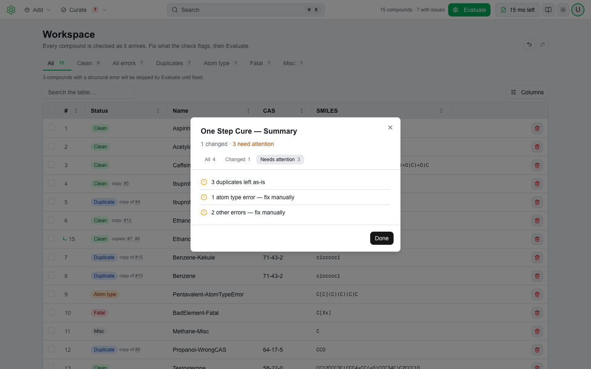
</picture></figure>

- A count line at the top: *N changed · N need attention*, or *Nothing changed.*
- Filter tabs **All** / **Changed** / **Needs attention**, shown when the run produced both kinds. The dialog opens on **Needs attention** so the rows you have to act on are not buried under the ones that went fine.
- Lines are grouped by what produced them — curation decisions under one heading, a PubChem lookup under another — and each carries an icon for its kind: applied, removed, transformed, or needs attention. Curation lines read *Removed 3 mixtures*, *Separated 2 mixtures into 5 parts*, *Kept the largest part of 4 mixtures*, *Removed 6 duplicates*, *Chiral tags removed from 2 compounds*, and so on; the last line is the balance — *Errors 12 → 3, duplicate groups 4 → 0*.
- **Done** closes it.

A whole run — lookup, corrections and transforms — is one step in the history. One undo takes all of it back. A row whose structure the cure changed loses its evaluation results, which belonged to the old structure; a row it left alone keeps them.

---

## PubChem consent

PubChem is contacted only after you agree, every time. The dialog is titled **Send data to PubChem?** and names exactly what will leave your system:

- From One Step Cure: *PubChem Batch Correct will send compound names, CAS numbers, and SMILES for all compounds with issues to the PubChem API to look up and verify structures.*
- From a single row: *This will send the compound's name, CAS number, and SMILES to the PubChem API to look up and verify its structure.*

Both add *This data will leave your system.*, print the endpoint `https://pubchem.ncbi.nlm.nih.gov/rest/pug/`, and ask *Do you want to continue?* with **Cancel** and **Continue**.

<figure><picture>
  <source media="(prefers-color-scheme: dark)" srcset=".gitbook/assets/workspace-pubchem-warning-dark.png">
  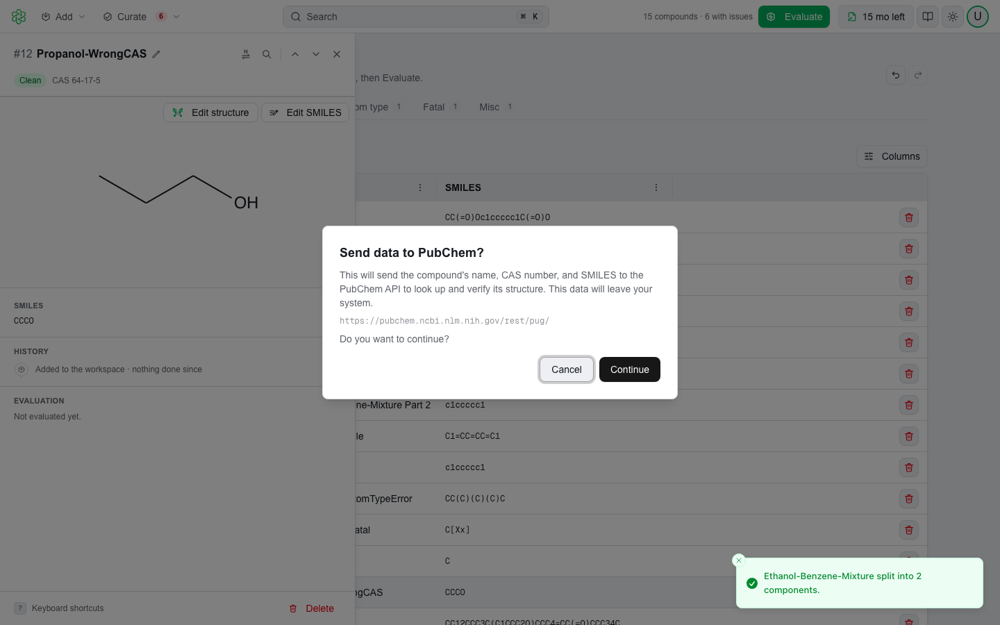
</picture></figure>

The question is asked before anything is changed. Canceling a batch consent aborts the whole One Step Cure run before it touches a compound.

<figure><picture>
  <source media="(prefers-color-scheme: dark)" srcset=".gitbook/assets/workspace-pubchem-results-dark.png">
  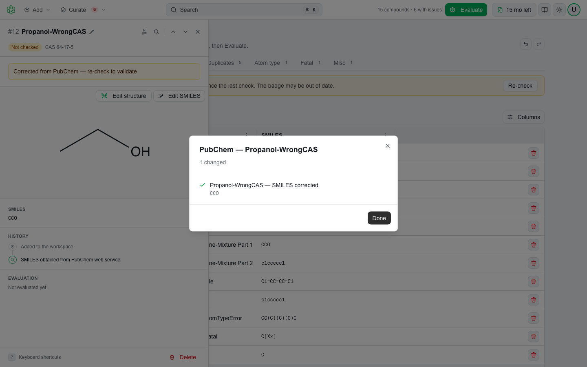
</picture></figure>

A lookup can correct the SMILES to the structure PubChem returns, and fill in a missing CAS number or name. A row being looked up shows a **Looking up…** chip in its Status column. A single-row lookup reports in a summary dialog titled **PubChem — &lt;name&gt;**, with lines such as *SMILES corrected*, *CAS: 50-00-0 added*, or the warning *No match found in PubChem.* A corrected row is **Not checked** until the next check. A batch lookup that comes back with nothing reports *PubChem returned nothing — compounds left unchanged.*


PubChem is a third-party service run by the NCBI. MultiCASE does not store or log what you send to it. Review [PubChem's policies](https://www.ncbi.nlm.nih.gov/home/about/policies/) before sending compound data you consider confidential.


---

## Undo and redo

The workspace keeps a history of up to 50 steps, each named after the action that made it — *Add 14 compounds from mydata.smi*, *Re-check*, *One Step Cure*, *Delete &lt;name&gt;*, *Edit SMILES — &lt;name&gt;*, *Rename to "…"*, *Split into 2 components*, *Re-pick components — &lt;name&gt;*, *PubChem lookup — &lt;name&gt;*, *Use tautomer — &lt;name&gt;*, *Edit structure — &lt;name&gt;*, *Evaluate 14 items*.

- **Curate ▾ → Undo** names what it will reverse: *Undo One Step Cure*. So do the two arrow buttons beside the view chips, and their tooltips. ⌘ Z and ⇧ ⌘ Z (Ctrl + Z and Ctrl + Shift + Z on Windows) do the same from anywhere on the page, except inside a text field or a dialog.
- Undoing confirms what came back: *Undid: One Step Cure.*
- A step is everything that action did: undoing a delete brings the row back with its evaluation results and takes it off the history log; undoing a load takes back the rows and their verdicts together.
- An evaluation is a step of its own, so undoing something you did before a run does not take the run's results with it.
- Saving an edit without changing the text is not recorded, so it leaves no step that appears to do nothing.
- Undo and redo wait while a load, a check, a cure or an evaluation is running.

History covers the workspace. It does not reverse a download you already saved, and **Clear workspace** empties the history with the rows.

---

## Download

**Curate ▾ → Download curated** writes the current compounds to a file, in two labeled sections:

| Section | What it writes |
|---|---|
| **Clean only — N** | Only rows the check found clean. A **Not checked** row is not clean and is not included. |
| **Everything — N** | Every compound, issues and all. |

<figure><picture>
  <source media="(prefers-color-scheme: dark)" srcset=".gitbook/assets/workspace-download-menu-dark.png">
  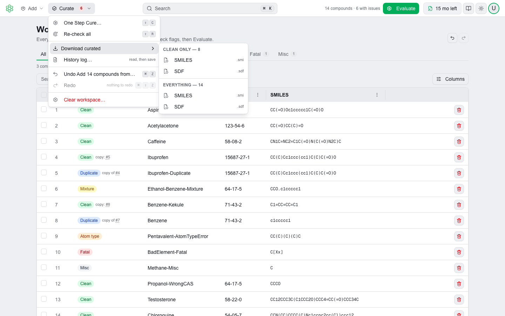
</picture></figure>

Each section offers **SMILES** (`.smi`) or **SDF** (`.sdf`), saved as `curated_clean.smi`, `curated_clean.sdf`, `curated_all.smi` or `curated_all.sdf`. A successful export confirms *Exported N compounds as SMILES.*; with nothing to write you get *Nothing to export.*

The SMILES file is one tab-separated line per compound: SMILES, name and CAS. The SDF file carries each structure as a full atom-and-bond block with 2D coordinates, with `> <Name>` and `> <CAS>` data fields, so any structure tool can read it. A row with no readable structure has no block to write; the toast says how many were left out.

**History log** saves `curation_log.txt`: one line per compound — its number, its name and what has been done to it — followed by the rows you removed, marked *Removed*.

Both files can be loaded back into the workspace, from the Add menu or by dropping them on the page.

---

## Clearing

**Curate ▾ → Clear workspace…** asks first. The dialog names what goes — the compounds, the reactions and every evaluation result — with **Cancel** and a red **Clear workspace**. This is the one action undo cannot reverse, and re-evaluating consumes tests again.

---

## Your workspace is kept

The workspace, its verdicts and its evaluation results are held in your browser (or the desktop app's own web storage), so leaving and coming back does not lose your work. They are cleared when you sign out, and they do not follow you to another browser or another computer.

---

## Tips

- **Re-check after manual work.** Edits, splits and renames are not re-checked until you do — and Duplicate is recalculated from the whole set, so it can only be right after a fresh check. One Step Cure re-checks for you as its last step. The amber strip is the reminder.
- **One Step Cure first, by hand afterwards.** Let it clear the bulk, then work the rows it left under **Fix manually**, from the panel.
- **Check the count when you load.** *N compounds added from …* is your only warning that a row in the file did not parse.
- **Splitting raises the compound count.** A mixture split into two components leaves two rows where there was one.
- **Check the tautomer when a result surprises you.** A model sees the form you loaded. **Tautomers** on the row shows the alternatives and lets you evaluate the one you meant.
- **Draw what you cannot type.** A row the check calls **Fatal** opens in the structure editor with an empty canvas; draw it and **Use this structure** replaces the SMILES. See [Drawing Structures](structure-editor.md).

---

Need help with a set that will not curate? Raise it at [support.multicase.com](https://support.multicase.com) — see [Getting Support](support.md).
