# DataKurator

🧪 DataKurator is a built-in curation tool that validates and standardizes your compound dataset before running predictions. It detects structural problems, verifies identifiers against PubChem, and lets you clean SMILES in bulk — all before evaluation sends data to any model.

Navigate to **DataKurator** from the top navigation bar.

---

## Workflow Overview

DataKurator is a three-step process: **Upload → Curate → Export**.

---

## Step 1 — 📂 Upload

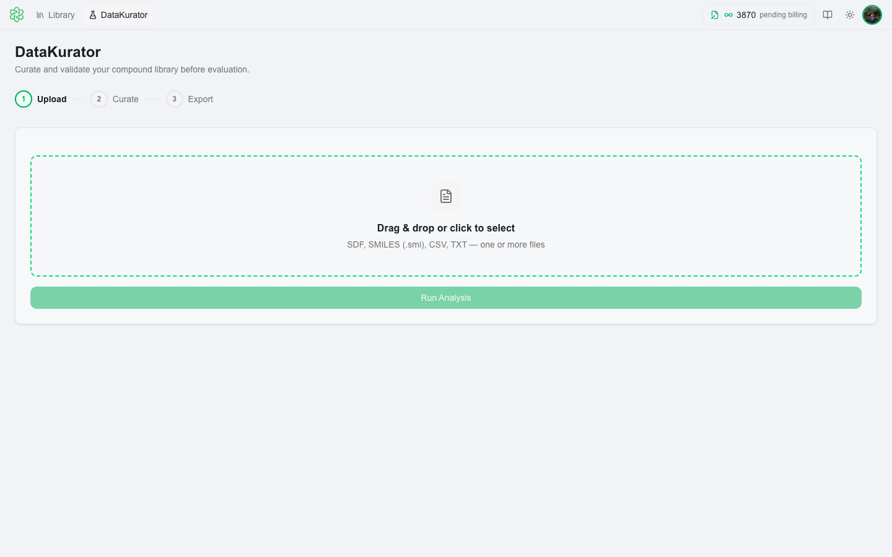

Drag & drop or click to select your compound file. **Supported formats:**
- SMILES (`.smi`, `.smiles`, `.txt`) — one compound per line; optional name and CAS columns
- SDF (`.sdf`) — standard structure-data file

Once a file is selected, it is shown in the upload zone before analysis begins.

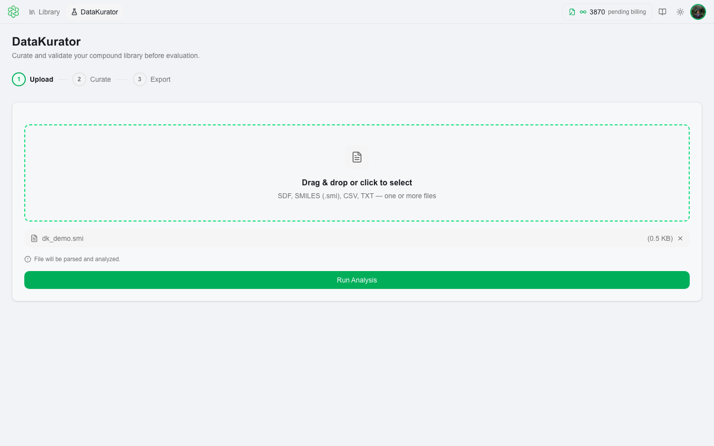

Click **Run Analysis** to parse the file and run structural analysis. This step runs entirely on your device — no data is sent to any server at this point.

---

## Step 2 — 🔍 Curate

After analysis, results appear in a table with one row per compound. Each row shows the compound's name, CAS number, SMILES string, a colored status badge, and an error detail.

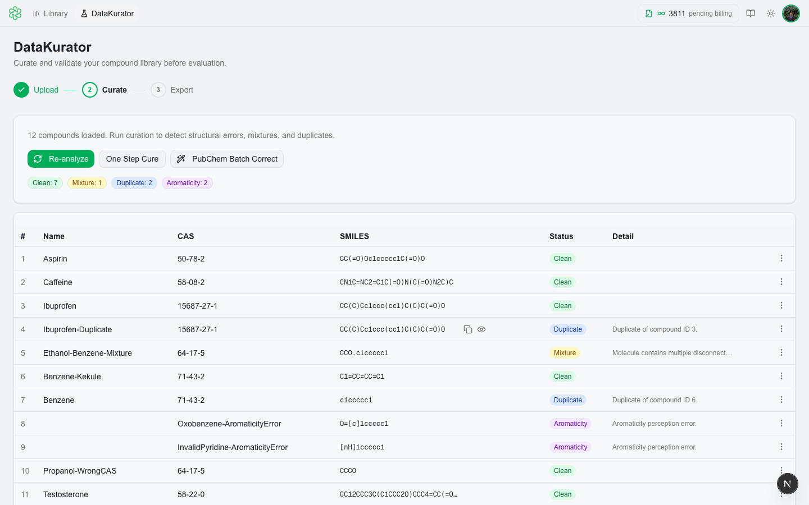

### Error Types

Each compound is tagged with its highest-severity issue:

| Badge | Meaning |
|---|---|
| 🟢 **Clean** | Compound passed all structural checks |
| 🟡 **Mixture** | SMILES contains multiple components separated by `.` |
| 🔵 **Duplicate** | Same structure found more than once in the dataset |
| 🟠 **AtomType** | Contains unsupported or unusual atom types |
| 🟣 **Aromaticity** | Aromaticity perception failed — structure may be drawn in Kekulé form |
| 🟤 **CasMismatch** | CAS number does not match the SMILES structure per PubChem |
| 🩵 **NameMismatch** | Compound name does not match the SMILES structure per PubChem |
| 🔴 **Fatal** | Structure could not be parsed at all |

A compound can have multiple secondary issues in addition to its primary badge — hover the detail column to see the full list.

---

### 🔬 Structure Viewer

Hover over any row to reveal the **👁 View Structure** button on the right side of the SMILES column. Click it to open a 2D structure depiction of the compound.

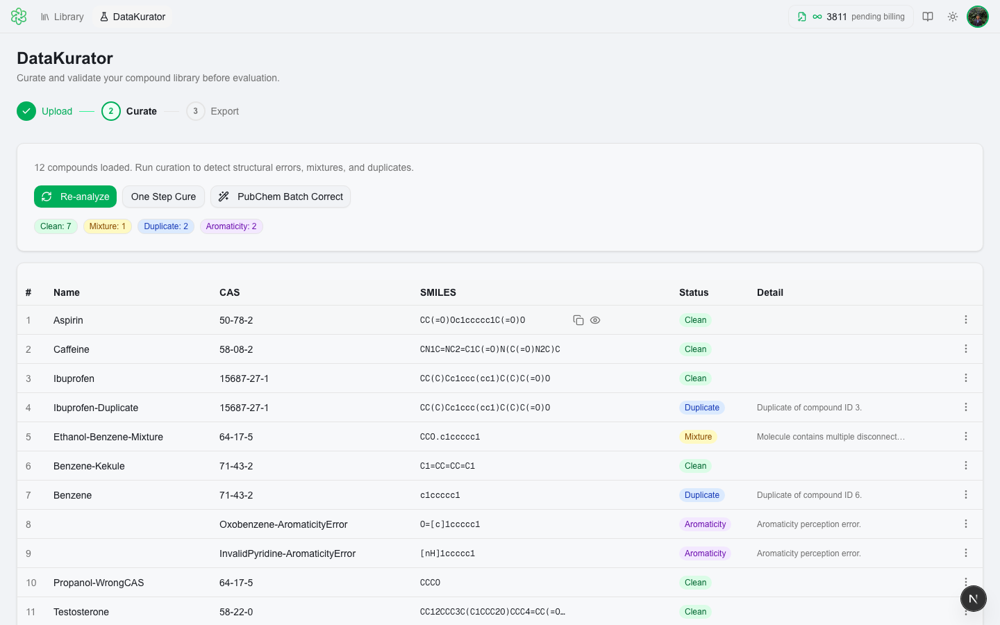
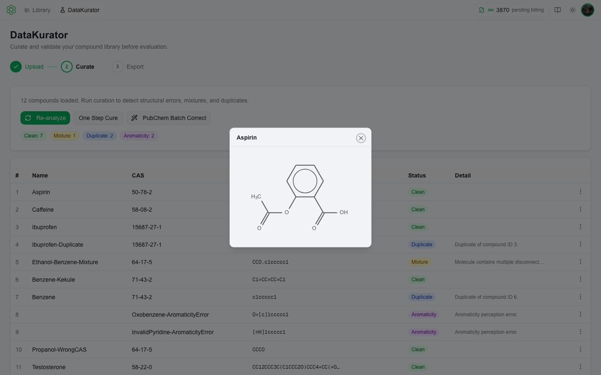

---

### ⋮ Row Actions Menu

Every row has a **⋮ Actions** button on the far right. Click it to open a dropdown with per-compound actions:

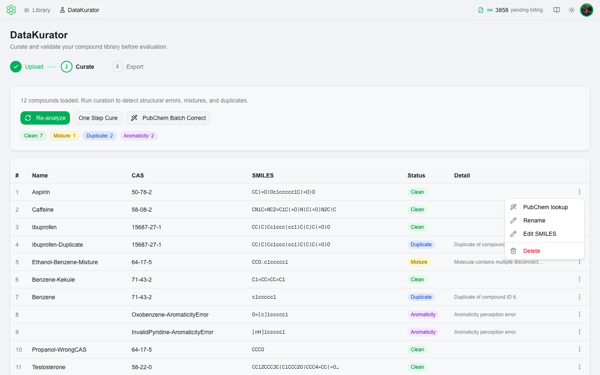

| Action | What it does |
|---|---|
| **Pick components (N)** | Expand the mixture fragment picker for this compound (Mixture rows only) |
| **PubChem lookup** | Look up this single compound in PubChem and apply corrections |
| **Rename** | Edit the compound name inline |
| **Edit SMILES** | Edit the SMILES string directly in the row |
| **Delete** | Remove this compound from the dataset |

---

### ✂️ Mixture Fragment Picker

For rows tagged as **Mixture**, clicking **Pick components (N)** in the row menu expands a fragment picker sub-row below the compound. It lists all fragments found in the SMILES string (split on `.`).

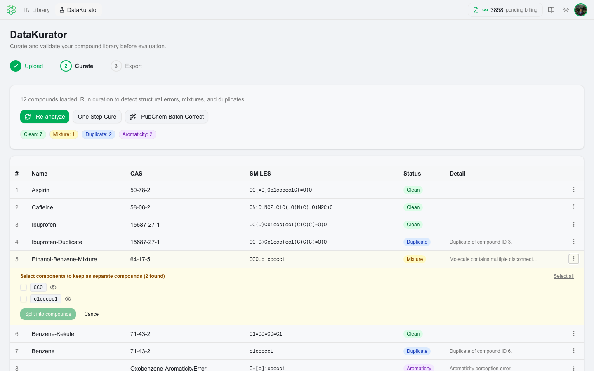

- Click individual fragments to select them, or click **Select all** to select every fragment.
- Click **Split into N compounds** to split the mixture into separate rows — one per selected fragment.

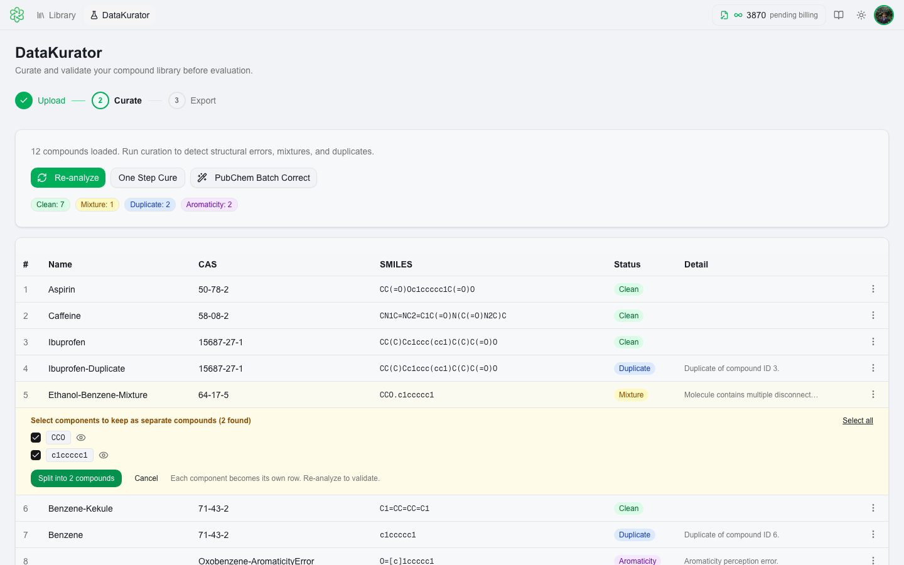
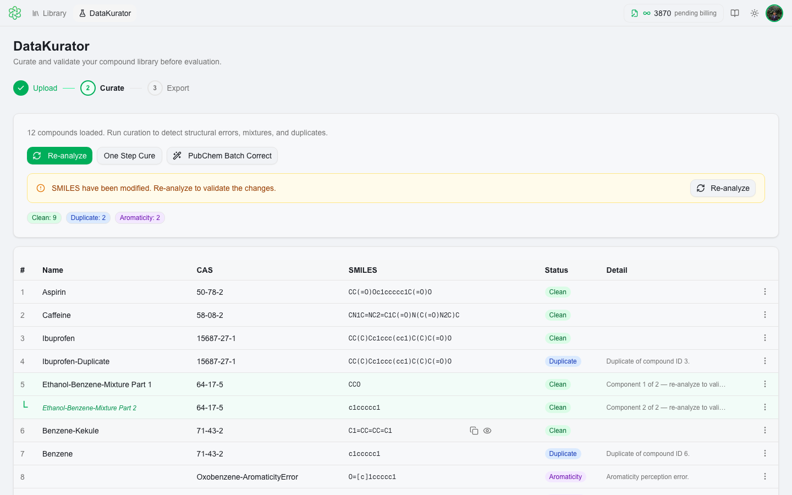

After splitting, the resulting rows appear in-place with a "└" indent marker showing their ancestry. You can re-pick components at any time via the row menu.

---

### ✏️ Inline SMILES Editing

Click **Edit SMILES** in a row's Actions menu to edit the SMILES string directly inline. A text input replaces the SMILES cell.

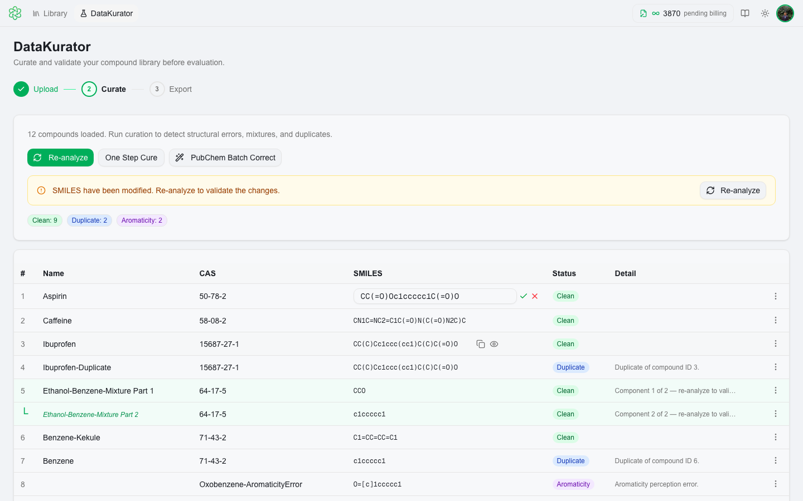

- Press **Enter** or click the green ✓ to commit your change.
- Press **Escape** or click the red ✗ to cancel.

After editing, the row shows "Edited — re-analyze to validate". Click **Re-analyze** at the top to re-run structural checks on the modified dataset.

---

### ⚡ One Step Cure

The **One Step Cure** button runs an automated batch fix across your entire dataset. Clicking it opens a dialog where you choose how to handle each error type:

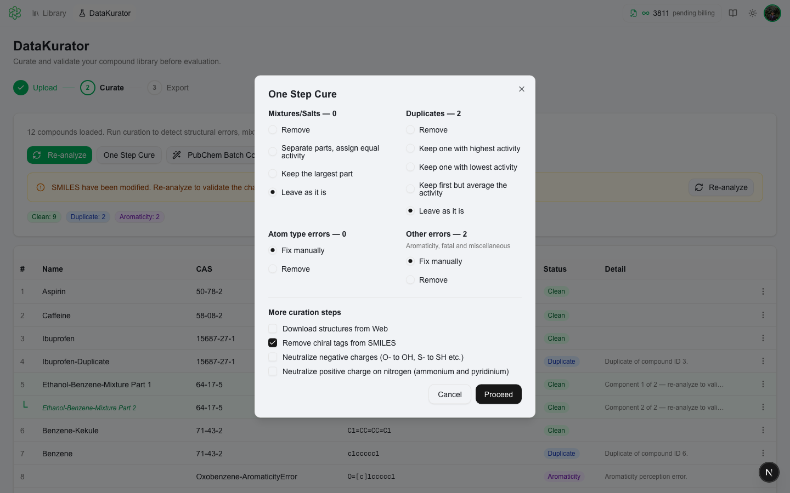

**Configurable options:**
- **Mixtures** — remove all mixtures, keep the largest fragment, separate into individual compounds, or leave as-is
- **Duplicates** — remove duplicates or leave them
- **Atom type errors** — remove or leave
- **Other errors** (aromaticity, fatal, misc) — remove or leave
- **SMILES transforms** — optionally apply: remove chiral tags, neutralize negative charges, neutralize positive nitrogen

After running, a **Change Summary** dialog lists every action taken — removed compounds, kept components, and transforms applied.

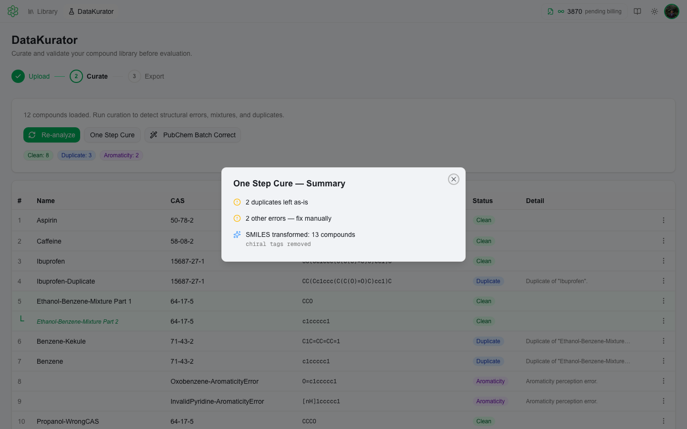

---

### 🔍 PubChem Batch Correct

Click **PubChem Batch Correct** to look up every compound in [PubChem's REST API](https://pubchem.ncbi.nlm.nih.gov/rest/pug/) and apply automatic corrections. Before running, a confirmation dialog explains what data is sent:

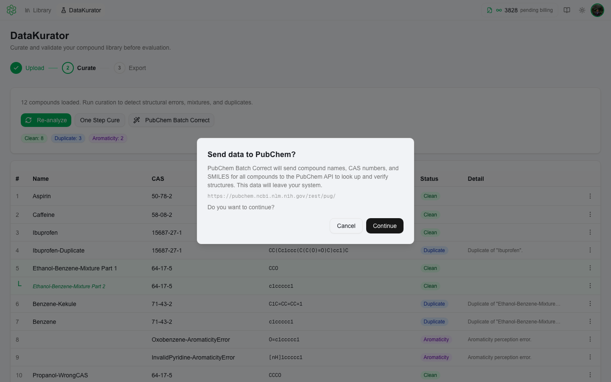

> ⚠️ **Privacy note:** PubChem Batch Correct sends each compound's SMILES to the PubChem REST API (`pubchem.ncbi.nlm.nih.gov`). MultiCASE does **not** store or log the data sent to PubChem. Review [PubChem's terms of use](https://www.ncbi.nlm.nih.gov/home/about/policies/) before use.

After running, a **PubChem Results** summary dialog shows what was corrected for each compound:

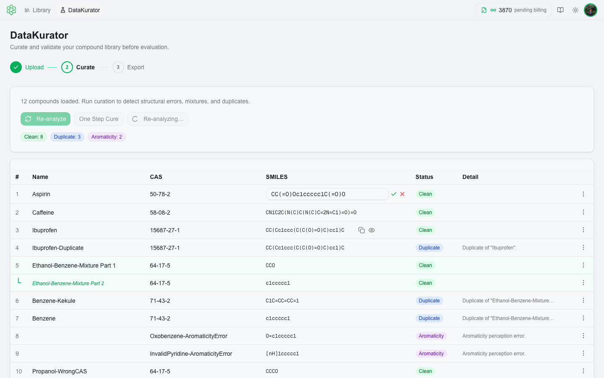

For each compound, PubChem Batch Correct can:
- Correct the SMILES to the canonical PubChem structure
- Fill in a missing or update a mismatched CAS number
- Fill in or correct the compound name

After corrections are applied, the dataset is automatically re-analyzed so duplicate and mismatch errors are re-evaluated.

You can also run **PubChem lookup** on a single row via the ⋮ row menu — this performs the same lookup for just that one compound.

---

## Step 3 — 📤 Export

Once your dataset is ready, click **Proceed to Export** to see a full curation summary and send your compounds to QSARFlex.

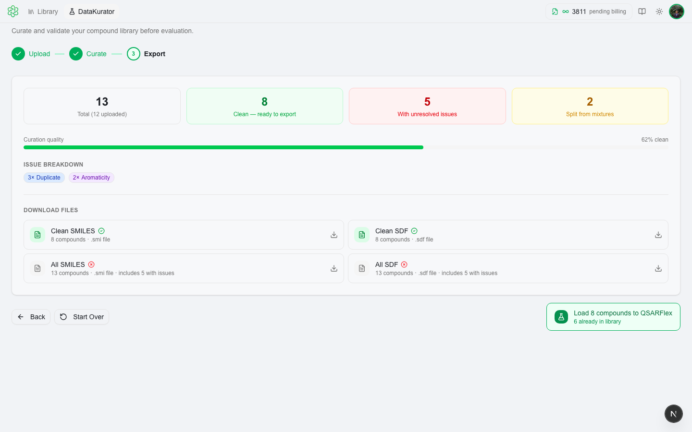

The export page shows:
- **Total compounds** — how many are in the curated dataset (may differ from upload count if you split mixtures)
- **Clean** — compounds with no structural errors, ready for evaluation
- **With unresolved issues** — compounds that still have errors after curation
- **Split from mixtures** — fragments extracted during curation (shown when applicable)
- **Curation quality bar** — percentage of the dataset that is clean
- **Issue breakdown** — badge counts for each error type still present

### 🚀 Load to QSARFlex (primary action)

The green **"Load N compounds to QSARFlex"** button in the bottom-right is the primary export path. Clicking it:
1. Adds all **clean compounds** directly to your QSARFlex Library in one click
2. Navigates you back to the Library, ready to evaluate

> 💡 This is the fastest path — no file download needed. Only clean (error-free) compounds are added. Compounds with unresolved issues are excluded.

### 📥 Download files (secondary)

If you need the curated data as a file (for archiving, sharing, or importing into other tools), use the download options:

| Option | Format | Includes |
|---|---|---|
| Clean SMILES | `.smi` | Error-free compounds only |
| Clean SDF | `.sdf` | Error-free compounds only |
| All SMILES | `.smi` | All compounds, including those with issues |
| All SDF | `.sdf` | All compounds, including those with issues |

Downloaded files can be imported back into QSARFlex via **+ Compounds → Batch Upload**.

---

## Tips

- **Re-analyze after manual edits** — any time you edit SMILES, split mixtures, or rename compounds, click **Re-analyze** to refresh error badges. Errors like CasMismatch and Duplicate are recalculated on re-analysis.
- **Use One Step Cure first** — run OSC to handle the bulk of issues automatically, then use PubChem Batch Correct and manual editing for edge cases.
- **DataKurator vs direct import** — when you upload a file directly to the Library, structural issues trigger a prompt offering to send the file to DataKurator. Take that path to curate before importing.
- **Mixture splits increase compound count** — if you split a mixture into two fragments, the export shows both as separate compounds. The total on the export page may be higher than your original upload count.
