# DataKurator

🧪 DataKurator validates and standardizes a set of compounds before you evaluate them. It reads your file, classifies every structure, and gives you bulk and per-row tools to fix what it finds — then hands the clean set straight to your Library, or writes it out as a file.

Open it from the **DataKurator** tab in the navigation bar, or press ⌘K / Ctrl+K and run **DataKurator** from the command bar.

---

## Two steps, not three

DataKurator is **Load → Curate**.

Export is not a separate screen. Downloading curated files and loading compounds into your Library are both actions on the Curate screen, in the same action bar as everything else.


**Changed in 4.0.** There is no third step and no **Proceed to Export** button. **PubChem Batch Correct** is no longer a button of its own either — verifying against PubChem is a checkbox inside the **One Step Cure** dialog. Curate now also has real **Undo** and **Redo**.


---

## Where curation runs

| Where you are running QSAR Flex | What happens to your structures |
|---|---|
| **Web app** (www.qsarflex.multicase.com) | Your structures go to the QSAR Flex service at `qsarflex-be.multicase.com`. Each curation action is an authenticated HTTPS request to it: `POST /curate/analyze` to classify, `/curate/smiles-transform` for SMILES transforms, `/curate/correct` for PubChem verification, `/curate/export` to build a download. Reading your files uses `/compound/batch` — or `/compound/batch/multi` when you drop more than one — and structure pictures use `/compound/render`. |
| **Desktop — Windows and macOS, both Local and Cloud** | The app answers those same calls inside itself. The desktop shell intercepts them and runs the curation engine in-process, so curation happens on your machine. |

On the server, a curation request is handled in memory: the structures are written to a temporary file only so the engine can load them, that file is deleted as the request finishes, and nothing is written to a database.


Earlier versions of this page said analysis "runs entirely on your device — no data is sent to any server". That is **not** true of the web app, where every curation step is a call to the QSAR Flex service. It is true of curation in the desktop apps.


PubChem is a separate matter, and is treated as one: nothing is ever sent to PubChem without the **Send data to PubChem?** dialog first. See [PubChem consent](#pubchem-consent) below.

The Local / Cloud choice you made when installing the desktop app decides where **evaluation's** reference database lives. It does not change where curation runs — curation is local in both desktop variants.

The difference shows up when you evaluate. Both desktop builds run the prediction models on your workstation. The Local build holds the reference database on the machine; the Cloud build queries a MultiCASE-hosted PostgreSQL database at `central-db.multicase.com` over TCP 5432, and some of those lookups carry the structure being evaluated as a SMILES query parameter. So only **Desktop — Local** keeps your structures entirely on the workstation.

---

## Step 1 — 📂 Load compounds

The first screen is a single dashed drop zone headed **Load compounds to start curating**, with the line *Load compounds and they are checked straight away for structural errors, mixtures and duplicates.*

<figure><picture>
  <source media="(prefers-color-scheme: dark)" srcset=".gitbook/assets/datakurator-upload-dark.png">
  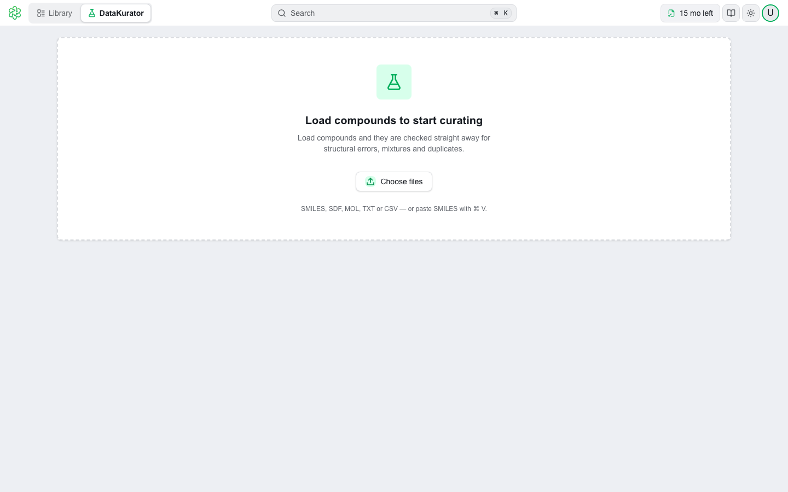
</picture></figure>

There are three ways in, and all three go straight through to Curate:

- **Drop** one or more files onto the card. While you drag, the heading changes to **Drop to start curating**.
- **Choose files** opens the file picker.
- **Paste** SMILES with ⌘ V / Ctrl + V.

Supported extensions are `.smi`, `.smiles`, `.txt`, `.csv`, `.tsv`, `.tab`, `.dat`, `.sdf` and `.mol` — the hint under the button reads *SMILES, SDF, MOL, TXT or CSV — or paste SMILES with ⌘ V* (*Ctrl + V* on Windows).

While it works, the card names the phase it is in — **Reading your file…**, then **Curating N compounds…** — with a **Cancel** button. Cancelling stops the run and reports *Loading cancelled — nothing was loaded.*

When the file has been read you get a count against the file it came from: *N compounds read from mydata.smi.* Check that number against what you expected — the parser returns the compounds it could read and does not report the rows it skipped, so the count is your only signal that a row was dropped.


If the compounds parse but curation itself fails, they are still loaded and you are told: *Compounds loaded, but curation did not run. Use Re-analyze to check them.* An empty issue list after that message means "not checked", not "clean".


You can also arrive here from the Library. Adding compounds that fail curation raises a **Curation issues detected** dialog offering **Add Anyway** or **Fix in DataKurator** — the second hands those compounds and their results to DataKurator and drops you straight on the Curate screen.

---

## Step 2 — 🔍 Curate

The Curate screen is headed **DataKurator** / *Curate and validate your compound library before evaluation*, with a summary card that sticks to the top of the window as you scroll the table.

<figure><picture>
  <source media="(prefers-color-scheme: dark)" srcset=".gitbook/assets/datakurator-results-dark.png">
  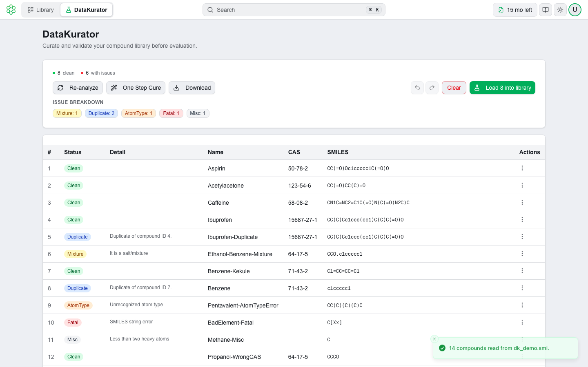
</picture></figure>

### The summary card

One line of counts, each with a coloured dot:

- **N clean** — rows with no issue.
- **N with issues** — rows carrying any issue.
- **N split from mixtures** — rows that came out of a mixture split, shown only when there are some.

Under it, when anything is flagged, an **Issue breakdown** row of badges gives the count per class (`Mixture: 12`, `Duplicate: 3`, and so on). A row that carries more than one finding is counted under each.

If curation has not run yet — a restored session, or a load where curation failed — the card instead reads *N compounds loaded. Run curation to detect structural errors, mixtures, and duplicates* and offers a green **Run Analysis**.

### The action bar

Every action lives in this card.

| Control | What it does |
|---|---|
| **Run Analysis** | Classifies the loaded set. Shown only before the first successful analysis. |
| **Re-analyze** | Re-runs classification over the current rows, edits included. Reports *Re-curation complete.* |
| **One Step Cure** | Opens the bulk-correction dialog. See **One Step Cure** below. |
| **Download** | Dropdown of file exports. See [Download](#download). |
| **Undo** / **Redo** | Step back and forward through curation actions by name. See [Undo and redo](#undo-and-redo). |
| **Clear** | Discards the loaded set and returns to the Load screen, after a confirmation. |
| **Load N into library** | Green primary action: adds the clean compounds to your evaluation Library. |

### Curation classes

Every row is given one status badge, plus a badge for each additional finding.

| Badge | What it means |
|---|---|
| **Clean** | No structural problem found. |
| **Mixture** | The SMILES holds more than one disconnected component — *Molecule contains multiple disconnected components.* |
| **Duplicate** | The same canonical structure appeared earlier in the set — *Duplicate of compound ID N.* Only structurally valid rows are compared, so a broken SMILES is never called a duplicate. |
| **AtomType** | *Unsupported atom type detected.* |
| **Aromaticity** | *Aromaticity perception error* — the ring system could not be perceived as drawn. |
| **Fatal** | The structure could not be read — *Structural error (code N).* |
| **Misc** | Other structural error — *Structural error (ring/atom count).* |
| **CasMismatch** | The SMILES does not match the structure PubChem returns for the row's CAS number. |
| **NameMismatch** | The SMILES does not match the structure PubChem returns for the row's name. |


**CasMismatch** and **NameMismatch** can only come from a PubChem check, and analysis never runs one — every analysis request the app makes asks for the PubChem step to be skipped, so nothing goes to PubChem unasked. Neither badge therefore appears in QSAR Flex 4.0: the PubChem option in One Step Cure and the single-row **PubChem lookup** correct the SMILES to the structure PubChem returns and re-badge the row **Clean** rather than flagging a mismatch.


### The results table

Columns are **#**, **Status**, **Detail**, **Name**, **CAS**, **SMILES** and **Actions**.

- **Detail** is truncated to fit. Hover it — or tab to it — to see the full text; a `+N` marker means the row carries further findings, and they are all in the tooltip.
- **Name** and **SMILES** are edited in place. **Enter** commits, **Escape** cancels, and the green ✓ and ✗ do the same with the mouse.
- Each SMILES cell has a **copy** button and a **View structure** eye button, both revealed on hover.
- Rows produced by a mixture split are tinted green. The first component keeps the original row number; the rest are indented with a `└` marker in place of a number.

#### 🔬 Structure viewer

Hover a row and click the eye button beside the SMILES to open a full-size 2D depiction of that structure.

<figure><picture>
  <source media="(prefers-color-scheme: dark)" srcset=".gitbook/assets/datakurator-structure-hover-dark.png">
  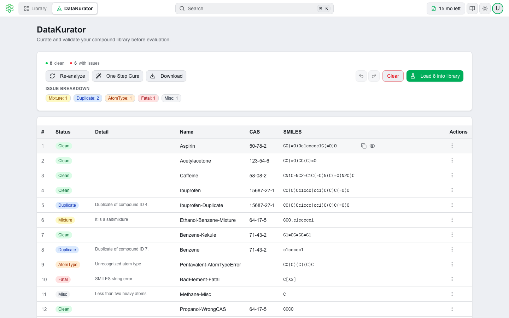
</picture></figure>
<figure><picture>
  <source media="(prefers-color-scheme: dark)" srcset=".gitbook/assets/datakurator-structure-viewer-dark.png">
  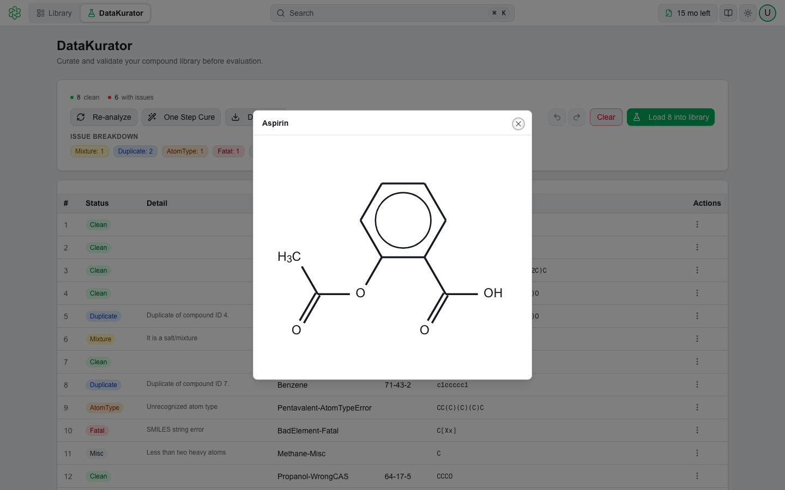
</picture></figure>

Depictions are drawn from the SMILES on demand; a structure that cannot be drawn shows *Could not render structure*.

#### ⋮ Row menu

Every row has an actions button on the far right.

<figure><picture>
  <source media="(prefers-color-scheme: dark)" srcset=".gitbook/assets/datakurator-row-menu-dark.png">
  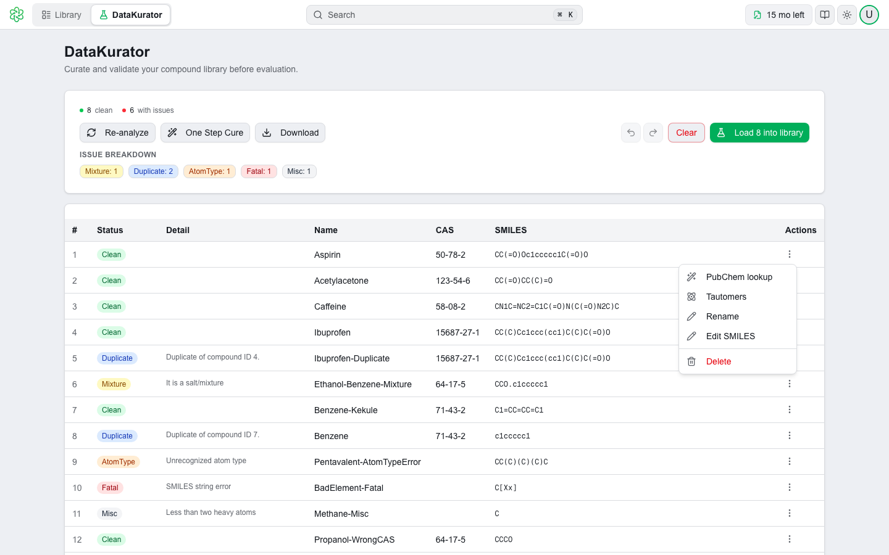
</picture></figure>

| Action | What it does |
|---|---|
| **Pick components (N)** / **Hide components** | Opens or closes the component picker. Mixture rows only. |
| **Re-pick components** | Collapses a split back into its original mixture and reopens the picker. Shown on rows that came from a split. |
| **PubChem lookup** | Looks this one compound up in PubChem, after the consent dialog. |
| **Rename** | Edits the name in place. |
| **Edit SMILES** | Edits the SMILES in place. |
| **Delete** | Removes the row. |

---

### ✂️ Splitting mixtures

Open **Pick components (N)** on a Mixture row and a picker opens beneath it, headed *Select components to keep as separate compounds (N found)*. Each component is listed with a checkbox, its SMILES and its own structure button; **Select all** ticks them all.

<figure><picture>
  <source media="(prefers-color-scheme: dark)" srcset=".gitbook/assets/datakurator-fragment-picker-dark.png">
  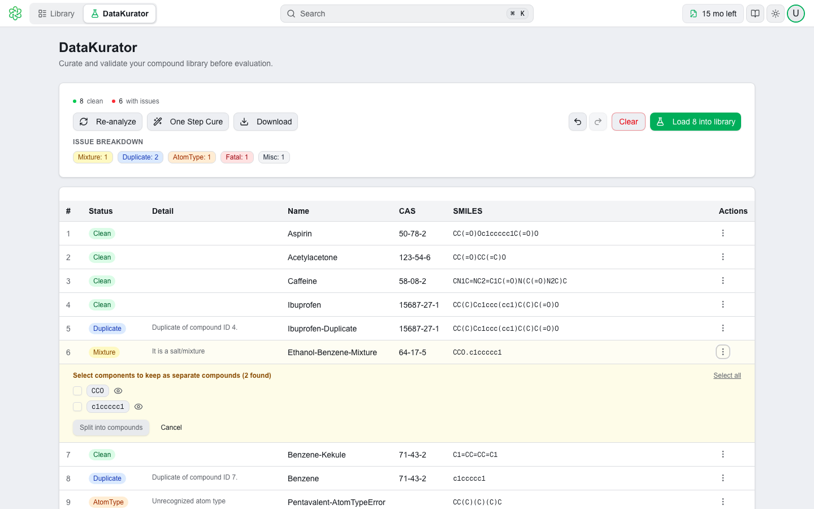
</picture></figure>

Click **Split into N compounds** to keep the ticked components, or **Cancel** to close the picker. The note beside the button says it plainly: *Each component becomes its own row. Re-analyze to validate.*

<figure><picture>
  <source media="(prefers-color-scheme: dark)" srcset=".gitbook/assets/datakurator-fragments-selected-dark.png">
  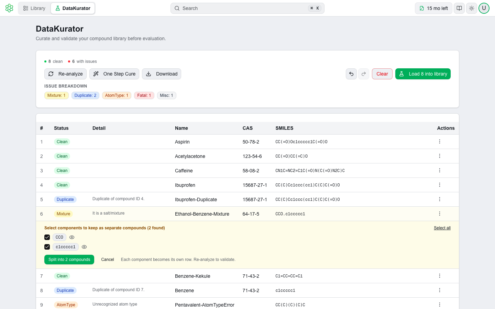
</picture></figure>
<figure><picture>
  <source media="(prefers-color-scheme: dark)" srcset=".gitbook/assets/datakurator-after-split-dark.png">
  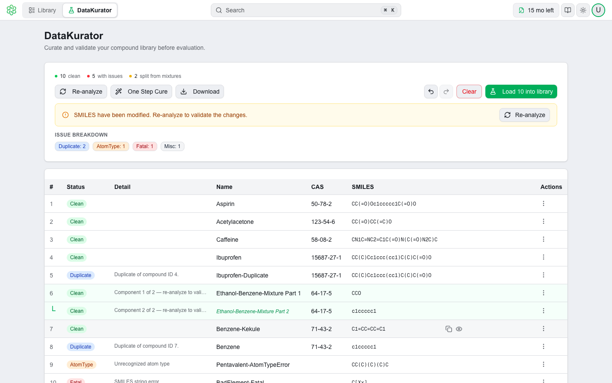
</picture></figure>

Splitting into more than one component names the results *&lt;name&gt; Part 1*, *Part 2* and so on, and each row's detail names its position — *Component 1 of N — re-analyze to validate*, then *Component 2 of N*, and so on. The original mixture SMILES is remembered, so **Re-pick components** always offers you every component — not just the ones you kept last time.

---

### ✏️ Editing in place

**Edit SMILES** replaces the SMILES cell with a text box; **Rename** does the same for the name.

<figure><picture>
  <source media="(prefers-color-scheme: dark)" srcset=".gitbook/assets/datakurator-edit-smiles-dark.png">
  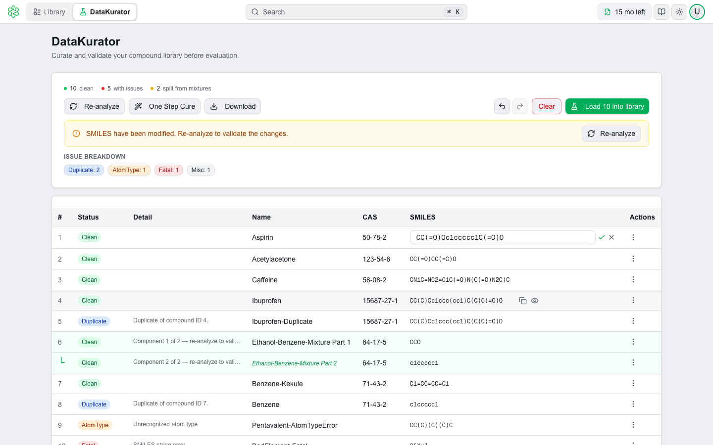
</picture></figure>

- **Enter** or the green ✓ commits. **Escape** or the ✗ cancels.
- Committing the same string you started with changes nothing and is not recorded as an edit.
- An edited row is marked *Edited — re-analyze to validate*, and an amber strip appears in the summary card: *SMILES have been modified. Re-analyze to validate the changes.* with a **Re-analyze** button in it.

An edited SMILES is not re-checked until you re-analyze. Its badge until then says only that you changed it.

---

### ⚡ One Step Cure

**One Step Cure** corrects the whole set in one run. The dialog counts what it is about to act on, so you can see the size of each decision before you make it.

<figure><picture>
  <source media="(prefers-color-scheme: dark)" srcset=".gitbook/assets/datakurator-osc-dialog-dark.png">
  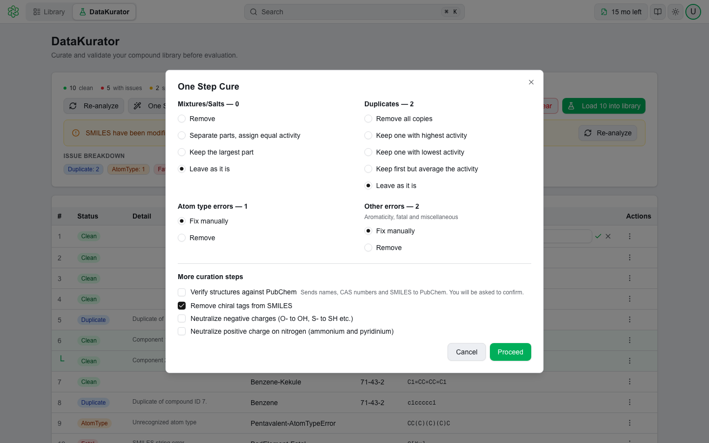
</picture></figure>

Four counted choices:

| Group | Options |
|---|---|
| **Mixtures/Salts — N** | Remove · Separate parts, assign equal activity · Keep the largest part · Leave as it is |
| **Duplicates — N** | Remove · Keep one with highest activity · Keep one with lowest activity · Keep first but average the activity · Leave as it is |
| **Atom type errors — N** | Fix manually · Remove |
| **Other errors — N** | Fix manually · Remove — *Aromaticity, fatal and miscellaneous* |

Then **More curation steps**, a set of checkboxes:

- **Verify structures against PubChem** — off by default, with the note *Sends names, CAS numbers and SMILES to PubChem. You will be asked to confirm.*
- **Remove chiral tags from SMILES** — on by default.
- **Neutralize negative charges (O- to OH, S- to SH etc.)**
- **Neutralize positive charge on nitrogen (ammonium and pyridinium)**

**Cancel** closes the dialog; **Proceed** runs it.

What each choice does:

- **Remove** drops the matching rows from the set.
- **Keep the largest part** replaces a mixture with its single longest component.
- **Separate parts, assign equal activity** turns each component into its own row, named *Part 1…N*, exactly as the manual picker would.
- **Fix manually** leaves those rows alone, and the summary reminds you how many are waiting for you.
- Any Duplicates option other than **Leave as it is** removes the duplicate rows.
- The three SMILES transforms are applied to every row, not only the flagged ones.

The run happens in a fixed order — structural choices, then SMILES transforms, then the PubChem lookup if you asked for one, then a re-analysis of the result — so badges are up to date when it finishes.

#### While it runs

A progress panel covers the screen with the named steps of *this* run (**Applying corrections**, **Transforming SMILES**, **Looking up in PubChem**, **Re-analyzing**), ticking each off as it completes. There is no percentage bar, because there is no honest one to draw.

**Cancel** — or **Escape** — stops the run: *One Step Cure cancelled — nothing was changed.* Nothing is written to the table until every step has finished, so a cancelled run really does leave your compounds as they were. The same is true of a refusal at the PubChem consent dialog.

#### The change summary

A One Step Cure run with anything to report finishes in a summary dialog — **One Step Cure — Summary** — that says what it did.

<figure><picture>
  <source media="(prefers-color-scheme: dark)" srcset=".gitbook/assets/datakurator-osc-summary-dark.png">
  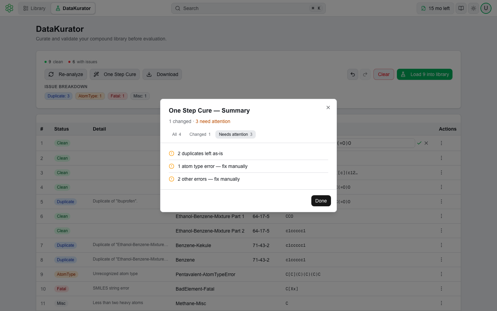
</picture></figure>

- A count line at the top: *N changed · N need attention*, or *Nothing changed.*
- Filter tabs **All** / **Changed** / **Needs attention**, shown when the run produced both kinds. The dialog opens on **Needs attention** so the rows you have to act on are not buried under the ones that went fine.
- Lines are grouped by what produced them — curation decisions under one heading, a PubChem lookup under another — and each carries an icon for its kind: applied, removed, transformed, or needs attention.
- **Done** closes it.

---

### PubChem consent

PubChem is contacted only after you agree, every time. The dialog is titled **Send data to PubChem?** and names exactly what will leave your system:

- From One Step Cure: *PubChem Batch Correct will send compound names, CAS numbers, and SMILES for all compounds to the PubChem API to look up and verify structures.*
- From a single row: *This will send the compound's name, CAS number, and SMILES to the PubChem API to look up and verify its structure.*

Both add *This data will leave your system.*, print the endpoint `https://pubchem.ncbi.nlm.nih.gov/rest/pug/`, and ask *Do you want to continue?* with **Cancel** and **Continue**.

The question is asked before anything is changed. Cancelling a batch consent aborts the whole One Step Cure run before it touches a compound.

A lookup can correct the SMILES to the structure PubChem returns, and fill in a missing CAS number or name. A row being looked up shows a **Looking up…** chip in its Status column. A single-row lookup reports in a summary dialog titled **PubChem — &lt;name&gt;**, with lines such as *SMILES corrected*, *CAS added: 50-00-0*, *Name added: …*, or the warning *No match found in PubChem.* A batch lookup that comes back with nothing reports *PubChem returned nothing — compounds left unchanged.*


PubChem is a third-party service run by the NCBI. MultiCASE does not store or log what you send to it. Review [PubChem's policies](https://www.ncbi.nlm.nih.gov/home/about/policies/) before sending compound data you consider confidential.


---

### Undo and redo

Curate keeps a real history, up to 50 steps, and each step is named after the action that made it — *Run analysis*, *Re-analyze*, *One Step Cure*, *Delete &lt;name&gt;*, *Edit SMILES — &lt;name&gt;*, *Rename to "…"*, *Split into 3 components*, *Re-pick components — &lt;name&gt;*, *PubChem lookup — &lt;name&gt;*.

- The buttons name what they will reverse: hover **Undo** and the tooltip reads *Undo One Step Cure*. With nothing to reverse it reads *Nothing to undo*.
- Undoing confirms what came back: *Undid: One Step Cure.*
- A whole One Step Cure run — corrections, transforms, lookup and re-analysis — is a single step. One undo takes all of it back.
- Committing an edit or a rename without changing the text is not recorded, so it leaves no undo step that appears to do nothing. Other actions always record a step, even a run that changed no rows.

History covers the curation table. It does not reverse a download you already saved, or compounds already added to your Library.

---

### Download

The **Download** dropdown writes the current table to a file. It offers two labelled sections:

| Section | What it writes |
|---|---|
| **Clean only — N compounds** | Only rows with no issue. |
| **Everything — N compounds** | Every row, with *Includes N with unresolved issues.* spelled out under the heading. |

Each section offers **SMILES** (`.smi`) or **SDF** (`.sdf`), and the files are saved as `curated_clean.smi`, `curated_clean.sdf`, `curated_all.smi` or `curated_all.sdf`. A successful export confirms *Exported N compounds as SMILES.*; with nothing to write you get *Nothing to export.*

The SMILES file is one tab-separated line per compound: SMILES, then the name (or the row number when there is no name). The SDF file carries each structure as a `> <SMILES>` data field, alongside `> <Name>` and `> <CAS>`, rather than as an atom-and-bond block — so open it with a tool that reads the SMILES field.

The SMILES file can be loaded back into QSAR Flex through **+ Compounds → Batch**, or dropped straight onto the Library. The SDF cannot: QSAR Flex reads an SDF's atom block, and this file does not carry one.


⌘K / Ctrl+K → **Export curated structures** opens this menu from anywhere. **Clear DataKurator** is in the command bar too. Both are listed as unavailable, with the reason *Nothing loaded*, when DataKurator is empty.


---

### 🚀 Load into library

The green **Load N into library** button is the way forward from curation. It adds **only the clean compounds** to your evaluation Library, confirms *N compounds added to the library.*, and takes you to the Library ready to evaluate. Its tooltip tells you what you are adding to: *Adds to the 24 compounds already in your library* — or *Adds these compounds to your evaluation library* when the library is empty.

Rows with unresolved issues are not added. With no clean rows at all, the button is disabled.

---

### Clearing

**Clear** asks first. The **Clear curation?** dialog names what goes: *This removes N compounds from DataKurator, including N rows you have edited or split. There is no undo, and your QSAR Flex library is not affected.* — with **Cancel** and a red **Clear curation**. Confirming returns you to the Load screen.

This is the one action on the screen that undo cannot reverse.

---

## Your session is kept

DataKurator remembers the loaded compounds and their results in your browser, so leaving the page and coming back does not lose your work. The saved session belongs to the account that made it: it is discarded when you sign out, and a different user signing in on the same machine starts clean.

---

## Tips

- **Re-analyze after manual work.** Edits, splits and renames are not re-checked until you do — and Duplicate is recalculated from the whole set, so it can only be right after a fresh run. One Step Cure re-analyzes for you as its last step.
- **One Step Cure first, by hand afterwards.** Let it clear the bulk, then work the rows it left under **Fix manually**.
- **Check the count when you load.** *N compounds read from …* is your only warning that a row in the file did not parse.
- **Splitting raises the compound count.** A mixture split into two components leaves two rows where there was one, so the total can exceed the number of compounds in your file.
- **Curate before importing.** If the Library flags issues while you are adding compounds, take **Fix in DataKurator** rather than **Add Anyway** — the compounds arrive here already analyzed.

---

Need help with a set that will not curate? Raise it at [support.multicase.com](https://support.multicase.com) — see [Getting Support](support.md).
