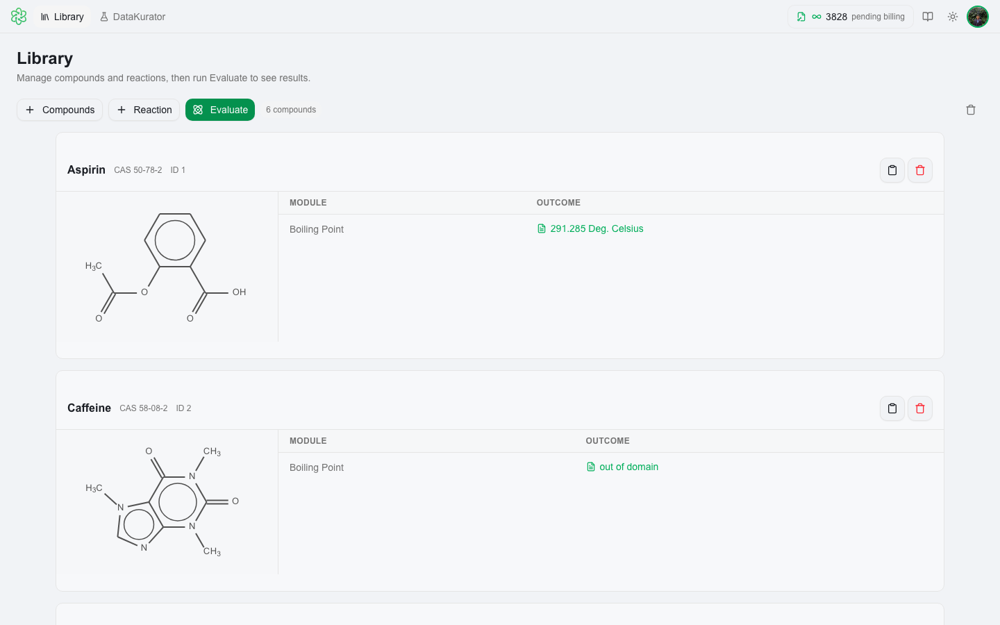
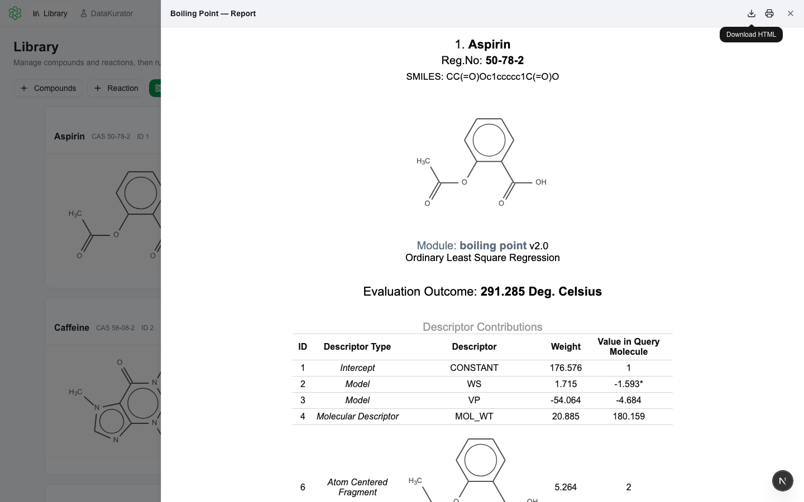

# Evaluation

🔬 Run licensed prediction modules against all compounds in your Library with one click. QSAR Flex evaluates every compound simultaneously and displays results inline — no waiting between compounds.

---

## Starting an Evaluation

With at least one compound in the Library, click the green **Evaluate** button in the toolbar — or press **⌘K** (Mac) / **Ctrl+K** (Windows).

The **Select Modules to Evaluate** dialog opens, listing every module available under your license grouped by bundle.

<picture>
  <source media="(prefers-color-scheme: dark)" srcset=".gitbook/assets/evaluate-dialog-dark.png">
  
</picture>

Modules are shown grouped by their license bundle — for example, **Physicochemical**, **Nitrosamine**, **Ecotoxicity**, and **ADME**. Modules you are not licensed for appear grayed out and cannot be selected. Contact [support@multicase.com](mailto:support@multicase.com) to add bundles.

Select one or more modules and click **Evaluate**. QSARFlex runs every selected module against every compound in the Library simultaneously.

> 💡 **Tip:** You can evaluate the same library multiple times with different module selections — results accumulate per-module without overwriting previous runs.

---

## Results

After evaluation completes, results appear in each compound's card in the Library.

<picture>
  <source media="(prefers-color-scheme: dark)" srcset=".gitbook/assets/eval-results-dark.png">
  
</picture>

Each compound card shows a table with:
- **Module** — the prediction endpoint that was run
- **Outcome** — the prediction result (e.g., Active/Inactive, a numeric value, or a category label)

Possible result formats depend on the module:
- **Binary** — `Active` / `Inactive` (e.g., Ames Mutagenicity)
- **Numeric** — a predicted value with units (e.g., `3.4 mg/mL` for Water Solubility)
- **Category** — a potency class or descriptor (e.g., CPCA category)
- **Click to view** — for matrix outputs like Cross Similarity

---

## 📄 Module Reports

Click any result value in a compound's card to generate a full HTML report for that compound and module. The report opens as a slide-in panel on the right.

<picture>
  <source media="(prefers-color-scheme: dark)" srcset=".gitbook/assets/eval-report-dark.png">
  
</picture>

Reports include:
- **Prediction outcome** and confidence level
- **Structural alerts** — fragments or substructures that contributed to the prediction
- **Supporting evidence** — analogues, model metadata, and regulatory context where applicable
- **CPCA / Surrogate** reports — for nitrosamine modules, full potency categorization with acceptable intake limits and supporting data

Use the **Export** button at the top of the report panel to download the report as an HTML or PDF file.

---

## Where Evaluation Runs

| Variant | Evaluation |
|---|---|
| 🌐 **Web App** | Sent to MultiCASE servers over HTTPS |
| 💻 **Desktop — Local** | Runs on-device — compound structures are not sent to MultiCASE servers for model inference |
| ☁️ **Desktop — Cloud** | Sent to MultiCASE cloud infrastructure over HTTPS |

All variants require internet for license verification and authentication. See [Security](security.md) for full details.

---

## Tips

- **Multiple runs accumulate** — run evaluation again at any time; new module results are added to existing ones without overwriting.
- **Cross Similarity** generates an NxN matrix and requires ≥2 compounds to produce meaningful output.
- **Surrogate Search** and **Cross Similarity** are Desktop-only modules.
- Results persist across sessions — the Library retains evaluation outcomes even after closing and reopening the app.

See the [Model Catalog](fundamentals/model-catalog.md) for descriptions of all available endpoints.
