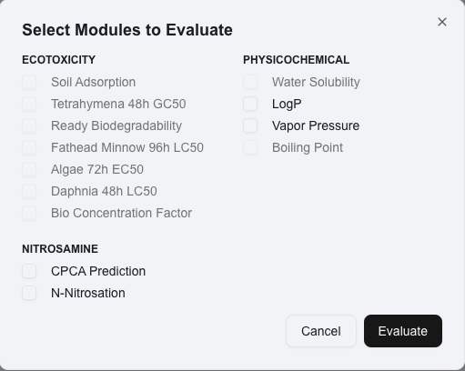

# 🧑‍🔬 Evaluation

**Initiate Evaluation**

* **Load Compounds or Reactions**: Ensure compounds or reactions are loaded.
* **Click "Evaluate"**: From the home screen, press the green "Evaluate" button.

<figure><figcaption></figcaption></figure>

**Select Evaluation Modules**

* **Dialog Box**: A "Select Modules to Evaluate" dialog appears.
* **Choose Modules**: Select from available modules, limited by your license (e.g., Soil Adsorption, Tetrahymena 48h GC50, Water Solubility, CPCA Prediction, N-Nitroso).

<figure><figcaption></figcaption></figure>

**Confirm Evaluation**

* **Click "Evaluate"**: In the dialog box, click "Evaluate" to proceed.
* **Modify or Exit**: Click "Cancel" to modify your selection or exit.

**Review Outcome**

* **Check Outcomes**: After evaluation, review the results in the "Results" panel for the selected modules.

<figure><figcaption></figcaption></figure>

* Click the button next to the outcome to generate a module report, which will open in a new tab.

You can see a sample report [here](https://d35fy2f4trk71w.cloudfront.net/sample-report.html).

## Next Steps

For issues regarding Access and Licensing, proceed to the next section.
