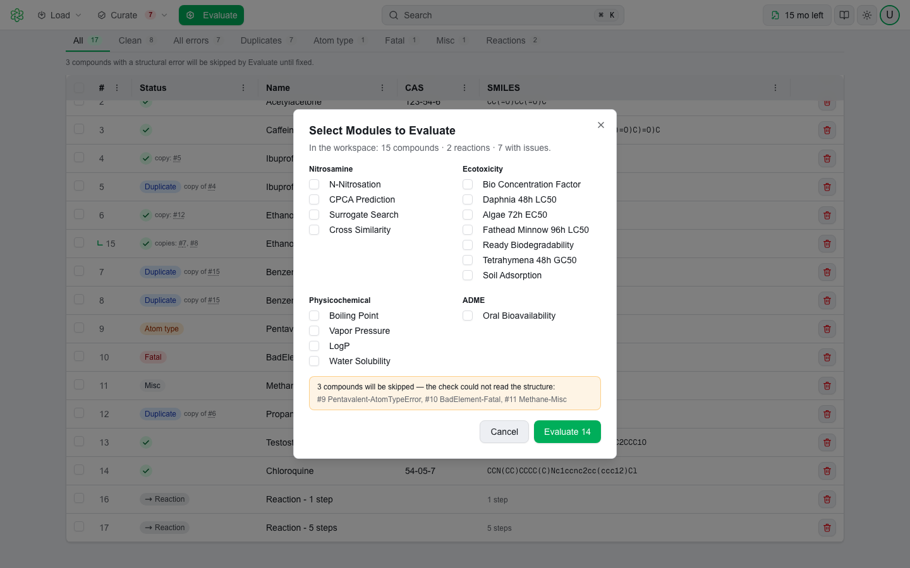
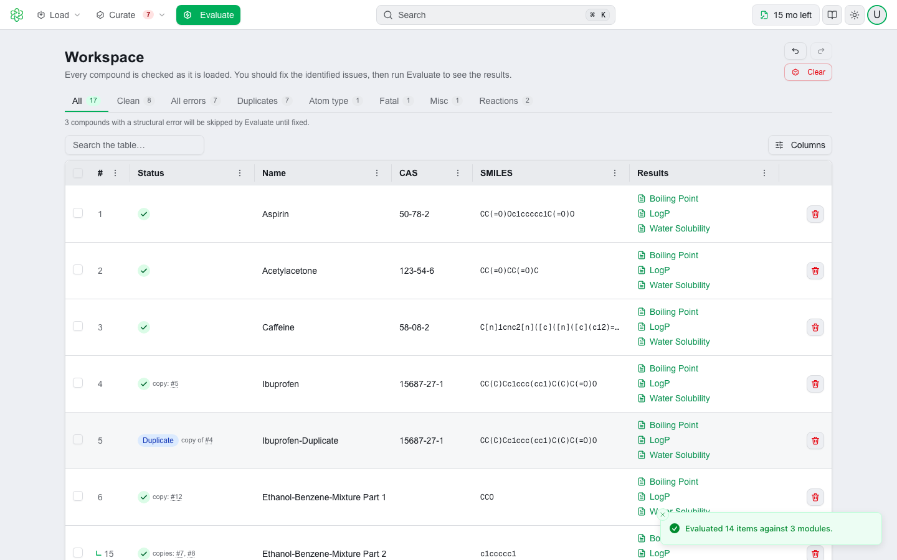
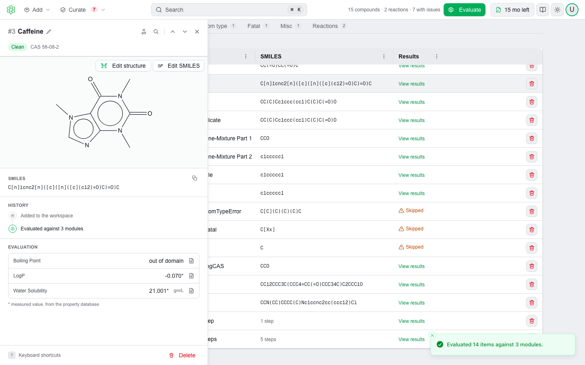
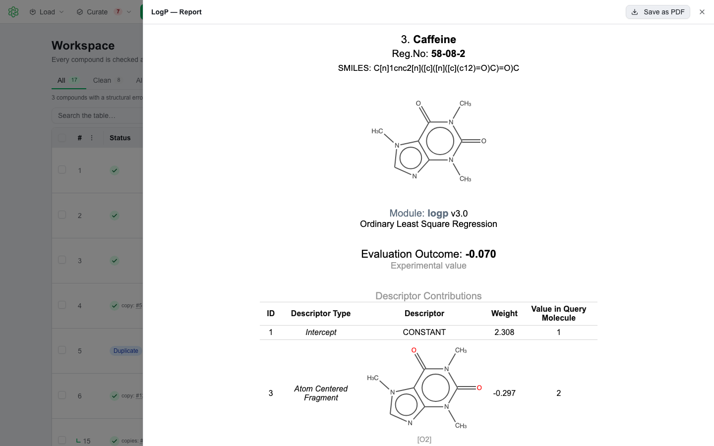

# Evaluation

🔬 Evaluation runs the prediction modules your license covers against the workspace — compounds and reactions — in a single run, and writes the outcomes onto the rows: a **Results** column on the table, one link per module straight into its report, and the outcome per module in each row's panel.

---

## Starting an Evaluation

With at least one item in the workspace, there are two ways to start:

- Click the green **Evaluate** button on the navbar.
- Open the command bar with **⌘K** (macOS) / **Ctrl+K** (Windows) and choose **Evaluate**.

The button's tooltip says what will happen before you press it — *Evaluate 14 items*, or *Evaluate 11 items; 3 with structural errors will be skipped*. It is disabled, with the reason in the tooltip, while the workspace is empty, while it is still loading, and while a load, a check, a cure or a run is already in progress. The command bar lists **Evaluate** on an empty workspace too, grayed out, with *"Nothing in the workspace"* on the row.

### What is sent

Every reaction, and every compound the check could read. A compound the check rejected outright — **Fatal**, **Atom type**, **Aromaticity** or **Misc** — has no structure a model can score, so it is left out, and the workspace says so above the table: *3 compounds with a structural error will be skipped by Evaluate until fixed.* Mixtures and duplicates are sent as they are; the engine handles salts itself. Fix the rest from the row's panel or with One Step Cure — see [Curating Compounds](curation.md).

---

## Choosing Modules

Either route opens the **Select Modules to Evaluate** dialog. Its first line is what it will run over — *In the workspace: 14 compounds · 2 reactions · 6 with issues.*

<figure><picture>
  <source media="(prefers-color-scheme: dark)" srcset=".gitbook/assets/evaluate-dialog-dark.png">
  
</picture></figure>

When the run will skip rows, the dialog names them — number and name — above the buttons, so nothing is left out silently.

Modules are laid out in two columns and grouped under their license bundle — **Nitrosamine**, **Ecotoxicity**, **Physicochemical** and **ADME**. Modules your account is not licensed for are listed but grayed out and cannot be ticked, so you can always see what exists beyond your current license.

Tick one or more modules and click **Evaluate**. Submitting with nothing ticked shows *"Select at least one module"*. **Cancel** closes the dialog without starting anything.

Two things decide what appears in this list:

- **Coverage.** The dialog shows modules whose coverage is *All* or *Web*. A module marked *Desktop* coverage does not appear.
- **Your license.** The dialog asks the license server which modules your active license covers, and only those are selectable.


Need a module or a whole bundle added to your license? Raise it at [support.multicase.com](https://support.multicase.com) — new licenses, added modules and enterprise rollouts all go through the portal.


### When the Dialog Cannot Offer You Anything

Three different things can stop the dialog working, and 4.0 tells them apart instead of showing an empty grayed-out list for all three. In every case the **Evaluate** button is disabled and the reason is shown at the top of the dialog.

| What the dialog says | What it means | What to do |
|---|---|---|
| *"The module catalog could not be loaded, so there is nothing to evaluate against. Check your connection and reopen this dialog."* | The list of modules itself never arrived, so there is nothing to draw. | Check your connection, close the dialog and open it again. |
| *"Your licensed modules could not be checked right now, so no module can be selected. This is not a license problem — try again shortly."* | The catalog loaded, but the license service did not answer when asked what you are entitled to. | Wait a moment and try again. Nothing is wrong with your license. |
| *"No license found / License not activated"* | The license service answered, and the answer is that this account has no active license for QSAR Flex. | Activate a license on the **Account → License** tab, or request one at [support.multicase.com](https://support.multicase.com). See [Access & Licensing](fundamentals/access-and-licensing.md). |

---

## While the Run Is Going

A full-screen overlay covers the page for the length of the run. It shows:

- The title **Evaluating the workspace** and the number of compounds being evaluated.
- A named step — **Running modules** — with a spinner. It is a checklist rather than a percentage bar on purpose: an evaluation is a single request that returns nothing until it has finished, so a percentage would be invented.
- A note line under a rule, which names any reactions in the run (*"Also evaluating 2 reactions."*) and then says how your structures are handled:
  - On the **desktop** — *"Evaluating on-device — your compounds stay on this machine."*
  - On the **web app** — *"Compounds are evaluated via MultiCASE's cloud — nothing is retained after your session."*

  See [Where Evaluation Runs](#where-evaluation-runs) below.
- A **Cancel** button. **Esc** does the same thing, and focus is held inside the overlay while it is open.

Canceling stops the app waiting for the answer; it does not reach into the engine and stop work that has already begun. The app says so: *"Evaluation canceled. The workspace is unchanged; tests already started may still be billed."*


A run is metered against your license. Whether it finishes, fails or is canceled, the license figures in the navbar are re-read afterwards. On a pay-per-test license that is the remaining-tests count; on an on-demand subscription it is the pending-billing count.


---

## When the Run Finishes

**A complete run** raises a success toast: *"Evaluated 6 items against 3 modules."*

**A short run** — fewer results came back than items were sent — raises a warning toast *and* leaves a persistent **Partial evaluation** banner at the top of the workspace. The banner names the time of the run, how many of how many items came back, across how many modules, and ends: *"Items with no results below were not evaluated — re-run before relying on this set."* It stays until you dismiss it with the ✕, so it survives the toast disappearing.

**An unreadable response** clears the results rather than leaving the previous run's outcomes on screen looking like this run's, and says so.


Each run **replaces** the results of the previous run — outcomes do not accumulate across runs. If you want a compound to carry results from two different modules, tick both modules in the same run.


A run is a step in the workspace's history — *Evaluate 14 items* — so **Undo** puts the previous results back, and undoing something you did before the run does not take the run's results with it. A result belongs to the structure it was made for: editing a row's SMILES, adopting a tautomer, a PubChem correction or a One Step Cure transform clears that row's results, while a re-check that changes nothing keeps them.

Results are held on the device, in the browser (or the desktop app's own web storage), so they survive closing and reopening the app on that machine. They do not follow you to another browser or another computer.

---

## Reading the Results

Once a run has finished, the table gains a **Results** column. A row that was evaluated lists the modules that ran on it, one under the other, each with a document icon: click a module name and its report opens, one click from the table. A row the run skipped reads **Skipped**, with the reason in its tooltip; a row that was not part of the run reads **Not evaluated**.

<figure><picture>
  <source media="(prefers-color-scheme: dark)" srcset=".gitbook/assets/workspace-results-dark.png">
  
</picture></figure>

The outcomes themselves are in the row's panel: click the row and read **Evaluation results**, one line per module with the outcome on the right and a document icon — click the line to open that module's report, as the note under the list says: *Click 📄 to view detailed reports.* The heading is green once there are results. Before a row has been evaluated the panel reads *Not evaluated yet*; on a row the run skipped it reads *Evaluate skips this compound until the structure is fixed.* A `*` after a value marks an exact hit in the module's experimental database, and the panel says so under the list.

<figure><picture>
  <source media="(prefers-color-scheme: dark)" srcset=".gitbook/assets/workspace-panel-results-dark.png">
  
</picture></figure>

Outcomes are text, and the form depends on the module:

| Outcome | Meaning |
|---|---|
| A number with a unit | A predicted value, given to three decimals. |
| A label (for example a class or a call) | The model's own outcome label rather than a number. |
| A trailing `*` | An exact hit in the module's experimental database — the value is measured, not predicted. |
| `out of domain` | The query fell outside the model's applicability domain. No value is shown. |
| `2 Potential Nitrosamines` | N-Nitrosation: the number of nitrosamine products predicted to form. |
| `18 or 26.5 ng/day` | CPCA category 1, whose acceptable intake differs between the EMA (18) and the US FDA (26.5). |
| `Click to view report` | Oral Bioavailability, whose answer is the multi-method report rather than a single figure. |
| `N/A` | Nothing to show: no database hit, or a module that does not apply to this item. `N/A` is not clickable. |


Reactions are evaluated by the **N-Nitrosation** module only. Tick other modules alongside it and the reaction rows come back as `N/A` — the compounds in the same run are unaffected.


---

## 📄 Module Reports

Click a module name in the **Results** column, or a module's line in the panel, and QSAR Flex opens the full report for that one item and that one module in a panel that slides in from the right. Every structure in it is drawn by ChemiGraphy: the query compound sized to its heavy-atom count, each surrogate and product fitted to its column, terminal carbons written out as CH₃, the nitrosamine centre or the alert atoms in red.

<figure><picture>
  <source media="(prefers-color-scheme: dark)" srcset=".gitbook/assets/eval-report-dark.png">
  
</picture></figure>

<figure><picture>
  <source media="(prefers-color-scheme: dark)" srcset=".gitbook/assets/eval-report-dark.png">
  
</picture></figure>

One button sits in the panel's header: **Save as PDF**. It opens your system print dialog on the report; choose *Save as PDF* there. The report is laid out for US Letter on the web and in both desktop apps, so the same report paginates the same way wherever it is saved, and its footer names the product version and the time it was made.

Some reports link to further detail — a distribution graph, a compound's property record. Those open as a second, nested **Detailed Report** panel on top of the first rather than in a new window, so the flow works the same in the browser and inside the desktop shells.

What a report contains depends on the module:

- **Statistical models** (regression and logistic) — the module name and version, the outcome, and a **Descriptor Contributions** table of every model term with its weight and its value in your molecule. A **Fragment** row draws your molecule with the matching atoms highlighted in red; an **Expert Alert** row names the alert in words instead of drawing it. An outcome that fell outside the applicability domain is marked *(out of domain)*, and a value taken from experimental data is labeled as such instead of being presented as a prediction.
- **CPCA Prediction** — the N-Nitrosamine Carcinogenic Potency Evaluation: the highlighted nitrosamine center, the CPCA decision flow-chart with the scores at each step, the potency category and acceptable intake, the activating and deactivating features found, and tables of experimental surrogates.
- **N-Nitrosation** — the predicted nitrosamine products and their formation likelihood. For a reaction, the report covers the whole route: the scheme, the products formed at each step, and the literature references found for it.
- **Oral Bioavailability** — the four-method assessment reported side by side, with the supplementary metabolic-stability, transporter and formulation-sensitivity sections. A **Show Structural Influence** button opens a table that splits the alert hits into features boosting and features lowering that endpoint, each fragment listed with its relative contribution and a proposed mechanism.


Not every module type has a report generator. If clicking a module's line does nothing, that module produces the value only. A module missing from the catalog, or a row you have since deleted, is reported as a message rather than an empty panel.


If your license is a **trial**, reports generated by MultiCASE's servers come back stamped with a diagonal **TRIAL LICENSE / NOT FOR REGULATORY USE** watermark, and the watermark prints.

---

## Where Evaluation Runs

| Deployment | Where the models run |
|---|---|
| 🌐 **Web app** | The workspace is sent over HTTPS to the QSAR Flex service at `qsarflex-be.multicase.com`, which runs the models and returns the outcomes. The same service generates reports, draws structures, curates and hosts the structure editor's session. Structures are not persisted after the request. |
| 💻 **Desktop** | The engine runs inside the app on your machine, against the encrypted reference database the app downloads on first launch (~4 GB). Structures do not leave the workstation. |


The desktop app runs the prediction models on your workstation, so the structures you evaluate are never sent to MultiCASE to be evaluated. That is not the same as running offline — see below.


Both deployments need a network connection: sign-in, the license check and the usage metering all happen against MultiCASE's services. The web app validates your license on the server before every run. The desktop app fetches your license once at launch — it will not open without one — and reports each run's usage afterwards. See [Security](security.md) for the full data-handling picture.

---

## Notes

- **Run everything you need in one go.** A new run replaces the last one's results.
- **Deleting a row deletes its results** (undo brings both back), and **Clear workspace** wipes the workspace and every result with it.
- **The license server decides what you can tick.** The Select Modules dialog asks the license service which modules your license covers, and only those can be selected. In the web app that decision is enforced again on the server: the app sends module ids, the license service returns the modules it will allow, and those are what the engine is given.
- **Large runs take time.** The engine works through the workspace one molecule at a time, so the wait grows with the number of compounds multiplied by the number of modules.

See the [Model Catalog](fundamentals/model-catalog.md) for what each module predicts, and [Access & Licensing](fundamentals/access-and-licensing.md) for how runs are counted against your license.
