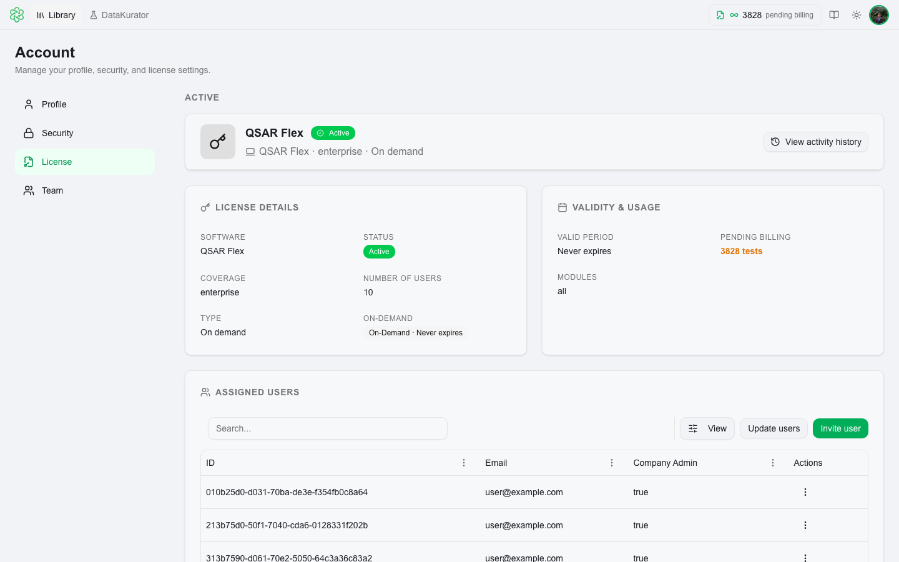

# Access & Licensing

To access QSAR Flex, contact [support@multicase.com](mailto:support@multicase.com) to request an account. MultiCASE will set up your account and configure the module bundles that match your needs.

---

## License Coverage

Every QSAR Flex account requires an active license — either **individual** or **enterprise**:

| Coverage | Who it's for |
|---|---|
| **Individual** | Single-user access on either the Web App or Desktop (Local or Cloud) |
| **Enterprise** | Multi-user access under a shared organization, with admin-controlled seat assignments |

Both coverage types give access to the same platform variants and module bundles. The difference is the number of users and whether the organization admin can reassign seats.

---

## Billing Models

Licenses can be structured in different ways depending on your workflow:

| Billing Type | How it works |
|---|---|
| **Subscription** | Unlimited evaluations for a fixed period (monthly or annual). Best for ongoing research workflows. |
| **Pay-per-test** | Purchase evaluation tests in blocks. Pay only for what you use. Remaining tests roll over. |
| **On-demand** | Pay-as-you-go with no upfront commitment. Ideal for occasional users. |

### 🔢 How Tests Are Counted

For **pay-per-test** and **on-demand** licenses, tests are consumed each time you run an evaluation:

> **1 test = 1 compound × 1 module**

So if you evaluate **10 compounds** with **3 modules** selected, that evaluation consumes **30 tests**.

Usage is recorded automatically after each evaluation run and deducted from your remaining balance. Your current remaining tests are always visible on the **Profile → License Information** page. Subscription licenses have unlimited evaluations and are not affected by this calculation.

---

## Module Bundles

Modules are sold in bundles — purchasing a bundle unlocks all endpoints within it. Available bundles:

| Bundle | Includes |
|---|---|
| 🔴 **Nitrosamine** | N-Nitrosation, CPCA Prediction, Surrogate Search, Cross Similarity |
| 🌿 **Ecotoxicity** | Bio Concentration Factor, Daphnia 48h LC50, Algae 72h EC50, Fathead Minnow 96h LC50, Ready Biodegradability, Tetrahymena 48h GC50, Soil Adsorption |
| 💧 **Physicochemical** | Boiling Point, Vapor Pressure, LogP, Water Solubility |
| 🧬 **Genotoxicity** | Ames Mutagenicity |
| 💊 **ADME** | Oral Bioavailability |

See the full [Model Catalog](model-catalog.md) for detailed descriptions of each endpoint.

---

## Getting Access

1. Email [support@multicase.com](mailto:support@multicase.com) with your use case and the bundles you need.
2. MultiCASE will provision your account and send you login credentials via email.
3. Log in at [qsarflex.com](https://qsarflex.com) using **Sign in with Cognito**, or open the Desktop app.

---

## Viewing Your License

After signing in, click your **profile avatar** (top right) and go to **Profile → License Information** to see:

- Your active license type, coverage, and status
- The module bundles included in your license
- Remaining tests or subscription period
- Users currently assigned to this license (enterprise only)

---

## Enterprise User Management

Enterprise license holders can:
- **Invite new users** to the platform
- **Assign users to a license** — control which team members have access
- **Reassign seats** — if you have 5 users but a 3-seat license, you can swap who occupies those seats at any time without losing data

See [Enterprise User Management](../license-management/enterprise-user-management.md) for full instructions.

---

## Desktop Downloads

### 💻 QSARFlex Local

QSAR model inference runs on-device — compound structures are not sent to MultiCASE servers for evaluation. Requires internet for license verification, authentication, and optional PubChem lookups.

- [Installer (.exe)](https://qsarflex-win-releases.s3.us-east-2.amazonaws.com/releases/local/QSARFlex-Local-win-Setup.exe)

### ☁️ QSARFlex Cloud

Filter models are installed locally and QSAR inference runs on-device. The reference database (used by the N-Nitrosation and Oral Bioavailability modules) is queried from MultiCASE's cloud. Compound structures are not sent to MultiCASE servers for evaluation. Requires an active individual or enterprise license and internet connection throughout use.

- [Installer (.exe)](https://qsarflex-win-releases.s3.us-east-2.amazonaws.com/releases/cloud/QSARFlex-Cloud-win-Setup.exe)
