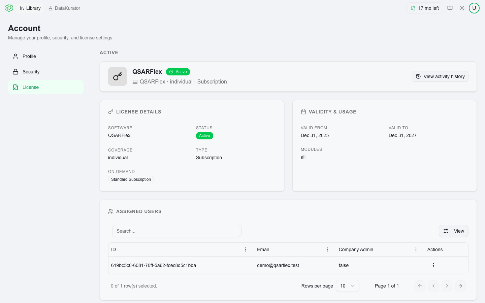
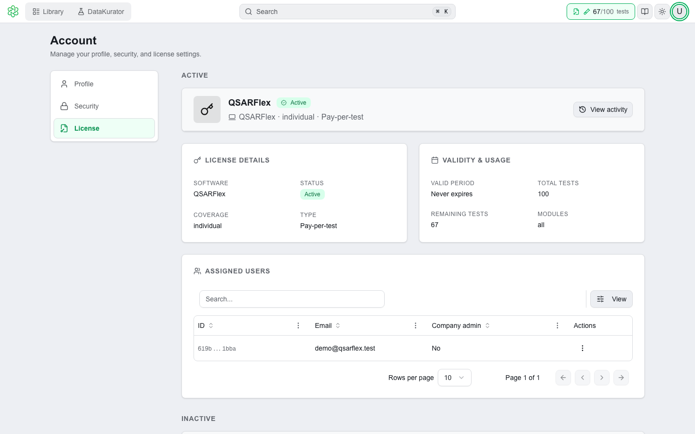
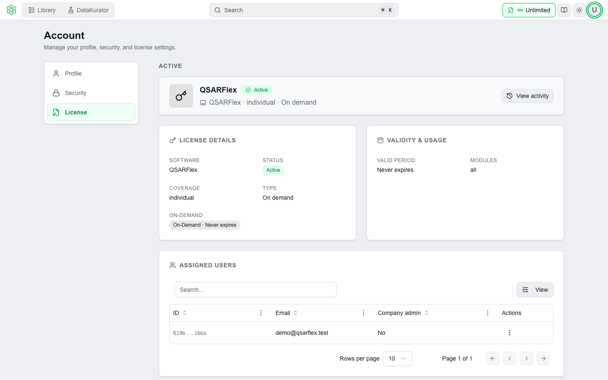
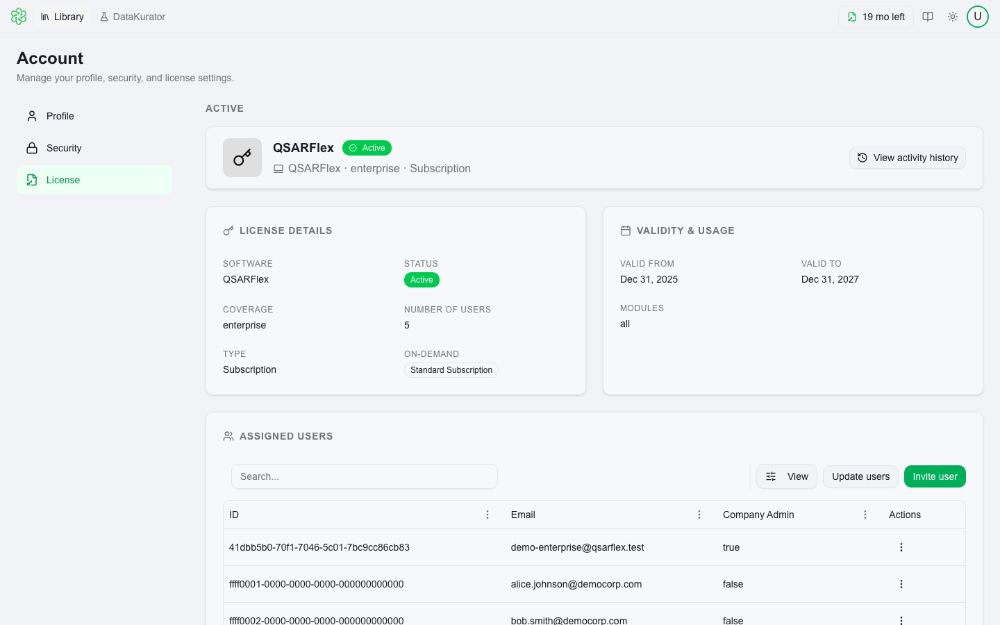
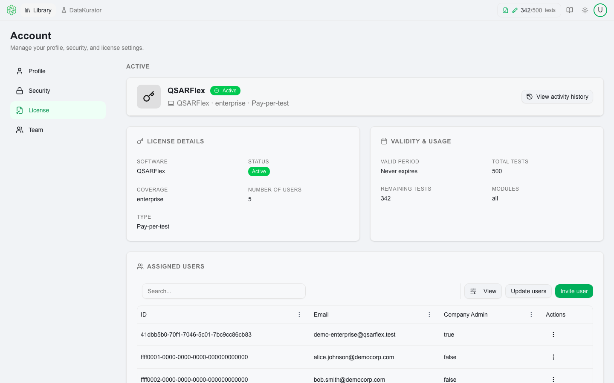
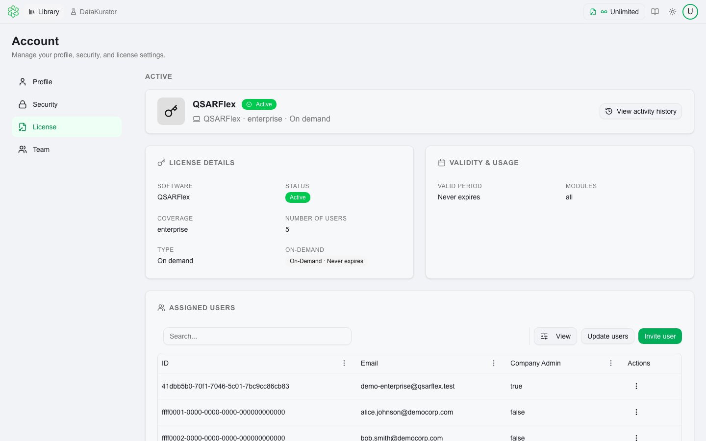
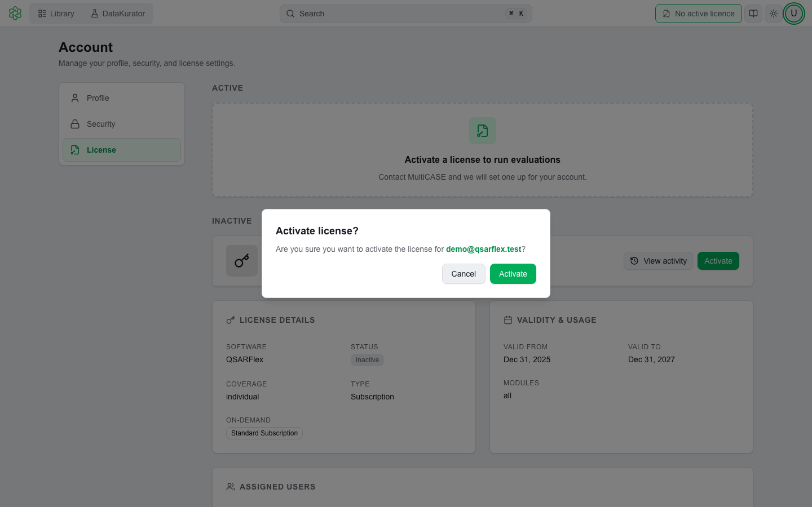

# Access & Licensing

Access to QSAR Flex is controlled by a license issued through the MultiCASE platform. Licenses define who can use the software, which modules they can run, how many evaluations they can run, and for how long.

The licence model itself is unchanged in 4.0. What changed is where you see it. Licensing now lives on the **Account** page, a licence status chip sits permanently in the navbar, and every test run against your licence is recorded in an activity history you can open yourself.

---

## Where licensing lives

Everything about your licence is on the Account page at `/profile`.

Three ways to get there:

- Click your avatar in the top-right of the navbar, then **Profile**.
- Click the **licence status chip** in the navbar. It opens the License tab directly.
- Press **⌘K / Ctrl+K** and run **Account and licence**.

The Account page is headed **Account** — "Manage your profile, security, and license settings." — with a card of tabs down the left:

| Tab | What it holds |
|---|---|
| **Profile** | Your profile photo and display name |
| **Security** | Change password (current, new, confirm) |
| **License** | Your licences, their details, and the link to activity history |
| **Team** | Your company's users — shown to company administrators only |

The tab you are on is in the URL, so `/profile?tab=license` is a link you can bookmark or send to a colleague.


The tab is called **License**. In earlier versions it was "License Information".


---

## The licence status chip

The navbar carries a licence chip on every screen, to the left of the Documentation button. It tells you at a glance whether you can evaluate, and it links to **Profile → License**.

| What the chip shows | What it means |
|---|---|
| A grey placeholder | Still loading. The space is reserved so the navbar does not jump. |
| **Unlimited** with an infinity icon | On-Demand subscription, nothing awaiting billing. |
| **N pending billing** | On-Demand subscription with N tests recorded but not yet invoiced. |
| **N mo left** / **Nd left** | Standard subscription. Months while more than 60 days remain, days below that. |
| **Active** | Standard subscription with no end date recorded. |
| **Expired** | The subscription end date has passed. |
| **123/500 tests** | Pay-per-test. Remaining out of total. It turns amber below 10 remaining. |
| **No active licence** | No active licence on this account. Evaluation needs one. |
| **Licence unavailable** | The licence service could not be reached. Evaluation will not run until it responds. |

Hover the chip for the detail: type and status always; on a pay-per-test licence, remaining tests out of the total; on a standard subscription, the end date. Below 10 remaining tests the tooltip adds a low-tests warning.


**No active licence** and **Licence unavailable** are different problems. The first means the account holds no licence; the second means we could not ask. Neither is caused by anything you did.


---

## License coverage

### Individual

The license is assigned to a single named user. Only that user can sign in and run evaluations under it.

### Enterprise

The license is assigned to a company and covers a configured number of seats. A company administrator manages who fills those seats — inviting users, adjusting roles, and revoking access at any time. At least one assigned user must be a company administrator, and a user can hold only one active seat per product.

Enterprise users who are **not** administrators see the licence in read-only form: a **View only** badge sits beside the status badge on the licence hero, the action buttons are hidden, and a banner reads "Read-only mode: You can view license information but cannot make changes. Contact your company administrator for modifications."

> See [Enterprise User Management](../license-management/enterprise-user-management.md) for details on managing seats and users.

---

## Billing models

### Subscription

Access is granted for a fixed time period. The number of evaluations is unlimited within that window — run as many as you need. A subscription licence is created inactive and has to be activated before you can evaluate.

### On-Demand

A subscription with no fixed end date. It is active as soon as it is issued and never expires. Evaluations are recorded as you run them and invoiced periodically, so usage shows as **pending billing** until the billing run picks it up.

### Pay-per-test

The license has a fixed total test count and no expiry date. It is active as soon as it is issued. Each evaluation consumes tests, and the remaining count is shown both on the License tab and on the navbar chip. When it reaches zero the web app blocks further evaluation until more tests are purchased. The desktop apps do not check the remaining count before a run — the usage is still recorded against the licence.


**How a test is counted.** One test is one item in your library against one **bundle** — not one module. Tests = library items × the number of distinct bundles among the modules you selected. Evaluating 10 compounds against three modules that all belong to the Ecotoxicity bundle consumes 10 tests. Evaluating the same 10 compounds against one Ecotoxicity module and one Physicochemical module consumes 20.


---

## Your license page

Go to **Profile → License**. Licences are grouped under **Active**, **Inactive** and **Expired**; the Inactive and Expired groups appear only when you have licences in them. Expired licences are listed in a compact table rather than as full cards.

Every licence card is built the same way.

**The hero** carries the product name, the status badge (Active, Inactive or Expired), the **View only** badge where it applies, and a line reading *product · coverage · type*. On the right sit the actions: **View activity**, and **Activate** on an inactive subscription.

**License details** shows:

| Field | Notes |
|---|---|
| Software | The licensed product |
| Status | Active, Inactive or Expired |
| Coverage | Individual or Enterprise |
| Number of users | The seat count. Enterprise licences only. |
| Type | Subscription, On demand, or Pay-per-test |
| On-Demand | Subscription licences only — either **On-Demand · Never expires** or **Standard Subscription** |

**Validity & usage** shows the fields that apply to your type:

| Field | Shown for |
|---|---|
| Valid from / Valid to | Standard subscription |
| Valid period — *Never expires* | On-Demand and pay-per-test |
| Total tests | Pay-per-test |
| Remaining tests | Pay-per-test. Turns red at zero. |
| Pending billing | On-Demand, when tests are awaiting invoicing |
| Modules | **all** or **specific** |
| Selected modules | The named modules, listed as chips, when Modules is *specific* |

**Assigned users** lists everyone holding a seat, with columns ID, Email, Company admin and a row menu offering **Edit**. Company administrators also get **Update users** (opens *Edit assigned users*) and **Invite user** (opens *Invite a new user*). On an individual licence the table simply shows you.


If the Pending billing figure could not be fetched it says "Couldn't be loaded" rather than showing zero. A billing number is never guessed.


### Individual licenses

Individual licenses are tied to your account. Only you can sign in and run evaluations under this license.

#### Subscription

<figure><picture><source media="(prefers-color-scheme: dark)" srcset="../.gitbook/assets/profile-license-individual-subscription-dark.png"></picture></figure>

Validity & usage shows a **Valid from** and **Valid to** date. As long as today falls inside that window and the status reads **Active**, you have full access with no cap on how many evaluations you run. When the window closes the status becomes **Expired**, the navbar chip reads *Expired*, and access is suspended until the licence is renewed.

#### Pay-per-test

<figure><picture><source media="(prefers-color-scheme: dark)" srcset="../.gitbook/assets/profile-license-individual-paypertest-dark.png"></picture></figure>

Validity & usage shows **Total tests** and **Remaining tests** against a **Valid period** of *Never expires*. The tests stay in your account until used. Watch the navbar chip — it turns amber below 10 remaining. At zero, Remaining tests turns red and the web app blocks further evaluation until you purchase more.

#### On-Demand

<figure><picture><source media="(prefers-color-scheme: dark)" srcset="../.gitbook/assets/profile-license-individual-ondemand-dark.png"></picture></figure>

The licence never expires and has no test cap, so Validity & usage shows **Valid period — Never expires** and, when there is anything outstanding, **Pending billing**. Everything you run is recorded and invoiced later. Open **View activity** to see exactly which runs are still pending. Ask about a billing period through the support portal at [support.multicase.com](https://support.multicase.com).

---

### Enterprise licenses

Enterprise licenses bill exactly like individual ones — the same three models apply. The difference is that the licence belongs to your company. A seat count controls how many users can be active at once, an administrator manages who those users are, and **Assigned users** lists them.

#### Subscription

<figure><picture><source media="(prefers-color-scheme: dark)" srcset="../.gitbook/assets/profile-license-enterprise-subscription-dark.png"></picture></figure>

The **Valid from** / **Valid to** window applies to everyone on the licence at once. When it closes, everyone loses access together, so arrange renewal before the end date.

#### Pay-per-test

<figure><picture><source media="(prefers-color-scheme: dark)" srcset="../.gitbook/assets/profile-license-enterprise-paypertest-dark.png"></picture></figure>

The test bank is shared. Every evaluation run by any assigned user draws from the same **Remaining tests** figure, and every assigned user sees the same number on their navbar chip. **View activity** breaks the usage down per user.

#### On-Demand

<figure><picture><source media="(prefers-color-scheme: dark)" srcset="../.gitbook/assets/profile-license-enterprise-ondemand-dark.png"></picture></figure>

Usage is recorded across all assigned users and invoiced collectively. **Pending billing** is the combined figure for the whole team.

> For managing users, inviting new team members, and adjusting seat assignments, see [Enterprise User Management](../license-management/enterprise-user-management.md).

---

## Activating a license

Pay-per-test and On-Demand licences are active as soon as MultiCASE issues them. A standard subscription arrives with status **Inactive** and an **Activate** button on its hero — you activate it yourself, and no licence key is involved.

1. Go to **Profile → License**.
2. Find the licence under **Inactive** and click **Activate**.
3. Confirm in the **Activate license?** dialog.

<figure><picture><source media="(prefers-color-scheme: dark)" srcset="../.gitbook/assets/license-activate-dark.png"></picture></figure>

The button shows *Activating…* while the request is in flight, then the licence moves to **Active** and you can evaluate. On an enterprise licence, only a company administrator can activate.

If the License tab shows **Get a license to start evaluating**, your account has not been provisioned yet. Raise it at [support.multicase.com](https://support.multicase.com).


If the tab instead reads **Couldn't load your licenses**, it says why underneath: "We couldn't reach the licensing service. Your licenses are unaffected — this is a display problem." Nothing has happened to your licences. Use **Retry**.


---

## Licence activity and usage history

Every evaluation writes a usage record against the licence it ran under. Click **View activity** on any licence hero to open **License activity** — "Every test run against this license, and whether it has been billed."

| Column | What it shows |
|---|---|
| **ID** | The activity record. Click it to open the full detail. |
| **User** | The email address of the person who ran the evaluation |
| **License** | The licence the run was charged to |
| **Tests used** | Tests consumed by that run |
| **Modules used** | How many modules were selected |
| **Activity time** | When the run was recorded |
| **Billed** | **Billed** or **Pending** |
| **Invoice reference** | The invoice the run appears on, once one exists |

**Billed** and **Pending** mean this:

- **Billed** — the run has been accounted for. Pay-per-test runs are billed immediately and decrement your remaining tests; standard subscription runs are billed immediately too, since the subscription itself is what you paid for.
- **Pending** — an On-Demand run that has been recorded but not yet invoiced. The periodic billing run flips it to Billed and fills in the invoice reference.

Clicking a row ID opens **Activity detail** — "A single recorded use of this license." — with the user, the licence, the tests used, the named modules, the activity time, the billing status and the invoice reference.

Before anything has been run, the page reads "Activity appears here after the first test".

> The full walkthrough, including what administrators can see across a team, is in [License Activity](../license-management/license-activity.md).


Usage follows the licence, not the person. Moving a user between seats or companies does not move their past activity records off the licence they ran under.


---

## Module bundles

Modules are sold in bundles — purchasing a bundle unlocks every endpoint within it. Your licence either covers **all** modules or a **specific** list, and that list is shown under Modules on the License tab.

| Bundle | Includes |
|---|---|
| 🔴 **Nitrosamine** | CPCA Prediction, Surrogate Search, N-Nitrosation, Cross Similarity |
| 🌿 **Ecotoxicity** | Fathead Minnow 96h LC50, Daphnia 48h LC50, Tetrahymena 48h GC50, Algae 72h EC50, Bio Concentration Factor, Ready Biodegradability, Soil Adsorption |
| 💧 **Physicochemical** | LogP, Water Solubility, Vapor Pressure, Boiling Point |
| 🧬 **Genotoxicity** | Ames Mutagencity *(the app spells it this way)* |
| 💊 **ADME** | Oral Bioavailability |

The Oral Bioavailability report also covers metabolic stability, CYP3A4 / CYP2D6 / CYP2C9 substrate potential, MDR1 (P-gp) substrate potential, formulation sensitivity and a BCS class. Those are sections of one module, not separately licensed ones.

See the full [Model Catalog](model-catalog.md) for record counts, platform availability and a description of each endpoint.

Bundles matter for two reasons: they are what a pay-per-test evaluation is priced by, and they are how the **Select Modules to Evaluate** dialog is grouped. Modules your licence does not cover appear in that dialog but cannot be ticked.

To add a bundle, raise a request at [support.multicase.com](https://support.multicase.com).

---

## When evaluation is blocked

The **Select Modules to Evaluate** dialog is explicit about which of three things went wrong:

| Message | What it means |
|---|---|
| "The module catalogue could not be loaded, so there is nothing to evaluate against." | The catalogue did not arrive. Check your connection and reopen the dialog. |
| "Your licensed modules could not be checked right now… This is not a licence problem — try again shortly." | Your entitlements could not be read. Your licence is fine. |
| "No license found / License not activated" | The account genuinely holds no active licence. |

Cancelling a run mid-flight reports "Evaluation cancelled. Your library is unchanged; tests already started may still be billed." Tests already in progress are not refunded by cancelling.

Curation is not metered. DataKurator does not consume tests and does not need an active licence — only evaluation and report generation do.

---

## Desktop application downloads

The desktop applications are available to all licensed users, on Windows and on macOS (Apple Silicon, macOS 12 or later). Both check for an active licence at launch and will not start without one.

Both builds run the prediction models on your workstation. What separates them is where the reference database lives.

**QSAR Flex Local** — the reference database lives on the machine. On first run the app downloads an encrypted copy of roughly 4 GB. The structures you evaluate never leave the workstation, but the variant is **not** usable offline: an internet connection is needed for sign-in and the licence check at every launch, and for the entitlement check that runs each time you open the module picker.

- [⬇️ Download QSAR Flex Local for Windows](https://downloads.multicase.com/qsarflex/local/QSARFlex-Local-Installer.exe)
- [⬇️ Download QSAR Flex Local for macOS](https://downloads.multicase.com/qsarflex/mac/local/QSARFlex-Local-Installer.dmg)

**QSAR Flex Cloud** — evaluation still runs on your machine, but the reference database does not. There is no 4 GB download; instead the app queries a MultiCASE-hosted PostgreSQL database at `central-db.multicase.com` over TCP port 5432 as it works. Some of those lookups send the structure being evaluated as a canonical SMILES, so structures do leave the machine on this build. An active licence and a connection are needed throughout use.

- [⬇️ Download QSAR Flex Cloud for Windows](https://downloads.multicase.com/qsarflex/cloud/QSARFlex-Cloud-Installer.exe)
- [⬇️ Download QSAR Flex Cloud for macOS](https://downloads.multicase.com/qsarflex/mac/cloud/QSARFlex-Cloud-Installer.dmg)


The web application sends your structures to the QSAR Flex service at `qsarflex-be.multicase.com` — for evaluation, report generation, structure depiction and DataKurator curation. They are not persisted after the request. If your structures must stay on your own hardware, **QSAR Flex Local** is the only build that keeps them there.


The Windows app installs per user, into your own account rather than machine-wide. Both apps check for application and reference-data updates when they start and every 15 minutes after that, and offer the update in a dialog when one is available.

Usage from the desktop apps is recorded against the same licence and appears in the same activity history as usage from the web app.

See [Installing on Windows](../install-win.md) and [Installing on macOS](../install-mac.md) for step-by-step guides.

---

> 📬 **Need a licence, more tests, another bundle, or extra seats?** Raise a request at [support.multicase.com](https://support.multicase.com). Sign in with the same MultiCASE account you use for QSAR Flex.
