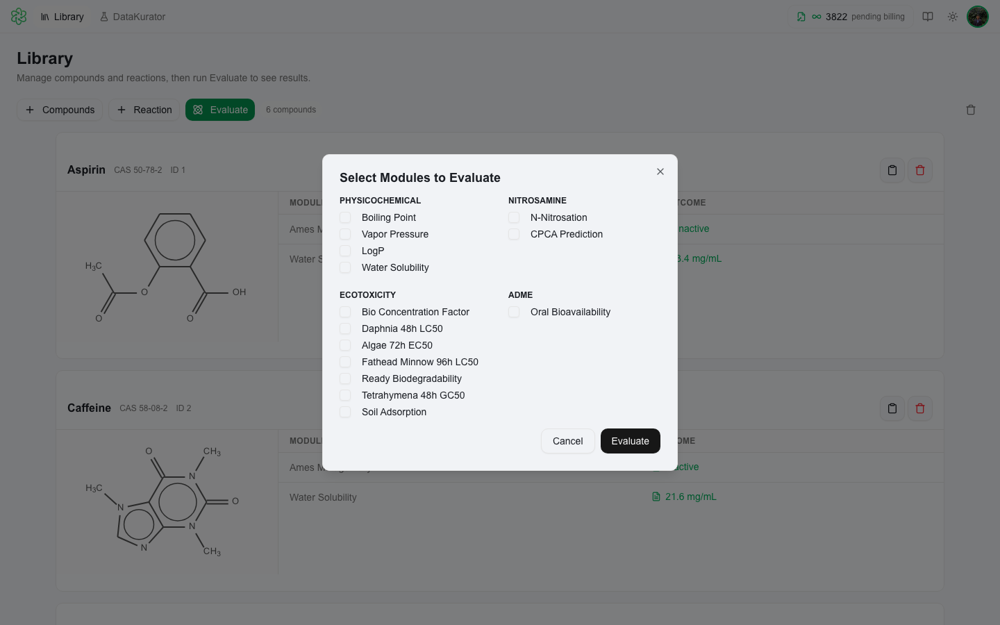

# Model Catalog

The QSAR Flex model catalog lists all available prediction endpoints organized by license bundle. Modules are licensed in bundles — purchasing a bundle unlocks all endpoints within it. Contact [support@multicase.com](mailto:support@multicase.com) to add bundles to your account.

---

## 🔴 Nitrosamine Bundle

For N-nitrosamine impurity assessment (NDSRIs and related compounds). Covers ICH M7 / EMA CPCA workflows.

| Module | Records | Platform | Description |
|---|---|---|---|
| **CPCA Prediction** | 209 NDSRIs (AI = 577) | Web + Desktop | Carcinogenicity Potency Categorization Approach (CPCA) for N-nitrosamines. Assigns NDSRIs to an AI potency category following ICH M7 and EMA guidance, with reasoning based on structural alerts and potency analogues. |
| **Surrogate Search** | 194 | Desktop only | Analog-based read-across using nitrosamine local environment similarity measure. Finds N-nitrosamine surrogates with available animal carcinogenicity data for read-across and AI derivation. |
| **N-Nitrosation Tool** | 1,238 | Web + Desktop | Nitrosation assessment for both individual compounds and synthetic routes. Predicts whether a compound is susceptible to nitrosation — i.e., can form an N-nitrosamine impurity under relevant pharmaceutical manufacturing conditions. |
| **Cross Similarity** | — | Desktop only | Generates a full N×N structural similarity matrix across your entire compound library using fingerprint-based comparison. Useful for grouping NDSRIs by structural class. |

---

## 🌿 Ecotoxicity Bundle

Evaluate various characteristics of adverse impact on the natural environment.

| Module | Records | Platform | Description |
|---|---|---|---|
| **Fathead Minnow 96h LC50** | 920 | Web + Desktop | Acute toxicity to *Pimephales promelas* (96 hrs. of exposure). Predicts the 96-hour lethal concentration for the standard vertebrate aquatic toxicity endpoint. |
| **Daphnia 48h LC50** | 2,124 | Web + Desktop | Acute toxicity to *Daphnia magna* (48 hrs. of exposure). Predicts the 48-hour lethal concentration for the standard freshwater invertebrate ecotoxicity test organism. |
| **Tetrahymena 48h GC50** | 1,898 | Web + Desktop | Acute toxicity to *Tetrahymena pyriformis* (48 hrs. of exposure). Predicts the 48-hour growth concentration causing 50% inhibition. |
| **Algae 72h EC50** | 1,377 | Web + Desktop | Acute toxicity to various algae (72 hrs. of exposure). Predicts the 72-hour effect concentration for algal growth inhibition — required for EU environmental classification. |
| **Bio Concentration Factor** | 563 | Web + Desktop | Ratio of concentration of contaminant in organism to surrounding water. Predicts how readily a compound accumulates in aquatic organisms relative to the ambient water concentration. |
| **Ready Biodegradability** | 1,443 | Web + Desktop | Aerobic biodegradation potential of a chemical substance within 28 days, as per OECD Test 301. |
| **Soil Adsorption** | 651 | Web + Desktop | The organic carbon-sorption coefficient (Koc). Predicts the organic carbon-normalized soil adsorption coefficient for terrestrial environmental fate modeling. |

---

## 💧 Physicochemical Bundle

Evaluate critical components of a chemical's physicochemical characteristics relevant to formulation, bioavailability, and environmental fate.

| Module | Records | Platform | Description |
|---|---|---|---|
| **LogP** | 12,645 | Web + Desktop | Octanol-water partition coefficient — a key indicator of lipophilicity, membrane permeability, and environmental partitioning. |
| **Water Solubility** | 3,800 | Web + Desktop | Water solubility at 25°C — relevant to bioavailability, formulation, and environmental fate modeling. |
| **Vapor Pressure** | 1,829 | Web + Desktop | Vapor pressure at 25°C — relevant for inhalation exposure assessments and environmental volatility. |
| **Boiling Point** | 4,890 | Web + Desktop | Boiling points of organic compounds, predicted using group contribution and QSAR approaches. |

---

## 🧬 Genotoxicity Bundle

Genotoxicity hazard endpoints required for ICH M7 and standard safety evaluation packages.

| Module | Platform | Description |
|---|---|---|
| **Ames Mutagenicity** | Web + Desktop | Predicts bacterial reverse mutation (Ames test) outcome. A primary endpoint in ICH M7 and pharmaceutical genotoxicity assessments. |

---

## 💊 ADME Bundle

Evaluate the extent to which a chemical is systemically available following oral exposure, and assess key metabolic and transport liabilities.

| Module | Records | Platform | Description |
|---|---|---|---|
| **Bioavailability Experimental Database** | 1,594 | Web + Desktop | Reference dataset of experimentally measured oral bioavailability values. Used as ground truth for analog-based and QSAR predictions. |
| **Bioavailability Analog-based Prediction** | 1,594 | Web + Desktop | Analog-based read-across to predict oral bioavailability by structural similarity to compounds with known experimental values. |
| **Bioavailability QSAR Model** | 1,594 | Web + Desktop | QSAR model to predict the fraction of an orally administered dose that reaches systemic circulation — a key early-stage drug development filter. |
| **Human Liver Microsomal Metabolism** | 4,637 | Web + Desktop | Predicts likelihood of rapid metabolic degradation in human liver microsomes. |
| **CYP3A4 Substrate Potential** | 2,601 | Web + Desktop | Predicts likelihood that the compound is a substrate for the major human cytochrome P450 enzyme CYP3A4. |
| **CYP2D6 Substrate Potential** | 2,249 | Web + Desktop | Predicts likelihood that the compound is a substrate for the major human cytochrome P450 enzyme CYP2D6. |
| **CYP2C9 Substrate Potential** | 2,209 | Web + Desktop | Predicts likelihood that the compound is a substrate for the major human cytochrome P450 enzyme CYP2C9. |
| **MDR1 (P-gp) Substrate Potential** | 539 | Web + Desktop | Predicts likelihood that the compound functions as a substrate for key solute carrier (SLC) and ATP-binding cassette (ABC) transporters, including MDR1 P-glycoprotein. |

---

## 🔍 Checking Your Active Modules

After signing in, go to **Profile → License Information** to see which bundles and modules are active on your account. Modules you are not licensed for appear grayed out in the Evaluate dialog.

If you need to add a bundle, contact [support@multicase.com](mailto:support@multicase.com).
