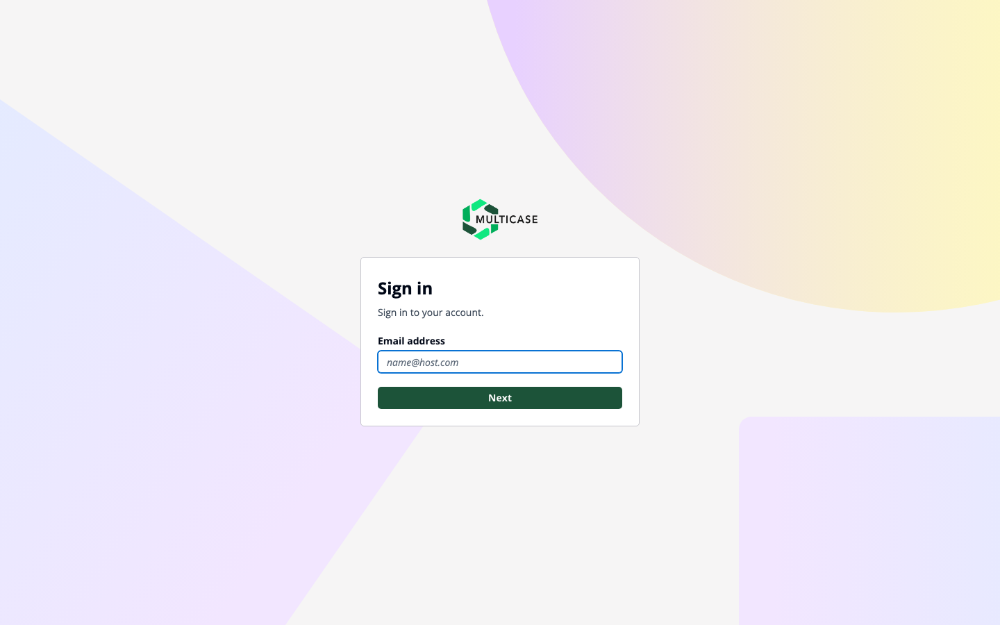
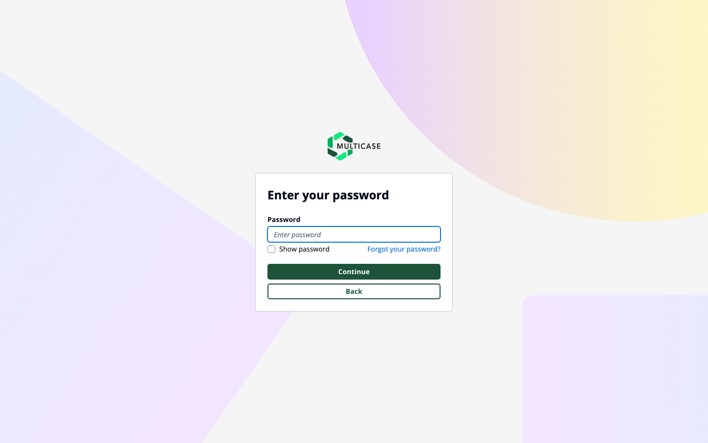

# Getting Started

QSAR Flex is available as a **web application** and a **Windows desktop application**. Both share the same interface and features.

---

## 1. 🔐 Log In

**Web:** Go to [qsarflex.com](https://qsarflex.com) and click **Sign in with Cognito** to authenticate with your MultiCASE account.

Clicking the button redirects you to the MultiCASE Cognito-hosted login page. Enter your email address first, then your password on the next screen.

**Desktop:** Open the installed app — it opens directly to the signed-in interface. The Local variant runs evaluation on-device; both variants require internet for license verification and authentication.

> Don't have an account? See [Access & Licensing](fundamentals/access-and-licensing.md) or email [support@multicase.com](mailto:support@multicase.com).

---

## 2. ➕ Add Compounds

Click **+ Compounds** in the Library toolbar to open the compound input dialog.

**Single compound** — enter a name, CAS number, or SMILES. Use **Auto Fill** to look up missing details from PubChem automatically.

**Batch upload** — switch to the **Batch** tab and upload an SDF, SMILES (`.smi`), CSV, or TXT file to load multiple compounds at once.

Compounds appear in your Library. Add as many as you need before evaluating.

---

## 3. 🔬 Evaluate

Click the green **Evaluate** button in the Library toolbar. A dialog opens to select the prediction modules licensed to you.

Check the modules you want to run and click **Evaluate**. Results appear in the Library for each compound.

Click any result value to generate and view a full HTML report for that compound and module.

---

## What's Next

- [Loading Compounds](product-guide/loading-compounds.md) — all supported file formats and autofill details
- [Loading Reactions](loading-reactions.md) — submit reaction SMILES and RXN files
- [DataKurator](datakurator.md) — clean and validate your dataset before evaluation
- [Evaluation](evaluation.md) — module selection, results, and report generation
- [License Management](license-management/enterprise-user-management.md) — manage users and license seats
