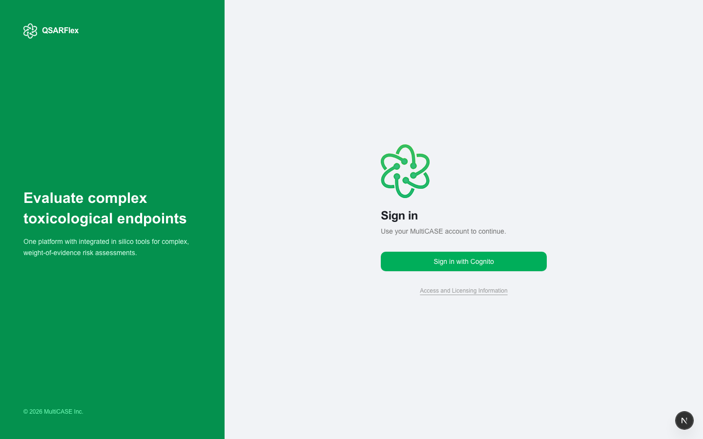

# Getting Started

QSAR Flex is available as a **web application** and a **Windows desktop application**. Both share the same interface and features.

---

## 1. Log In

**Web:** Go to [qsarflex.com](https://qsarflex.com) and click **Sign in with Cognito** to authenticate with your MultiCASE account.

**Desktop:** Open the installed app — it opens with the same interface and works fully offline.

> Don't have an account? See [Access & Licensing](fundamentals/access-and-licensing.md) or email [support@multicase.com](mailto:support@multicase.com).

---

## 2. Add Compounds

Click **+ Compound** in the Library toolbar to open the compound dialog.

**Single compound** — enter a name, CAS number, or SMILES. Use **Autofill** to look up missing details automatically.

**Batch upload** — switch to the **Batch** tab and upload an SDF, SMILES (.smi), CSV, or TXT file to load multiple compounds at once.

Compounds appear in your Library. Add as many as you need before evaluating.

---

## 3. Evaluate

Click the green **Evaluate** button in the Library toolbar. A dialog opens to select the prediction modules licensed to you.

Click **Evaluate** — results appear in the Library table for each compound, one column per module.

Click any result cell to generate and view a full HTML report for that compound and module.

---

## What's Next

- [Loading Compounds](product-guide/loading-compounds.md) — all supported file formats and autofill details
- [DataKurator](datakurator.md) — clean and validate your dataset before evaluation
- [Evaluation](evaluation.md) — module selection, results, and report generation
- [Loading Reactions](loading-reactions.md) — submit reaction files for analysis
