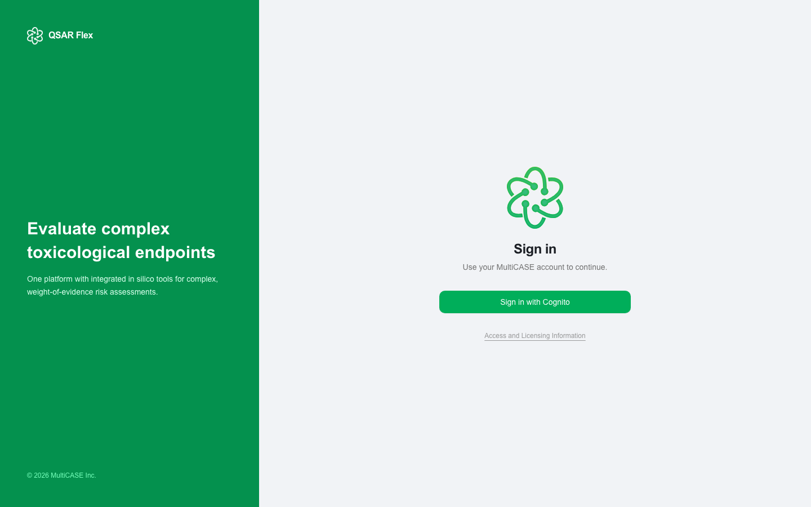
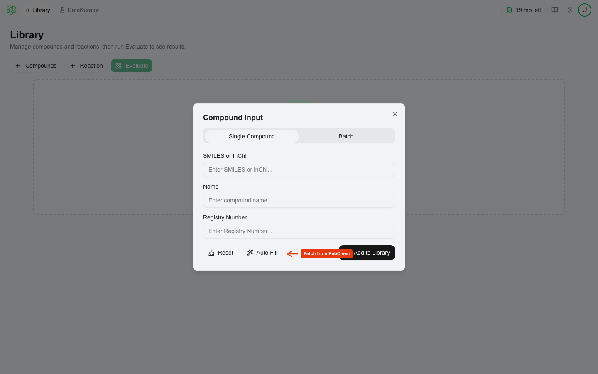
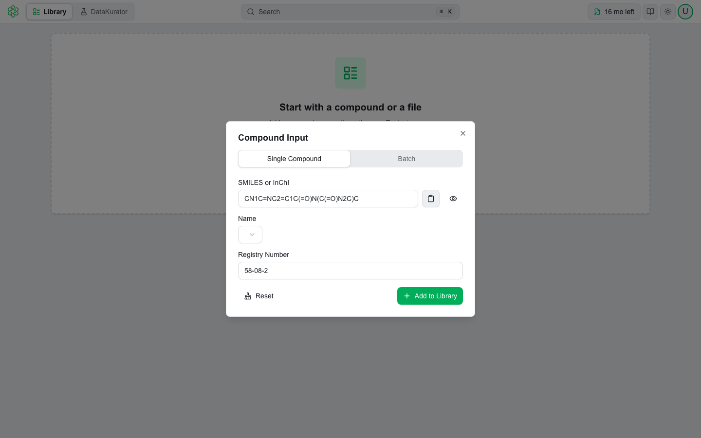
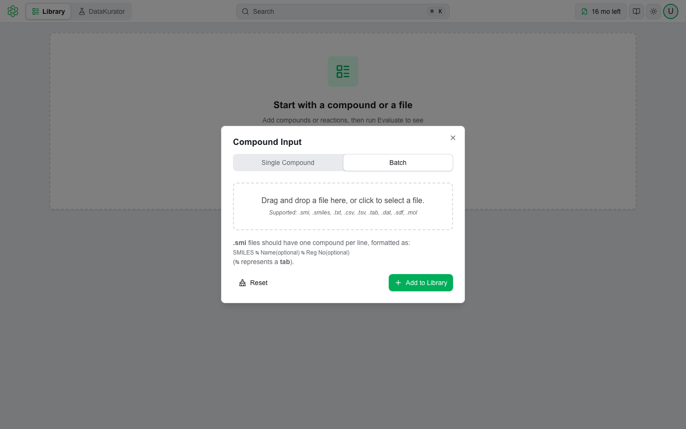
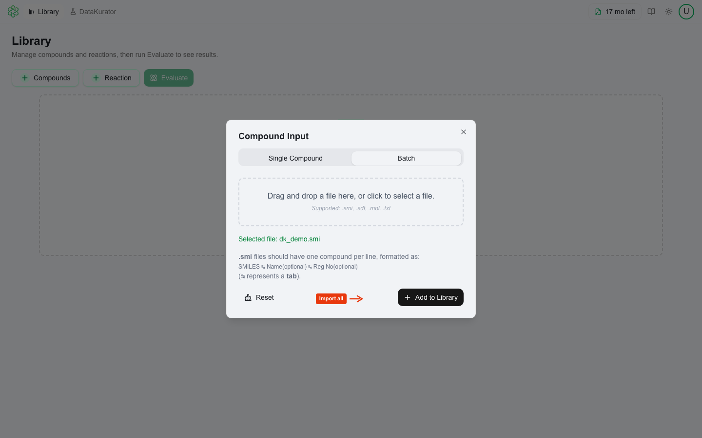
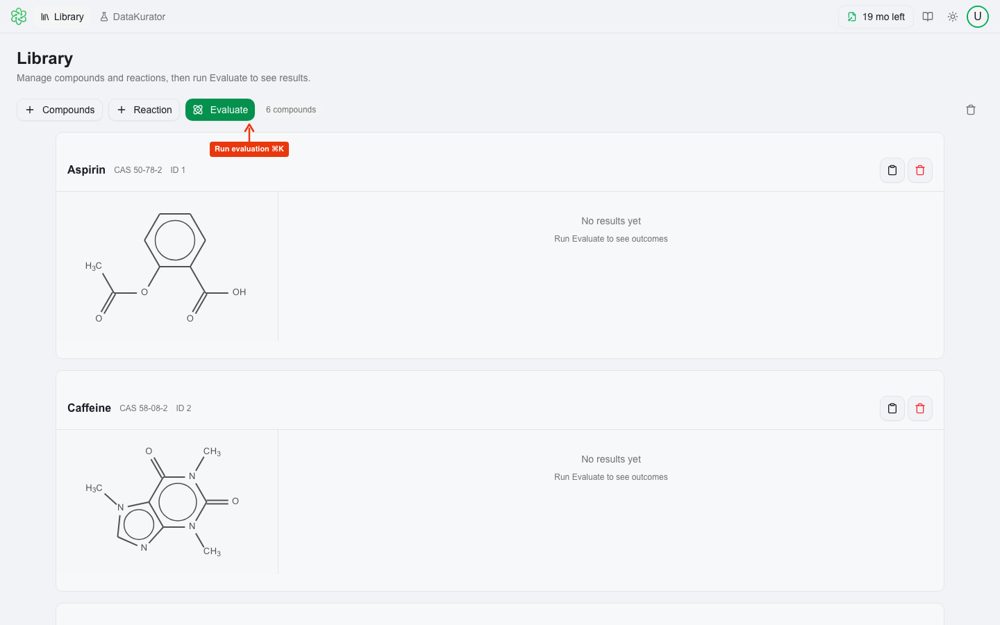
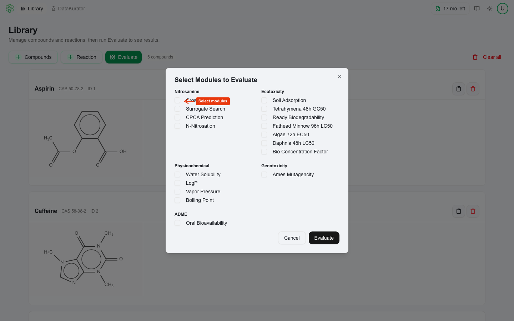
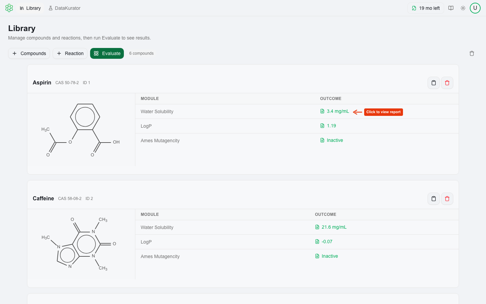
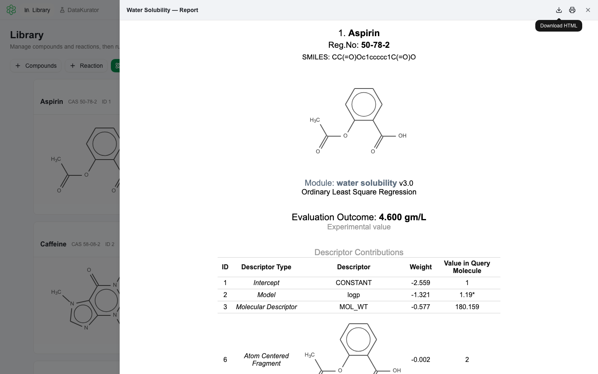

# Getting Started

QSAR Flex is available as a **web application** and as a **desktop application** for Windows and macOS. All three share the same interface and the same workflow: sign in, add compounds, run **Evaluate**, open a report.

---

## 1. 🔐 Sign In

**Web:** Go to [qsarflex.multicase.com](https://qsarflex.multicase.com). The sign-in page asks you to *Use your MultiCASE account to continue* — click **Sign in with Cognito** and you are taken to MultiCASE Accounts at `auth.multicase.com` to enter your credentials.

<figure><picture>
  <source media="(prefers-color-scheme: dark)" srcset=".gitbook/assets/signin-dark.png">
  
</picture></figure>

The same MultiCASE account signs you in to QSAR Flex, to the desktop app and to the support portal.

**Desktop:** Install the app and launch it. Sign-in opens in your default browser and hands you back to the app when it finishes, so the desktop app needs a network connection at every launch.

- 💻 Windows — see [Installing on Windows](install-win.md) for the installer
- 🍎 macOS (Apple Silicon) — see [Installing on macOS](install-mac.md) for the installer

The **desktop app** runs the prediction models on your own machine, and the reference database sits there too: it downloads on first launch — an encrypted file of about 4 GB — and stays on disk. The model files download on first launch as well, and the app needs internet for sign-in and license verification.

The **desktop app** keeps the structures you evaluate on your own machine. In the **web application**, structures go to the QSAR Flex service at `qsarflex-be.multicase.com` for evaluation, report generation, structure depiction and DataKurator curation. They are not persisted after the request.

Two steps reach a third party on either deployment, the desktop app included. **Auto Fill** sends the name, CAS number or SMILES you typed to PubChem at NCBI to look up the rest. DataKurator's *Verify structures against PubChem* sends names, CAS numbers and SMILES there as well. You have to ask for both, and DataKurator asks you to confirm before it runs. On the desktop these are the only steps that send your structures anywhere. Sign-in, the license check at launch, a usage record per evaluation and update checks still reach MultiCASE — none of them carries a structure.


Don't have an account yet, or need a license? See [Access & Licensing](fundamentals/access-and-licensing.md), or raise a request at [support.multicase.com](https://support.multicase.com).


---

## 2. ➕ Add Compounds

A brand-new account opens on an empty Library. There is no toolbar yet — the page shows a single card headed **Start with a compound or a file**, with two buttons: **Add Compounds** and **Add Reaction**. Under them is the line *You can also drop files here, or paste SMILES with ⌘ V.* — on Windows the same line reads *Ctrl + V*.

The **+ Compounds**, **+ Reaction**, **Evaluate** and **Clear all** toolbar appears above your items as soon as the Library has something in it. From then on, use that toolbar to add more.

Click **Add Compounds** to open the **Compound Input** dialog.

**Single compound** — the **Single Compound** tab has three fields: *SMILES or InChI*, *Name* and *Registry Number*. Fill in whichever you know and click **Auto Fill** to look up the rest from PubChem, then **Add to Library**.

<figure><picture>
  <source media="(prefers-color-scheme: dark)" srcset=".gitbook/assets/add-compound-dark.png">
  
</picture></figure>
<figure><picture>
  <source media="(prefers-color-scheme: dark)" srcset=".gitbook/assets/add-compound-autofill-dark.png">
  
</picture></figure>

**Batch upload** — switch to the **Batch** tab and drop in one structure file to load many compounds at once. Supported extensions are `.smi`, `.smiles`, `.txt`, `.csv`, `.tsv`, `.tab`, `.dat`, `.sdf` and `.mol`. A `.smi` file takes one compound per line, formatted `SMILES ↹ Name(optional) ↹ Reg No(optional)`.

<figure><picture>
  <source media="(prefers-color-scheme: dark)" srcset=".gitbook/assets/batch-upload-dark.png">
  
</picture></figure>
<figure><picture>
  <source media="(prefers-color-scheme: dark)" srcset=".gitbook/assets/batch-upload-with-file-dark.png">
  
</picture></figure>

**Drop or paste instead** — you do not have to open a dialog at all. Drop files anywhere on the Library page, or paste SMILES from the clipboard. Files are sorted by extension, so compound files and `.rxn` reaction files can be dropped together and each goes to the right importer; anything unsupported is called out in a message.

Compounds appear in the Library as cards, each with its structure beside a results pane reading *Ready to evaluate* / *Run Evaluate to see outcomes*. The **Module / Outcome** table takes over that pane once a run has produced results. Add as many as you need before evaluating.

<figure><picture>
  <source media="(prefers-color-scheme: dark)" srcset=".gitbook/assets/library-compounds-dark.png">
  
</picture></figure>


If any compound fails curation on the way in, a **Curation issues detected** dialog tells you how many are affected and offers **Add Anyway** or **Fix in DataKurator**, which hands the whole set to [DataKurator](datakurator.md) for cleaning.


---

## 3. 🔬 Evaluate

Click the green **Evaluate** button in the Library toolbar. The **Select Modules to Evaluate** dialog opens, listing modules grouped by bundle. Only modules your license covers can be selected, and you must select at least one.

<figure><picture>
  <source media="(prefers-color-scheme: dark)" srcset=".gitbook/assets/evaluate-dialog-dark.png">
  
</picture></figure>

Check the modules you want and click **Evaluate**. A progress overlay covers the page while the run proceeds, and you can cancel it. Results then fill the **Module / Outcome** table on every card.

<figure><picture>
  <source media="(prefers-color-scheme: dark)" srcset=".gitbook/assets/eval-results-dark.png">
  
</picture></figure>

Click any outcome value to generate the full report for that compound and module. It opens in a panel on the right titled *&lt;module&gt; — Report*, with two icon buttons in its toolbar — a download icon (**Download HTML**) and a printer icon (**Print / Save as PDF**).

<figure><picture>
  <source media="(prefers-color-scheme: dark)" srcset=".gitbook/assets/eval-report-dark.png">
  
</picture></figure>


Reports are HTML. **Download HTML** saves the report as a single self-contained file; there is no direct PDF export — use **Print / Save as PDF** and choose *Save as PDF* in your browser's print dialog.


---

## Two things worth knowing early

- **⌘K / Ctrl+K opens the command bar**, not the Evaluate dialog. It finds any action by name — *Add compounds*, *Evaluate*, *Clear the library*, *Export curated structures*, *Sign out* — from any page, and tells you where each one lives.
- **The Documentation button** in the top right of the navbar opens these docs in a new tab.

---

## What's Next

- [Loading Compounds](product-guide/loading-compounds.md) — all supported file formats and autofill details
- [Loading Reactions](loading-reactions.md) — submit reaction SMILES and RXN files
- [DataKurator](datakurator.md) — clean and validate your dataset before evaluation
- [Evaluation](evaluation.md) — module selection, results, and report generation
- [License Management](license-management/enterprise-user-management.md) — manage users and license seats
- [Getting Support](support.md) — how to reach us through [support.multicase.com](https://support.multicase.com)
