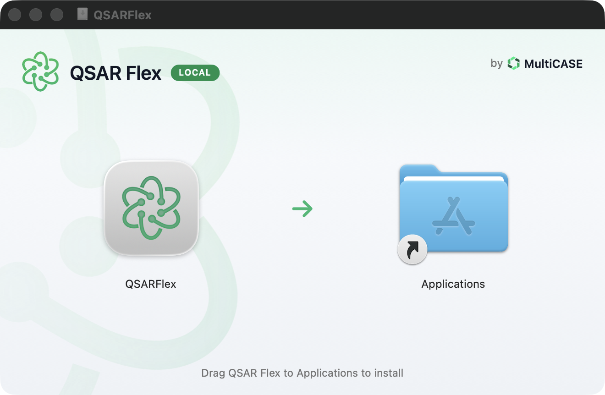
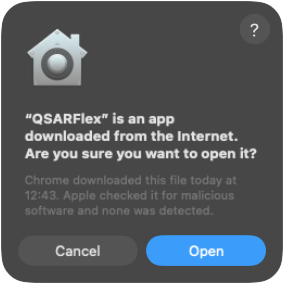
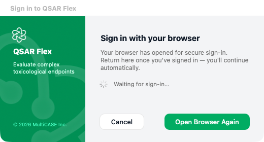
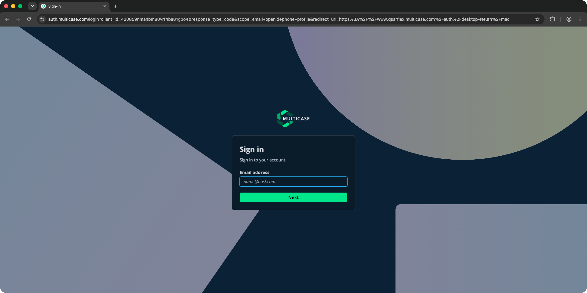
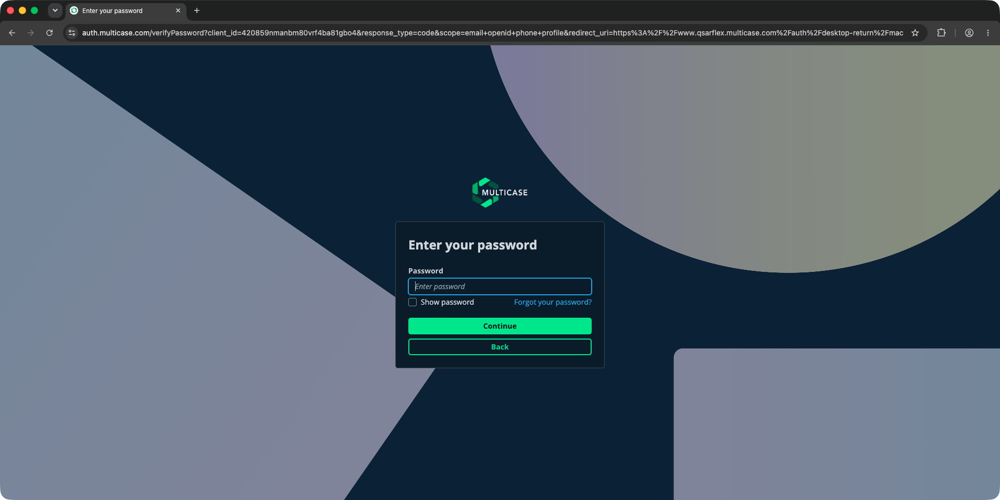
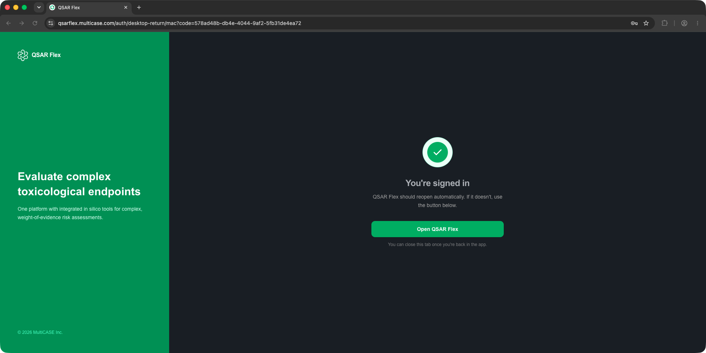
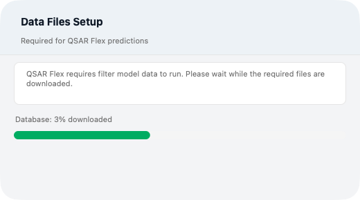
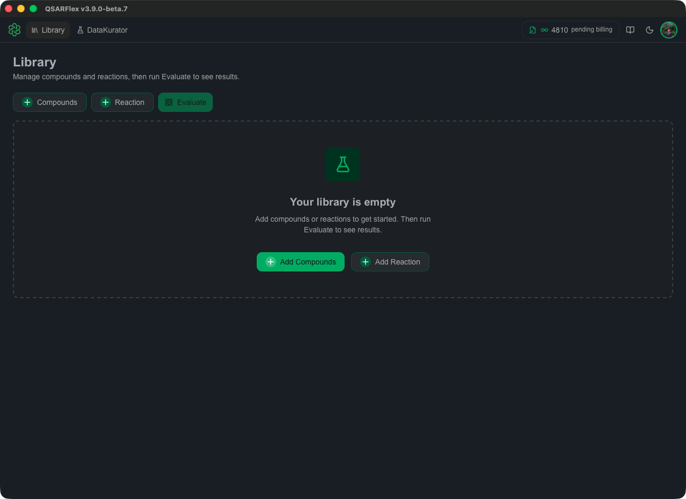

# Installing on macOS

This guide walks through installing the QSAR Flex desktop application on macOS — from download to your first sign-in.

> Installation does not require administrator rights, and QSAR Flex updates itself automatically when new versions are released.

---

## 1 — Download the installer

Download the macOS installer. It arrives as `QSARFlex-Local-Installer.dmg`.

[⬇️ Download QSAR Flex for macOS](https://downloads.multicase.com/qsarflex/mac/local/QSARFlex-Local-Installer.dmg)

---

## 2 — Drag QSAR Flex to Applications

Open the downloaded `.dmg`. In the window that appears, drag the **QSAR Flex** icon onto the **Applications** folder.

<figure></figure>

Once it copies, you can eject the installer disk image.

---

## 3 — Open QSAR Flex

Launch QSAR Flex from your **Applications** folder (or Launchpad). The first time you open it, macOS confirms it was downloaded from the internet — click **Open**.

<figure></figure>

> This prompt appears only on the first launch. QSAR Flex is notarized by Apple, so macOS has already checked it for malicious software.

---

## 4 — Sign in

QSAR Flex signs you in through your web browser, so your saved passwords and password manager work as usual. When this window appears, your default browser opens the sign-in page automatically.

<figure></figure>

In the browser, enter your email address and click **Next**.

<figure></figure>

Then enter your password and click **Continue**.

<figure></figure>

After signing in, allow the browser to open QSAR Flex when prompted — the app picks up your session automatically and you can close the browser tab.

<figure></figure>

> 💡 **Don't have an account?** Contact [info@multicase.com](mailto:info@multicase.com) to request access.

---

## 5 — One-time data setup

On first sign-in, QSAR Flex downloads the reference data used for predictions. This is a one-time setup and can take a few minutes depending on your connection — later launches skip this step.

<figure></figure>

---

## 6 — You're ready

When setup finishes, the main QSAR Flex workspace opens. You can now load compounds and run evaluations.

<figure></figure>

Next, head to [Getting Started](getting-started.md) to run your first evaluation.
