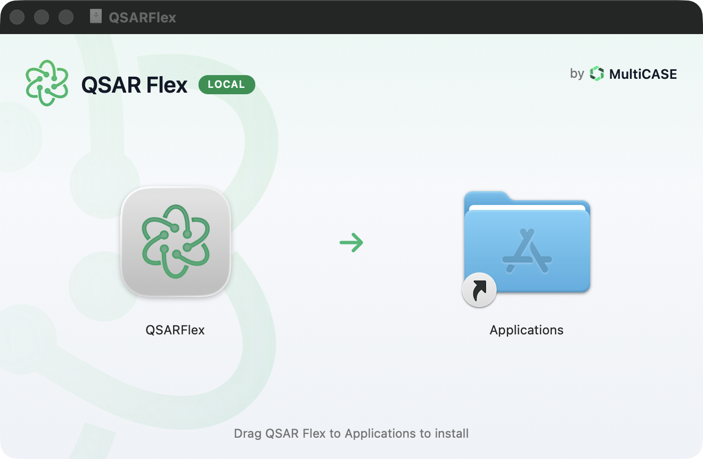
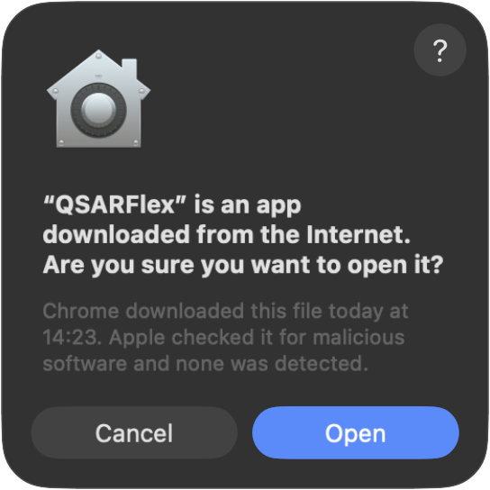
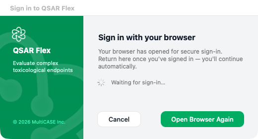
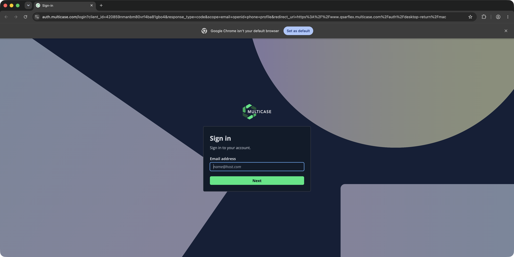
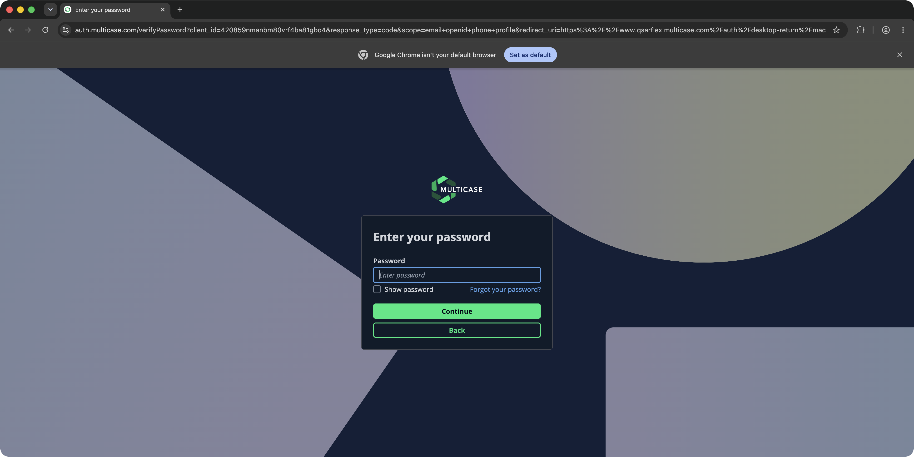
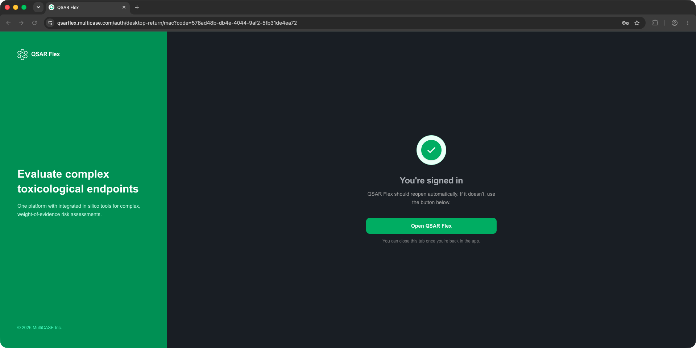
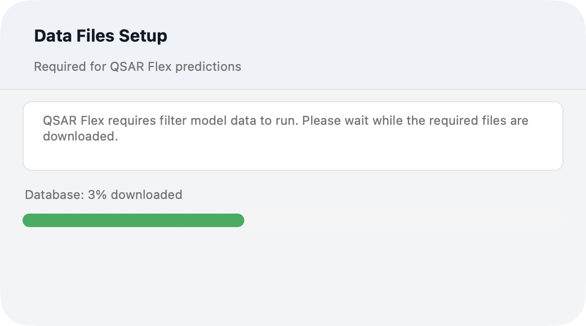
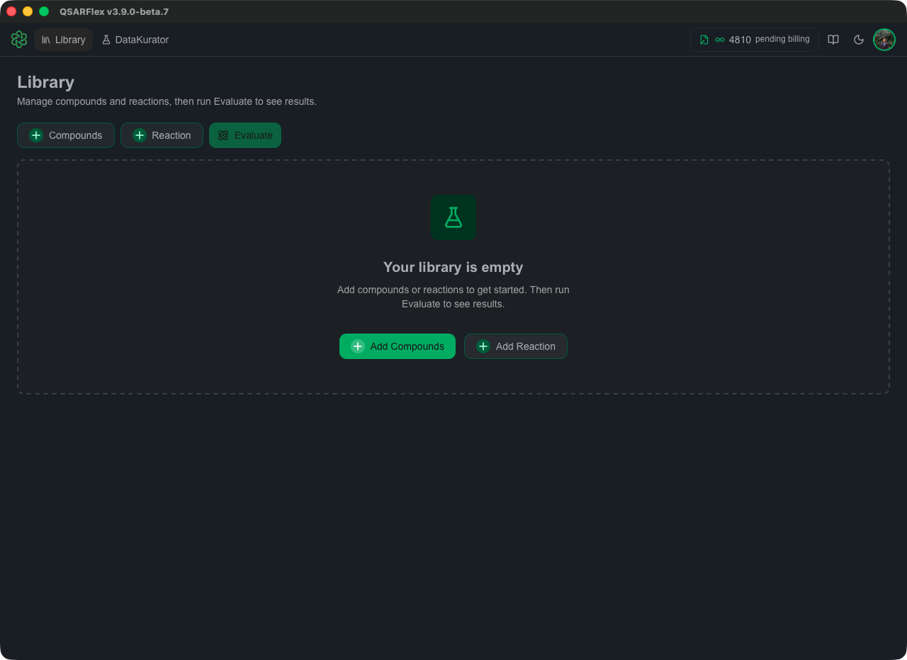

# Installing on macOS

This guide walks through installing the QSAR Flex desktop application on macOS — from download to your first evaluation.


**Before you start**

- **macOS 12 (Monterey) or later.**
- **Apple Silicon (arm64).** The macOS build ships for Apple Silicon only — there is no Intel or universal build.
- **An internet connection at every launch.** QSAR Flex signs you in and checks your license each time it starts.
- **About 4 GB of free disk space** for the reference database.


---

## 1 — Download QSAR Flex

QSAR Flex for macOS runs the prediction models on your own Mac. On first launch it downloads its
model files and reference database — about 4 GB — and stores them encrypted on disk. After that,
evaluation reads the reference data locally.

- 💻 [QSAR Flex for macOS (.dmg)](https://downloads.multicase.com/qsarflex/mac/local/QSARFlex-Local-Installer.dmg) — `QSARFlex-Local-Installer.dmg`


The prediction itself is computed by the app on your Mac, against reference data on your own disk.
Your compounds are never uploaded to MultiCASE to be evaluated for you, and nothing about the
structure leaves your Mac during an evaluation.

PubChem is separate, and it is contacted only when you ask for it — **Auto Fill** in the compound
dialog, or a **PubChem lookup** in DataKurator. Both send the compound's name, CAS number and SMILES
to PubChem. DataKurator asks you to confirm before it sends anything; **Auto Fill** goes as soon as
you click it.


---

## 2 — Drag QSAR Flex to Applications

Open the downloaded `.dmg`. It mounts a volume named **QSARFlex** and opens a window with the app on the left and an **Applications** shortcut on the right. Drag the **QSARFlex** icon onto **Applications**.

<figure></figure>

Once it copies, eject the installer disk image.

---

## 3 — Open QSAR Flex

Launch QSAR Flex from your **Applications** folder (or Launchpad). The first time you open it, macOS confirms the app was downloaded from the internet — click **Open**.

<figure></figure>


The app is signed with a MultiCASE Developer ID certificate and has been notarized and stapled by Apple, so Gatekeeper passes it — the dialog itself says Apple checked the file for malicious software and found none. You never need to right-click **Open**, approve it in **Privacy & Security**, or clear a quarantine flag from Terminal. This prompt appears once, on the first launch.


---

## 4 — Sign in

QSAR Flex signs you in through your default web browser, so your saved passwords and password manager work as usual. The app shows a **Sign in with your browser** window and opens the sign-in page for you. If the browser does not come forward, click **Open Browser Again**.

<figure></figure>

In the browser you land on MultiCASE Accounts. Enter your email address and click **Next**.

<figure></figure>

Then enter your password and click **Continue**.

<figure></figure>

The browser confirms **You're signed in** and hands you back to QSAR Flex automatically. If the app does not come forward, click **Open QSAR Flex**. You can close the tab once you are back in the app.

<figure></figure>


Your password is typed into MultiCASE Accounts in the browser, never into QSAR Flex. The same MultiCASE account signs you in to the web app, the desktop app and the support portal.



**Don't have an account, or no license yet?** QSAR Flex checks for an active license right after sign-in and will not open without one. Raise a request at [support.multicase.com](https://support.multicase.com) — new accounts, licenses and added modules all go through the portal.


---

## 5 — One-time data setup

After sign-in, QSAR Flex sets up the data it needs to make predictions. A **Data Files Setup** panel reports the progress, and each file is checksum-verified as it arrives.

<figure></figure>

- This is the model files plus the encrypted reference database — about 4 GB in total, so allow a few minutes on a fast connection and longer on a slow one.

This is a one-time setup. The files are kept in `~/Library/Application Support/QSARFlex/data`, outside the app itself, so later launches skip this step and app updates leave the data in place.

---

## 6 — You're ready

When setup finishes, the main QSAR Flex window opens on the **Library**. The navbar carries the **Library** and **DataKurator** tabs, the search box that opens the command bar with **⌘K**, your license status, a **Documentation** button and your account menu.

<figure></figure>

Next, head to [Getting Started](getting-started.md) to run your first evaluation.

---

## Keeping QSAR Flex up to date

QSAR Flex updates itself. It checks for a new version of the app and of the reference data when it starts and every 15 minutes after that, and prompts you only when there is something to install. You can also check at any time from **Help → Check for Updates**. Your reference data is not re-downloaded when the app updates.

### The Check for Updates sheet

The sheet shows two status rows — **Application** and **Data Files** — each reading **Up to date ✓** or naming what is available. If your license includes modules that belong to your company alone, one more row appears for each of them, labelled with the company and module name; other users never see those rows. The card below the rows carries the release notes for whatever is available, and **Update Now** installs everything at once: data files first, then company module data, then the application, which relaunches when its update is applied.

<!-- screenshot: install-mac-07-check-updates.png — Check for Updates sheet with Application "Up to date ✓" and Data Files "Update available ↑" -->

### Choosing a different version

Under the release notes, **Choose a different version…** opens a pop-up menu for the application, one for the data files, and one for each company module package. Every list is sorted newest first, the top entry carries the label **· latest** and the entry you are running carries **· installed**. Pick anything other than the latest and the sheet shows the warning *Older versions may not open files saved by newer ones.* and the button reads **Install selected**.

Use this when a result changes between versions and you need to reproduce the earlier one, or when MultiCASE support asks you to test a specific build. For everyday use, leave everything on latest.

<!-- screenshot: install-mac-08-choose-version.png — the expanded section with the Application menu open, "v3.9.2 · latest" at the top and "v3.9.0 · installed" selected -->
<!-- screenshot: install-mac-09-install-selected.png — an older version chosen: amber warning line visible, button reading "Install selected" -->

### Staying on an older version

After you install an older version, QSAR Flex stays on it. The background checks stop offering the newer version, and the sheet reports **Pinned to vX · newer vY available** in place of the usual status. **Return to latest** clears the pin and installs the newest version. The same applies to the data files and to each company module package, each pinned on its own.

<!-- screenshot: install-mac-10-pinned.png — sheet showing "Pinned to v3.9.0 · newer v3.9.2 available" with the Return to latest button -->

### How data versions are numbered

Data files carry the version of the application they were published with, so data **3.9.0** was published alongside application 3.9.0. When the data is republished between application releases, a fourth number counts the republish — **3.9.0.2** is the second data release for application 3.9.0. Application and data versions do not have to match: the status row is what tells you whether your data is current.

Company module data follows the same numbering and is offered only while your license includes the module. If the module leaves your license, its data is removed from the Mac at the next sign-in.

Sign-in happens on every launch, so QSAR Flex needs a connection each time you open it.

If an update, a sign-in or the data download fails, open a ticket at [support.multicase.com](https://support.multicase.com).
