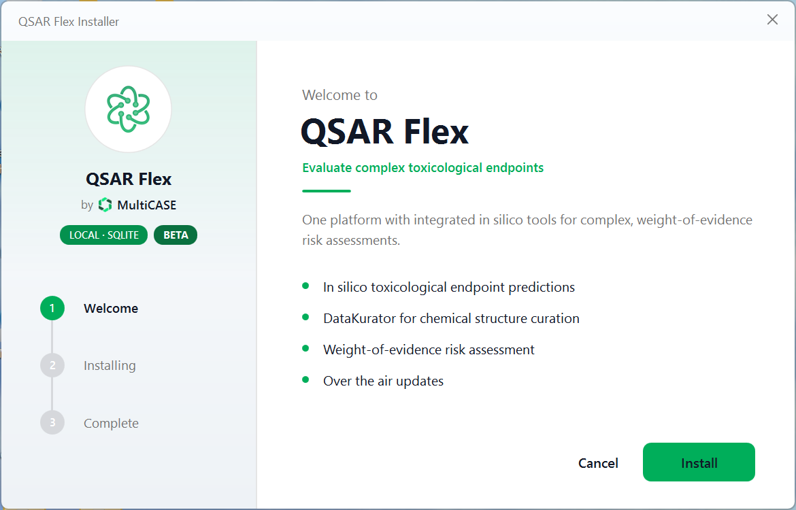
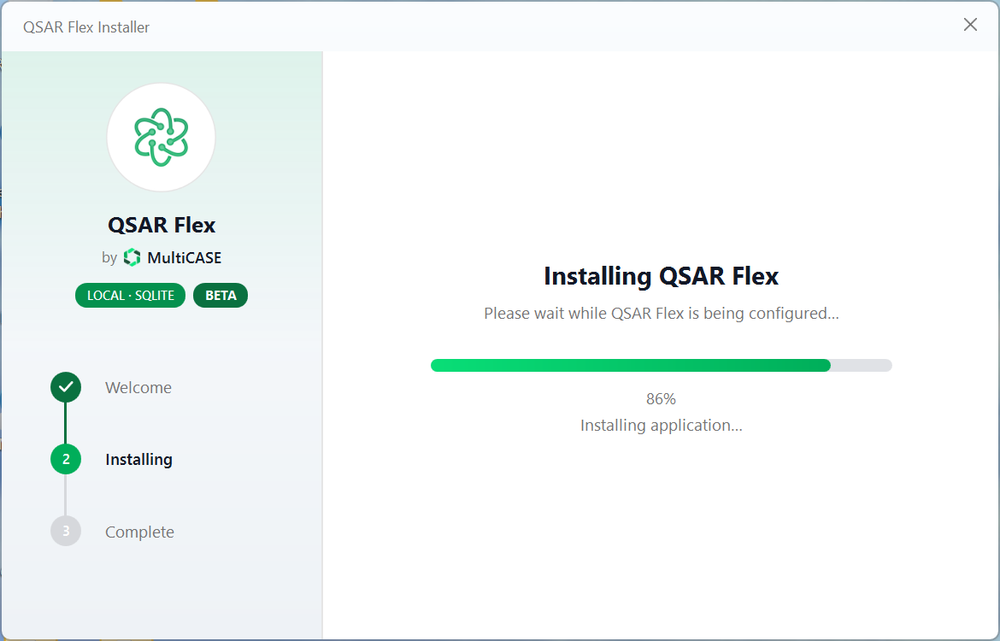
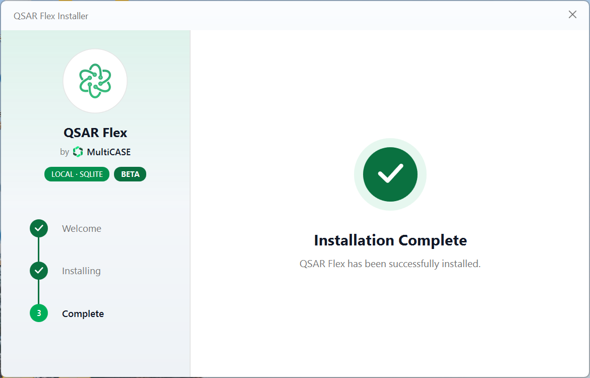
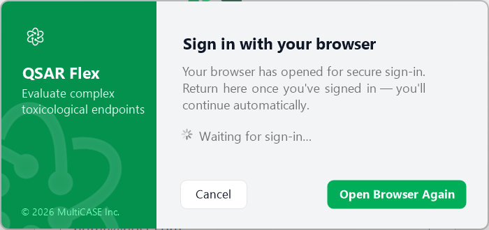
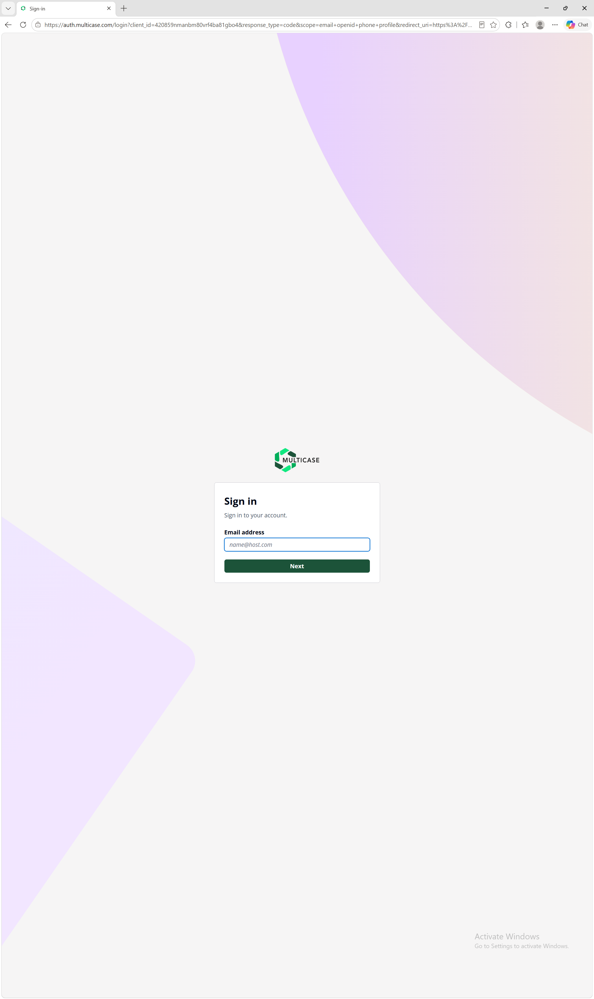
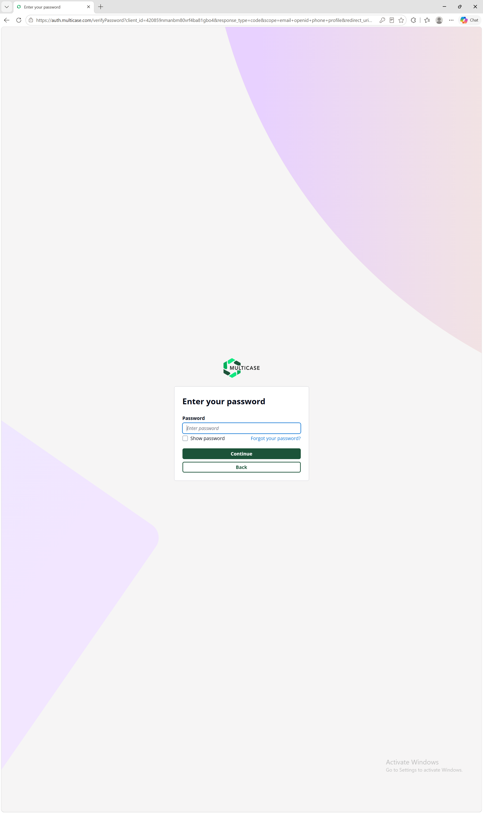
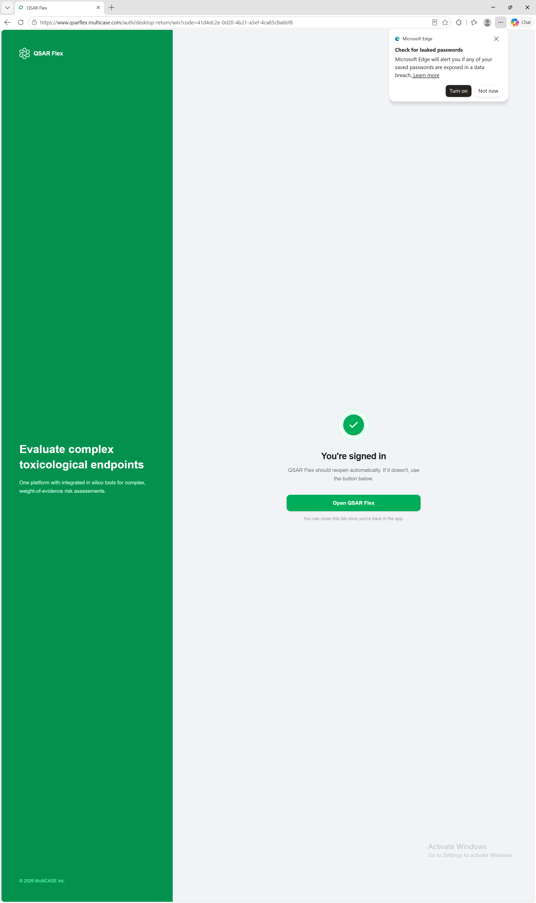
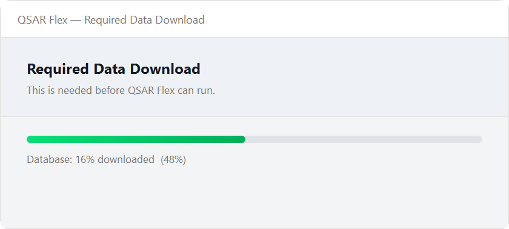
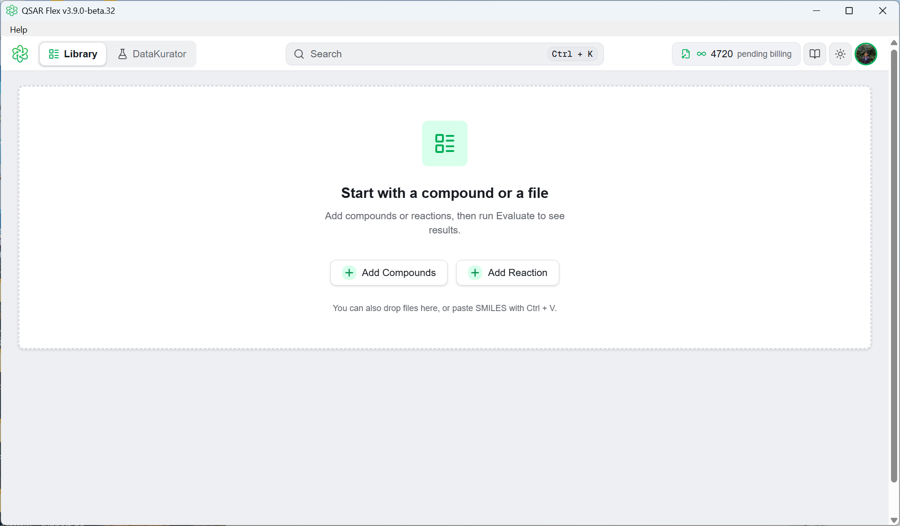

# Installing on Windows

This guide walks through installing the QSAR Flex desktop application on Windows — from download to your first evaluation.


**Installation needs no administrator rights.** QSAR Flex installs for your Windows user only, and it updates itself when new versions are released.


---

## Before you start

| What you need | Details |
| --- | --- |
| **64-bit Windows (x64)** | QSAR Flex is published as a 64-bit (x64) build only. There is no 32-bit or Arm build. |
| **Microsoft Edge WebView2 Runtime** | QSAR Flex draws its interface in WebView2. The runtime is included with Windows 11; on earlier versions of Windows, install Microsoft's free WebView2 Runtime if it is not already present. |
| **A MultiCASE account with an active licence** | QSAR Flex checks for an active licence every time it starts and will not open without one. See [Access & Licensing](fundamentals/access-and-licensing.md). |
| **An internet connection** | The installer downloads the application, and sign-in plus the licence check happen over the network at every launch. |


**Don't have an account yet?** Request one at [support.multicase.com](https://support.multicase.com). The same MultiCASE account signs you in to QSAR Flex and to the support portal.


---

## 1 — Download QSAR Flex

QSAR Flex for Windows runs the prediction engine on your own machine. Its reference data is held on
that machine as an encrypted database, which QSAR Flex downloads once, on first run — about 4 GB.


**Where your structures go.** The prediction models run on your workstation and the structures you
evaluate stay on it. Nothing is uploaded to MultiCASE to be evaluated for you.

Two features reach out to PubChem. **Auto Fill** in Add Compound sends the name, CAS number or SMILES
you typed, as soon as you press it. DataKurator can verify structures against PubChem — that option
is off by default and asks you to confirm before anything is sent.


Download the installer:

[⬇️ Download QSAR Flex for Windows](https://downloads.multicase.com/qsarflex/local/QSARFlex-Local-Installer.exe)

The file arrives as `QSARFlex-Local-Installer.exe`. The link always points at the current release.


**Both the installer and the application are code-signed** with Azure Trusted Signing, using a SHA-256 digest and an RFC 3161 trusted timestamp — so the signature stays verifiable after the signing certificate expires. To check it yourself, right-click the downloaded `.exe`, choose **Properties**, and open the **Digital Signatures** tab.


---

## 2 — Run the installer

Double-click the installer you downloaded. The setup window opens on **Welcome** — click **Install** to begin.

<figure></figure>

Windows does not ask for administrator approval: QSAR Flex is a per-user install.

---

## 3 — Install

The installer fetches the application and sets it up under your user account. It takes a few moments on a normal connection.

<figure></figure>

When it finishes you see **Installation Complete** and the installer closes itself.

<figure></figure>

The application does not start on its own. Open QSAR Flex from the Start menu or from the new desktop shortcut.

QSAR Flex now appears in **Settings → Apps → Installed apps** (Apps & Features) for the signed-in Windows user, listed as **QSARFlex** and published by **MultiCASE Inc.** — that is also where you uninstall it.

---

## 4 — Sign in

QSAR Flex signs you in through your web browser, so your saved passwords, password manager and single sign-on all work as usual. When this window appears, your default browser opens the sign-in page automatically.

<figure></figure>

If the browser does not open, or you closed the tab by accident, click **Open Browser Again**.

In the browser, enter your email address and click **Next**.

<figure></figure>

Then enter your password and click **Continue**.

<figure></figure>

The browser lands on a confirmation page and hands your session straight back to the app. If Windows or your browser asks for permission to open QSAR Flex, allow it; if the app does not come back to the front by itself, click **Open QSAR Flex**. You can close the tab once you are back in the application.

<figure></figure>


QSAR Flex keeps no sign-in tokens on disk, so it asks you to sign in through the browser each time you start it. Straight after sign-in it fetches your licence — if none is active, it reports a licence error and closes. Open a ticket at [support.multicase.com](https://support.multicase.com) if that happens.


---

## 5 — One-time data setup

On first run, QSAR Flex downloads the reference data it needs for predictions and shows a **Required Data Download** window. This step is mandatory and cannot be postponed — the application cannot run without the data — but it happens only once. Later launches skip it.

<figure></figure>

* This includes the encrypted reference database, roughly **4 GB**, so allow time on a slower connection.

Every downloaded file is verified against a SHA-256 checksum before it is used. The data is stored in `%LOCALAPPDATA%\QSARFlex\data` and is left in place when the application updates, so you never download it twice.

---

## 6 — You're ready

When setup finishes, the QSAR Flex workspace opens. You can now add compounds and reactions and run evaluations.

<figure></figure>

Next, head to [Getting Started](getting-started.md) to run your first evaluation.

---

## Staying up to date

QSAR Flex checks for application and data updates when it starts and every 15 minutes after that, and only interrupts you when something is actually available. You can also check on demand from **Help → Check for Updates**. Updates install the same way the app did — for your user, with no administrator rights.

---

## Getting help

Something not working, or you need a licence, extra modules or an enterprise rollout? Open a ticket at [support.multicase.com](https://support.multicase.com) and the team will answer in the ticket thread. See [Getting Support](support.md) for a walkthrough of the portal.
