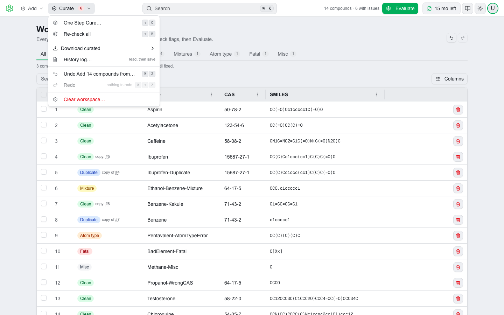
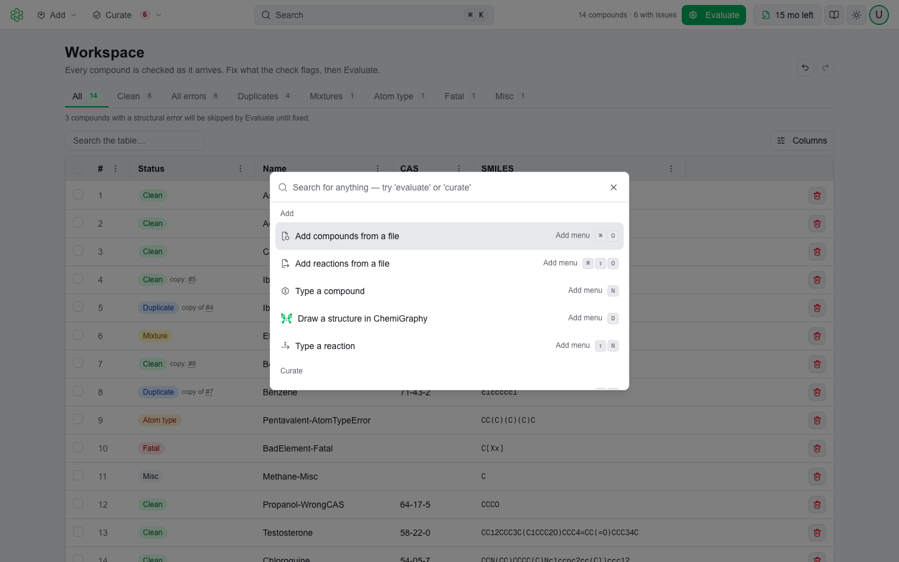

# The QSAR Flex Window

🧭 QSAR Flex puts everything the product does behind a single 48-pixel bar at the top of the window. The bar never scrolls away, and it is identical in the web app and the desktop app. The desktop app adds one native menu of its own — **Help → Check for Updates**, described under [Installing on Windows](install-win.md#staying-up-to-date) and [Installing on macOS](install-mac.md#keeping-qsar-flex-up-to-date) — and nothing else. This page describes each control on the bar.

Nothing on this page changes what QSAR Flex predicts. The chemistry, the models and the endpoints are what they are — the bar is only how you reach them.

---

## 🗺️ The Navbar

The bar has three clusters, read left to right:

| Position | Control | What it is for |
|---|---|---|
| Left | **Product mark** | Click the QSAR Flex logo to return to the workspace |
| Left | **Add ▾** | Everything that brings compounds and reactions in |
| Left | **Curate ▾** | Everything you do to the rows once they are in: One Step Cure, re-check, downloads, undo, clear |
| Center | **Search** | The command bar, opened with ⌘ K / Ctrl + K |
| Right | **Count** | What is loaded — *14 compounds · 2 reactions · 6 with issues* |
| Right | **Evaluate** | The one filled button on the bar. Runs the modules against the workspace |
| Right | **License status chip** | Your current license, at a glance |
| Right | **Documentation** | Opens this documentation space |
| Right | **Theme toggle** | Light, dark, or follow your system |
| Right | **Avatar** | Your account menu |

<figure><picture>
  <source media="(prefers-color-scheme: dark)" srcset=".gitbook/assets/workspace-table-dark.png">
  
</picture></figure>

There is one place the software goes — the **workspace**, the table of compounds and reactions you are working on — so there is nothing to switch between. Curation is not a second screen: every row carries its curation verdict, and the curation tools act on the rows in place. See [Curating Compounds](curation.md).

On the account pages (**Account** and the license activity pages) the two menus, the count and **Evaluate** step aside; the rest of the bar stays, and the logo brings you back.

Below the bar the page content is centred and capped in width, so a line of text is the same length on every screen.


Press **Tab** as soon as a page loads and a **Skip to content** link appears in the top-left corner. It jumps past every control on the navbar straight to the page itself.


---

## ➕ The Add menu

<figure><picture>
  <source media="(prefers-color-scheme: dark)" srcset=".gitbook/assets/workspace-add-menu-dark.png">
  
</picture></figure>

| Item | What it does |
|---|---|
| **Compounds from file…** | Opens the file picker. SMI, SDF, MOL, TXT or CSV; several files at once |
| **Reactions from file…** | Opens the file picker for `.rxn` files; several files become one multi-step reaction |
| **Type a compound…** | The **Type a compound** dialog — one compound by SMILES, InChI, name or registry number, or a batch file |
| **Type a reaction…** | The **Type a reaction** dialog — reaction SMILES, or `.rxn` files |
| **Draw in ChemiGraphy…** | Opens the structure editor on an empty canvas. See [Drawing Structures](structure-editor.md) |

The line at the bottom of the menu is a reminder: you can also **drop files anywhere on the page**, or **paste SMILES** with ⌘ V / Ctrl + V. Every route in ends the same way — the compounds are checked as they arrive and appear in the table with their verdict. See [Loading Compounds](product-guide/loading-compounds.md) and [Loading Reactions](loading-reactions.md).

While a load or a check is running the items are disabled and say so — *busy* — rather than queueing a second run behind the first.

---

## 🧪 The Curate menu

<figure><picture>
  <source media="(prefers-color-scheme: dark)" srcset=".gitbook/assets/workspace-curate-menu-dark.png">
  
</picture></figure>

The **Curate** button carries a red count of the rows with issues, so you can see from any page whether there is work to do.

| Item | What it does |
|---|---|
| **One Step Cure…** | The bulk-correction dialog: mixtures, duplicates, atom-type errors, other errors, PubChem verification, chiral tags and charges, in one run |
| **Re-check all** | Runs the structural check over every compound again |
| **Download curated ▸** | **Clean only** or **Everything**, as SMILES (`.smi`) or SDF (`.sdf`) |
| **History log** | Saves a text log of what was done to every row, including the rows you removed |
| **Undo / Redo** | Step back and forward through named steps — *Undo Add 14 compounds from mydata.smi*. ⌘ Z and ⇧ ⌘ Z (Ctrl + Z, Ctrl + Shift + Z on Windows) do the same |
| **Clear workspace…** | Empties the workspace and every evaluation result, after a confirmation. This is the one action undo cannot reverse |

An item that cannot run right now stays in the menu, grayed, with the reason beside it: *nothing loaded*, *busy*, *no clean rows*, *nothing to undo*.

---

## ▶️ Count and Evaluate

The count on the right of the bar is the workspace in one line — how many compounds, how many reactions, how many with issues. It appears once something is loaded, on windows wide enough to show it.

**Evaluate** is the only filled button on the bar. Hover it and its tooltip says what will happen: *Evaluate 14 items*, or *Evaluate 11 items; 3 with structural errors will be skipped*, or why it is disabled — *Load compounds first*, *Wait for the current run to finish*, *Nothing here can be evaluated yet — fix the structures first*. See [Evaluation](evaluation.md).

---

## ⌨️ The Command Bar

The center of the navbar is a search-shaped button labeled **Search** with a key cap on its right edge. The cap reads **⌘ K** on macOS and **Ctrl + K** on Windows. Its tooltip is *"Find any action by name"*.

There are two ways to open it:

- Click the **Search** control.
- Press **⌘ K** (macOS) or **Ctrl + K** (Windows) from anywhere in the app.

The shortcut deliberately does nothing while you are typing in a text box — ⌘ K inside a SMILES field belongs to that field.

On a narrow window the control shrinks to the magnifying-glass icon alone rather than disappearing, so it stays reachable where there is no keyboard to press ⌘ K on.

<figure><picture>
  <source media="(prefers-color-scheme: dark)" srcset=".gitbook/assets/workspace-command-bar-dark.png">
  
</picture></figure>

### Searching

Typing filters the list on both the visible command name and a set of hidden synonyms, so you do not have to know our word for the job. `import`, `upload` and `sdf` all find **Add compounds from a file**; `clean`, `duplicates` and `mixtures` all find **One Step Cure**; `logout` finds **Sign out**.

Every word you type has to appear somewhere, but the order does not matter. If nothing matches, the list reads *Nothing matches "…"* with the text you typed. Press **Enter** to run the highlighted command, or **Esc** to close the bar without running anything.

### The commands

Every command is offered on every page.

**Add**

| Command | What it does |
|---|---|
| **Add compounds from a file** | Opens the file picker for compound files |
| **Add reactions from a file** | Opens the file picker for `.rxn` files |
| **Type a compound** | Opens the Type a compound dialog |
| **Draw a structure in ChemiGraphy** | Opens the structure editor on an empty canvas |
| **Type a reaction** | Opens the Type a reaction dialog |

**Curate**

| Command | What it does |
|---|---|
| **One Step Cure** | Opens the One Step Cure dialog |
| **Re-check all compounds** | Runs the check again |
| **Download curated structures** | Opens the Download curated menu |
| **Open the history log** | Opens the history log |
| **Undo** / **Redo** | Steps back or forward, naming the step |
| **Clear the workspace** | Empties the workspace, after a confirmation |

**Workspace**

| Command | What it does |
|---|---|
| **Evaluate** | Opens the module selection dialog |

**Go to**

| Command | Destination |
|---|---|
| **Workspace** | The workspace |
| **Account and license** | Your Account page |

**QSAR Flex**

| Command | What it does |
|---|---|
| **Switch to dark mode** / **Switch to light mode** | Flips the theme. The label always names the theme you are not in |
| **Match my system appearance** | Hands the theme back to your operating system |
| **Keyboard shortcuts** | Opens the shortcut reference |
| **User guide** | Opens this documentation space in a separate tab or window |
| **Sign out** | Signs you out |

### Running a command from another page

A command does not require you to be standing on the workspace. Run **Evaluate** from your Account page and QSAR Flex goes to the workspace and opens the module dialog there. A command that changes the rows waits while a load, a check or a run is in progress, and says so: *Wait for the current run to finish.*

### Commands that cannot run

A command that is unavailable right now is still listed. It is grayed out, and the reason is printed on the row in place of the location:

| Reason shown | When |
|---|---|
| **Nothing in the workspace** | On **Evaluate** and **Clear the workspace**, while the workspace is empty |
| **No compounds loaded** | On the Curate commands, while there are no compounds |
| **Nothing to log yet** | On **Open the history log**, before any compound has been loaded or removed |
| **Already following your system** | On **Match my system appearance**, when your theme is already set to System |

This is on purpose. *"Where did Evaluate go?"* is a question worth answering even when there is nothing to evaluate.

### Where it lives

Every row that can run carries the place in the interface where the same command is normally found: **Add menu**, **Curate menu**, **Menu bar**, **Logo**, **Top right** or **Account menu**. The hint is there so the command bar teaches you the interface rather than replacing it.

---

## 🔑 The License Status Chip

The first control after **Evaluate** is a chip showing your active license. It is present on every page. While the license is being fetched a gray placeholder holds the space, so nothing beside it jumps sideways when the answer arrives.

What the chip says depends on the license:

| Chip reads | Meaning |
|---|---|
| **`142/500` tests** | A pay-per-test license: tests remaining out of tests bought |
| **Unlimited** | An on-demand subscription, which never expires |
| **`3` pending billing** | An on-demand subscription with test runs not yet invoiced |
| **`8 mo left`** | A dated subscription with more than 60 days to run, shown in whole months |
| **`23d left`** | A dated subscription with 60 days or fewer to run |
| **Active** | A subscription with no end date |
| **Expired** | A dated subscription whose end date has passed |
| **No active license** | The account has no active license. Evaluation will not run |
| **License unavailable** | The license service could not be reached |

A pay-per-test chip turns amber once fewer than **10** tests remain, and its tooltip adds *"⚠ Low tests remaining. Consider purchasing more."* If some of your runs are awaiting billing, the count appears after the tests as *(N pending)*.

Hovering the chip gives you the detail behind it — license type (Subscription, On demand or Pay-per-test), status, tests remaining where they apply, the subscription end date where there is one, and the line *"Click to view details"*.

**Clicking the chip opens the License tab of your Account page**, in every state including the two failure states. From there you can see the full license, its validity and usage, its assigned users, and its activity history.


**No active license** and **License unavailable** are different problems. The first means the account does not have a license yet — raise it at [support.multicase.com](https://support.multicase.com). The second means the license service did not respond; evaluation will not run until it does, and it is usually worth reloading before reporting it.


---

## 📖 The Documentation Button

The book icon opens **https://resources.multicase.com/qf-web** — this documentation space. It always opens away from the page you are on: a new browser tab in the web app, your default browser on the macOS desktop build, and a separate window on the Windows desktop build. The same target is available from the command bar as **User guide**.

---

## 🌗 The Theme Toggle

The sun/moon button opens a small menu with three choices:

- **Light**
- **Dark**
- **System** — follow your operating system's appearance

The one currently in force is marked with a green dot and set in a heavier weight, so you can tell whether the dark screen you are looking at is your own choice or your machine's.

The button's tooltip names the setting rather than the result: *"Appearance: dark"* when you have chosen a side, or *"Appearance: following your system (dark)"* when you have not.


System is a state you can get back to. The command bar's theme command only flips between light and dark; use **System** in this menu, or the command **Match my system appearance**, to hand the choice back to your operating system.


---

## 👤 The Avatar Menu

The last control is your avatar — your profile picture, or your initials if you have not set one. It carries a green border, and gains a second green ring while you are on an account page.

Opening it shows your name and the email address you signed in with, then two items:

- **Profile** — opens your Account page
- **Sign out**

Your Account page is where the Profile, Security, License and Team tabs live. The **Team** tab appears only if you are a company administrator.

---

## Related pages

- [Loading Compounds](product-guide/loading-compounds.md) — every way into the workspace
- [Curating Compounds](curation.md) — the verdicts, the row panel and One Step Cure
- [Evaluation](evaluation.md) — running modules against the workspace
- [Access & Licensing](fundamentals/access-and-licensing.md) — what your license covers
- [Getting Support](support.md) — reaching MultiCASE through the support portal
