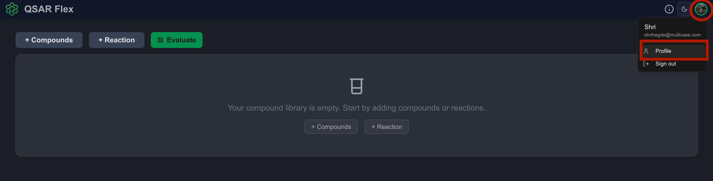
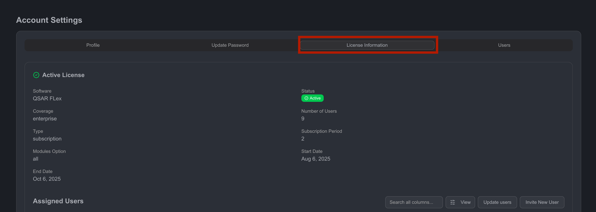
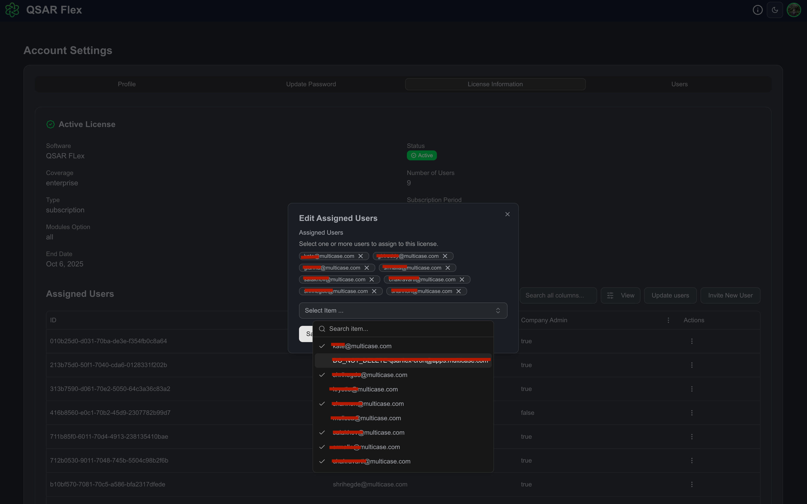

# Enterprise User Management

## User Management Guide

This guide provides instructions for managing users within the application, specifically for "Company Admin" roles. Non-admin users have read-only access.

### Adding a New User to an Active License

To add a new user to your license:

* Navigate to your "Profile" by clicking the icon in the top right corner.

<figure><figcaption></figcaption></figure>

* Click on the "License Information" tab.

<figure><figcaption></figcaption></figure>

* In the "Active License Information" section, click on "Update Users".
* Select the user you wish to add from the dropdown menu, then click "Save".

<figure><figcaption></figcaption></figure>

**Note:** If the user is not listed, invite them to QSAR Flex first.

### Inviting a New User to QSAR Flex

To invite a new user:

* Navigate to your "Profile" by clicking the icon in the top right corner.
* Click on the "Users" tab.
* Click the "Invite New User" button.
* Enter the new user's email address for the automated setup email.

<figure><figcaption></figcaption></figure>

**Reminder:** After inviting, add the user to an active license for access to QSAR Flex.
