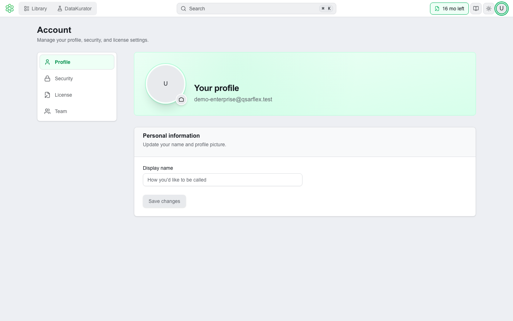
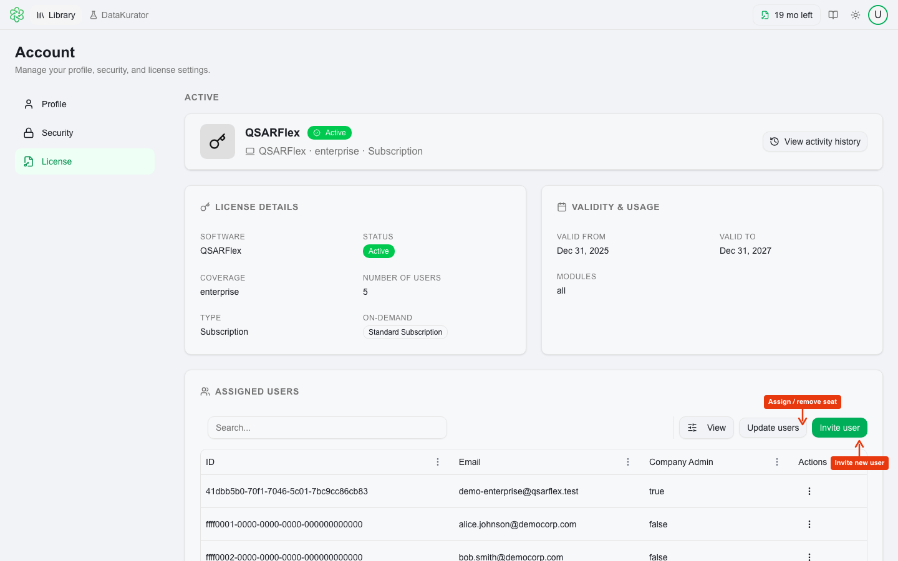
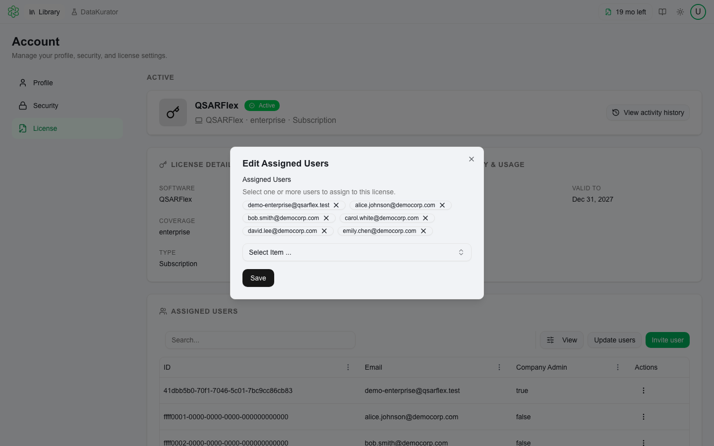
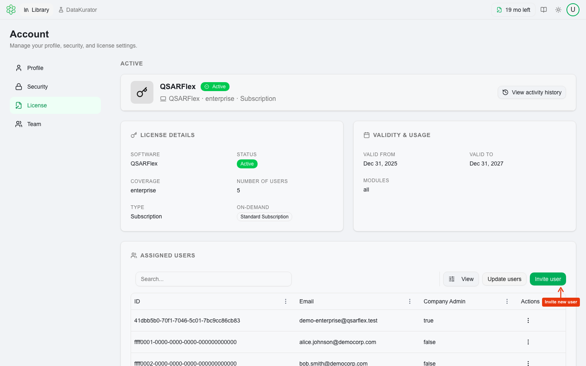
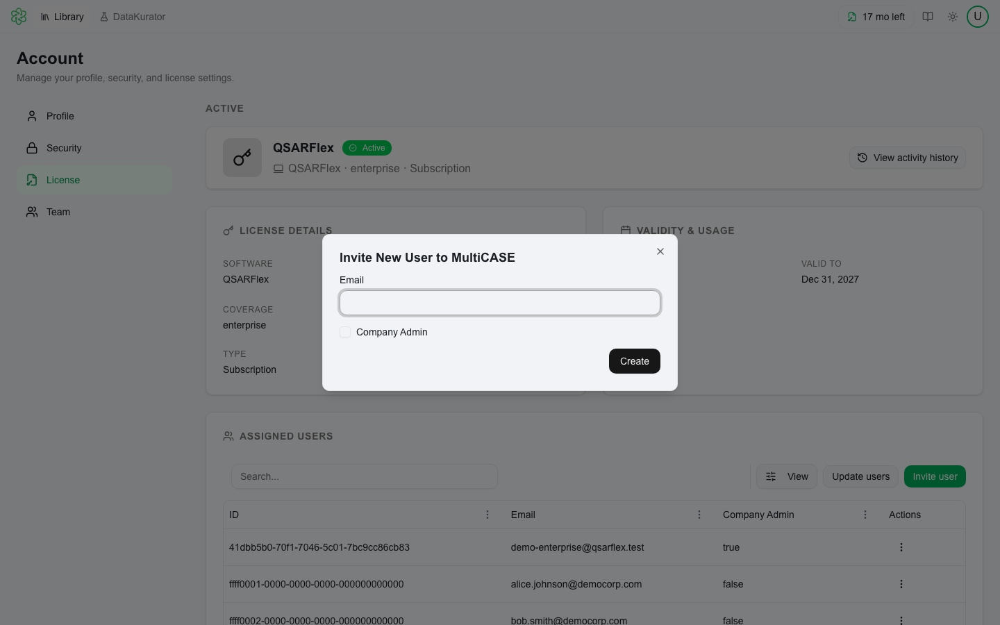
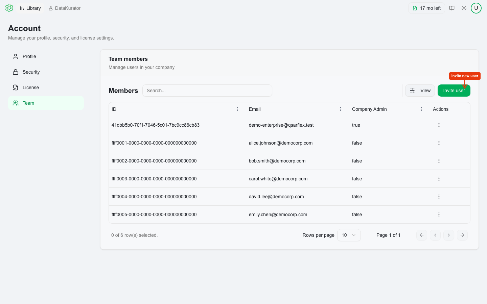

# Enterprise User Management

👥 Enterprise licenses support multiple users under a single organization. A **Company Admin** can manage the team without contacting MultiCASE: invite users to the platform, assign them to license seats, reassign seats at any time, activate an inactive subscription, and grant or revoke the Company Admin role. Non-admin users have read-only access to license information.

---

## Understanding License Seats

An enterprise license has a fixed number of **seats** — the number of users who can be actively assigned to it at one time. Your organization can have more total platform users than available seats.

**Example:** Your organization has 5 registered users but a 3-seat license. As an admin, you can freely choose which 3 of those 5 users are assigned to the license at any given time. You can swap assignments at any point — removing a user from a seat does not delete their account, and they regain access as soon as you re-assign them.

This flexibility is useful for:

- Teams with rotating access needs (e.g., project-based usage)
- Organizations that need to share a license across departments
- Onboarding new team members before deciding on seat allocation

---

## Opening the Account Page

Click your **profile avatar** in the top-right corner and choose **Profile**. This opens the **Account** page — a full page with a tab rail on the left: **Profile**, **Security**, **License**, and **Team**.

<figure><picture>
  <source media="(prefers-color-scheme: dark)" srcset="../.gitbook/assets/profile-dark.png">
  
</picture></figure>

Two of these tabs matter for license management:

- **License** — your organization's licenses, seat assignments, and activity.
- **Team** — every user in your company. This tab is only visible to Company Admins.


The license status chip in the navigation bar is a shortcut — clicking it takes you straight to the License tab.


---

## Viewing Your License

Select the **License** tab to see your organization's licenses, grouped as **Active**, **Inactive**, and **Expired**.

<figure><picture>
  <source media="(prefers-color-scheme: dark)" srcset="../.gitbook/assets/profile-license-dark.png">
  
</picture></figure>

Each license shows:

- Software name, coverage (individual / enterprise), and billing model (subscription / pay-per-test / on-demand)
- Status (active / inactive / expired)
- **Number of users** — the seat count for enterprise licenses
- Validity dates (for standard subscriptions) or total and remaining tests (for pay-per-test)
- Module entitlements (all modules, or the specific modules selected)
- The **Assigned users** table — who currently occupies a seat
- **Pending billing** — tests run but not yet invoiced, where applicable

---

## Assigning & Removing Users from a License

Only users with the **Company Admin** role can modify seat assignments.

1. Go to **Account → License**.
2. In the **Assigned users** section of the license, click **Update users**.

<figure><picture>
  <source media="(prefers-color-scheme: dark)" srcset="../.gitbook/assets/profile-license-assign-users-dark.png">
  
</picture></figure>

3. The **Edit assigned users** dialog lists every platform user in your organization, with the currently assigned users pre-selected.
4. Add or remove users from the license as needed.
5. Click **Save** to apply the changes.

If your change removes anyone, a confirmation dialog lists exactly who will lose access before anything is saved. Users added gain access immediately. Users removed lose access on their next evaluation in the web app; if they already have a desktop app open, the change takes effect the next time they start it.


You can reassign seats as often as needed — there is no cooldown or limit on reassignments.


### Rules the System Enforces

Seat assignments are validated when you save:

- You cannot assign more users than the license has seats.
- Every assigned user must belong to your company.
- At least one assigned user must be a Company Admin.
- Expired licenses cannot be modified.

One rule is checked later, not at save time: a user can hold a seat on only one active license per product. Assigning someone who already occupies a seat on another active license for the same product will save, but it blocks that license from being activated.

---

## Activating a License

When your organization receives a new standard subscription license, it starts out **Inactive** — nobody can use it until it is activated. A Company Admin can do this without contacting MultiCASE:

1. Go to **Account → License** and find the license under **Inactive**.
2. Click **Activate** and confirm in the **Activate license?** dialog.

Activation sets the license's start date to that moment. The end date is fixed when MultiCASE creates the license and does not move, so a license left sitting inactive loses that time — activate it as soon as your team is ready.

Only standard subscription licenses need this step. Pay-per-test licenses and On-Demand subscriptions are active from the moment they are created. A company can have only one active license per product at a time, and activation is blocked if any assigned user already holds a seat on another active license for the same product.

---

## Inviting a New User to the Platform

Adding a new person to your organization requires two steps: first invite them to the platform, then assign them to a license.

### Step 1 — Send the Invitation

1. Go to **Account → License** (or **Account → Team**).
2. Click **Invite user**.

<figure><picture>
  <source media="(prefers-color-scheme: dark)" srcset="../.gitbook/assets/profile-invite-user-dark.png">
  
</picture></figure>

3. In the **Invite a new user** dialog, enter the user's email address. Tick **Company admin** if the new user should also manage the team. Click **Invite**.

<figure><picture>
  <source media="(prefers-color-scheme: dark)" srcset="../.gitbook/assets/profile-users-invite-dialog-dark.png">
  
</picture></figure>

The account is created in your company and the user receives an automated invitation email to finish setting up their MultiCASE account. Their account appears in your Team list immediately.

### Step 2 — Assign to a License

1. Go to **Account → License** → **Update users**.
2. Select the new user in the **Edit assigned users** dialog and click **Save**.

The user now has access to all modules included in that license.

---

## Managing Your Team

Go to **Account → Team** to see the **Team members** list — every user in your organization, with their email and whether they are a Company Admin.

<figure><picture>
  <source media="(prefers-color-scheme: dark)" srcset="../.gitbook/assets/profile-users-dark.png">
  
</picture></figure>

From this tab, admins can:

- **Invite user** — add a new person to the company (same dialog as above).
- **Edit** (via the row's actions menu) — open the **Edit user** dialog and toggle the **Company admin** role for any user in your company.

---

## Auditing Usage — License Activity

Every evaluation run against your license is recorded. Click **View activity** on the license to open its **License activity** page — a table of every test run: who ran it, how many tests it used, which modules, when, and whether it has been billed or is pending, with the invoice reference once invoiced.

This is the admin-facing audit trail for usage and billing. See [License Activity](license-activity.md) for a full walkthrough of the table.

---

## What Non-Admins See

Enterprise users without the Company Admin role can open **Account → License** but see a **View only** badge on the license and a read-only notice. They can review the license details and assigned users but cannot change assignments, activate licenses, or invite users — and the Team tab is not shown to them. They should contact their Company Admin for changes.

---

## Notes

- Only users with the **Company Admin** role can manage users and license assignments.
- Each license seat can be assigned to one user at a time, but you can freely swap who occupies each seat.
- Invited users can be assigned to a seat right away; they complete their account setup from the invitation email.
- To change your license capacity (add or remove seats), open a ticket at [support.multicase.com](https://support.multicase.com).
