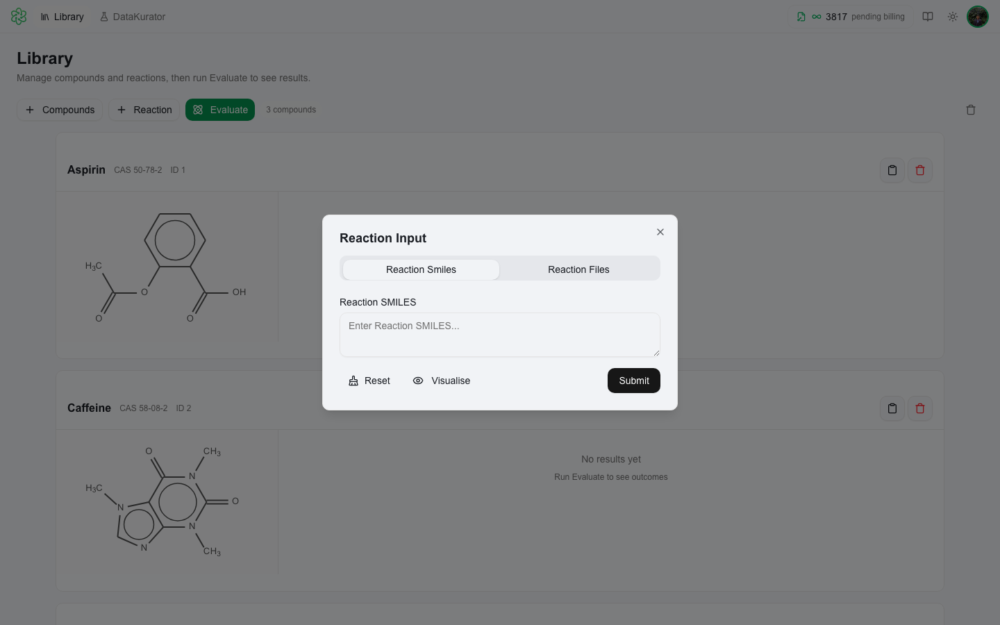
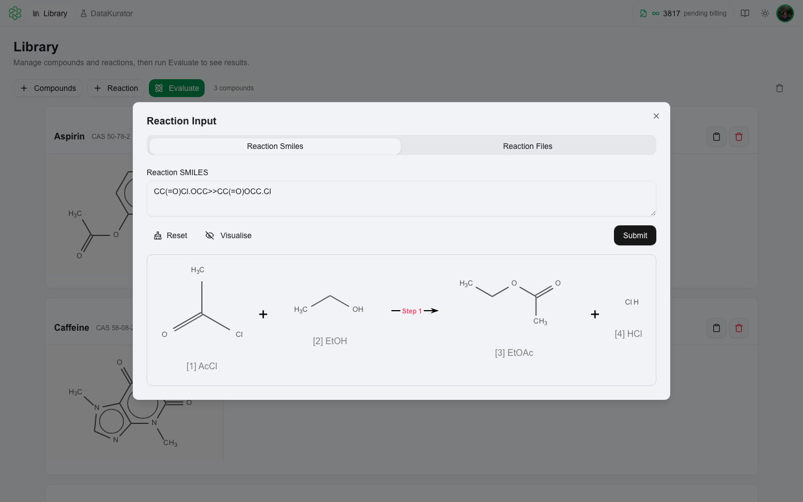
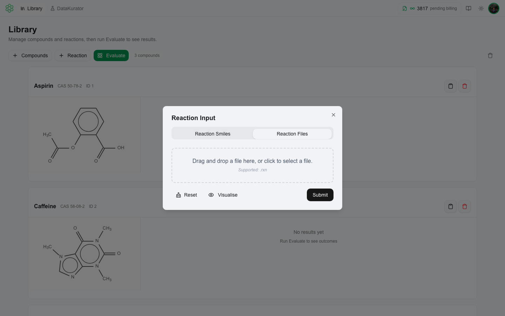
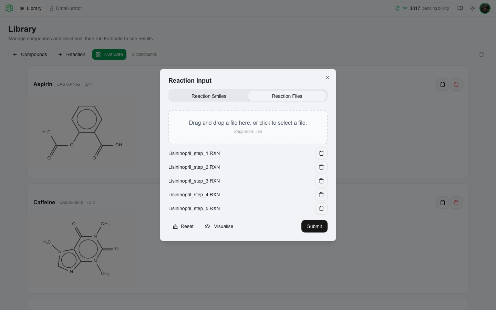
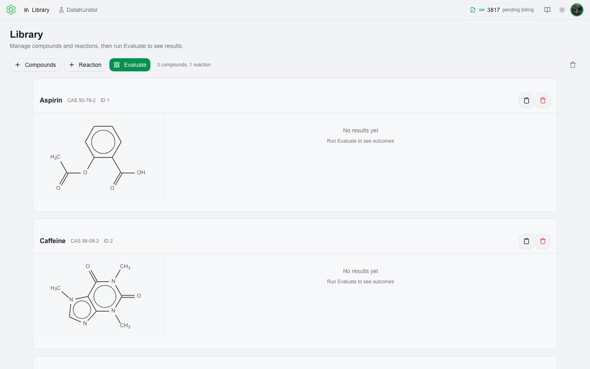
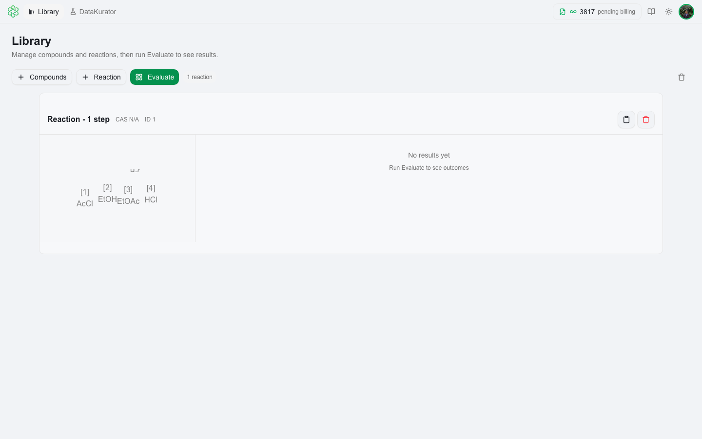

# Loading Reactions

⚗️ QSAR Flex can load and visualize chemical reactions alongside compounds in your library. Click **+ Reaction** in the Library toolbar to open the reaction input dialog.

---

## ✏️ Reaction SMILES

The **Reaction SMILES** tab is the default view. Use this to type or paste a reaction SMILES string directly.



**Reaction SMILES format:** `reactants>>products` — use `.` to separate multiple reactants or products. Optionally include agents in the middle segment: `reactants>agents>products`.

Examples:
```
CC(=O)Cl.OCC>>CC(=O)OCC.Cl
[Na]Br.ClC>>ClC.[Na]Br
```

1. Paste your reaction SMILES into the text field.
2. Click the submit button to process and visualize.



The reaction diagram is rendered inline, showing all reactants, agents (if any), and products with 2D structure depictions. Multi-step reactions are displayed as a sequence.

---

## 📄 Reaction Files (RXN)

Switch to the **Reaction Files** tab to load reactions from `.rxn` files — the industry-standard MDL RXN format used by ChemDraw, Marvin, and other chemistry tools.



1. Drag & drop one or more `.rxn` files into the upload area, or click to browse. You can select **multiple files at once** for a multi-step synthesis.
2. The file names appear once uploaded.



3. Submit to visualize all reaction steps together.



Multi-step synthesis sequences are loaded by selecting all step files together in a single upload — QSARFlex renders them as a connected sequence.

---

## 📚 Reactions in the Library

Once submitted, the reaction appears in the Library alongside your compounds as its own card.



You can freely mix compounds and reactions in the same library — they show up as separate cards. Loaded reaction cards display:
- The reaction diagram with all structures
- Arrow notation for reaction direction
- Any evaluation results if the reaction was run through a compatible module

---

## 🔬 Next Steps

With reactions in your library, click **Evaluate** to run analysis modules. Some modules (such as reaction-specific models) operate on reaction entries rather than individual compounds.

- [Evaluation](evaluation.md) — run prediction modules on your library
- [Loading Compounds](product-guide/loading-compounds.md) — add compounds alongside reactions
