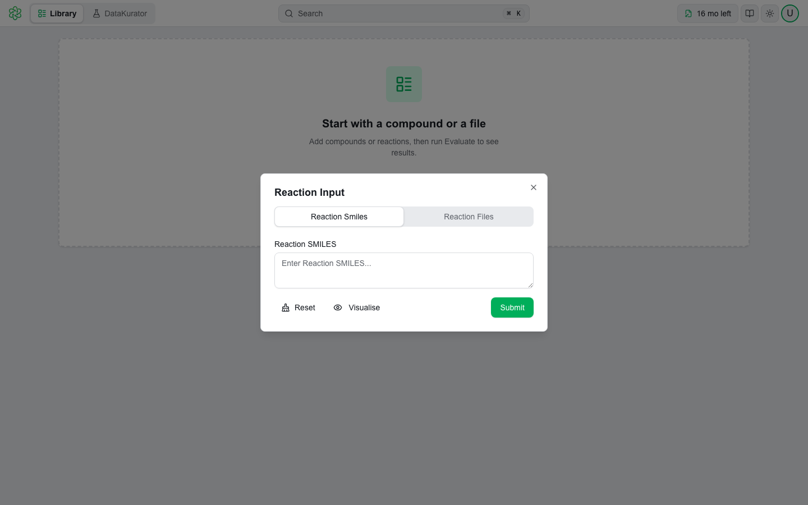
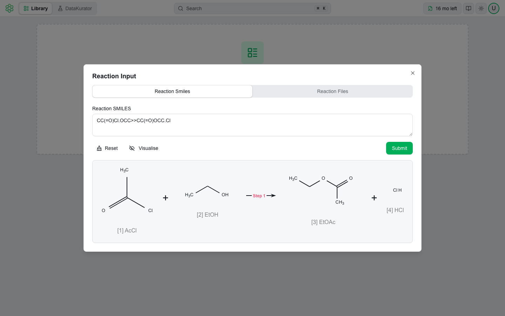
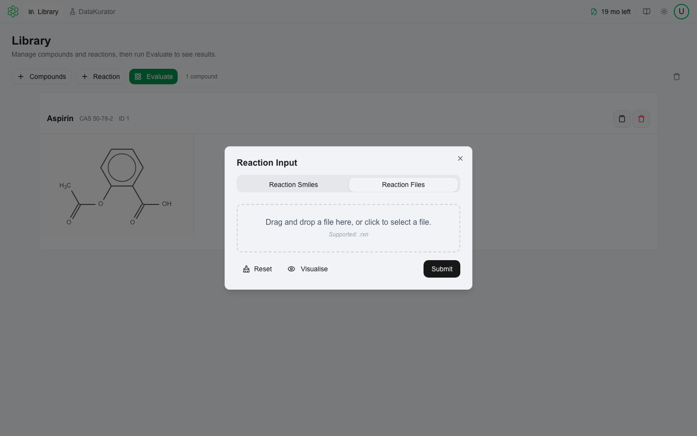
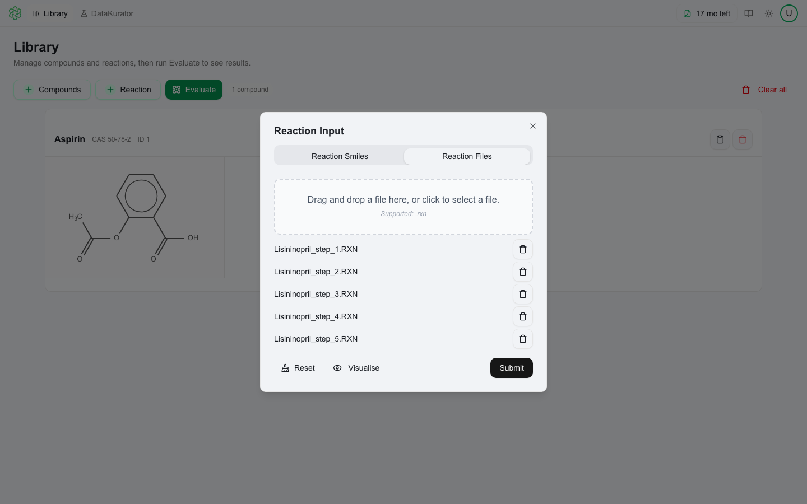
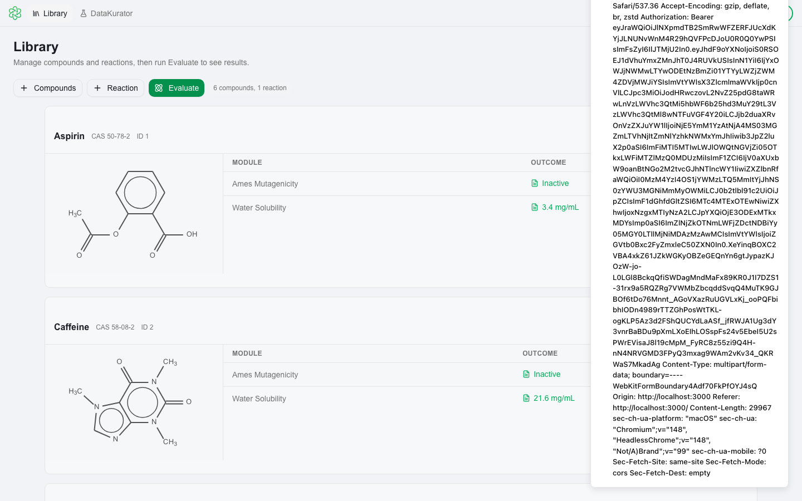
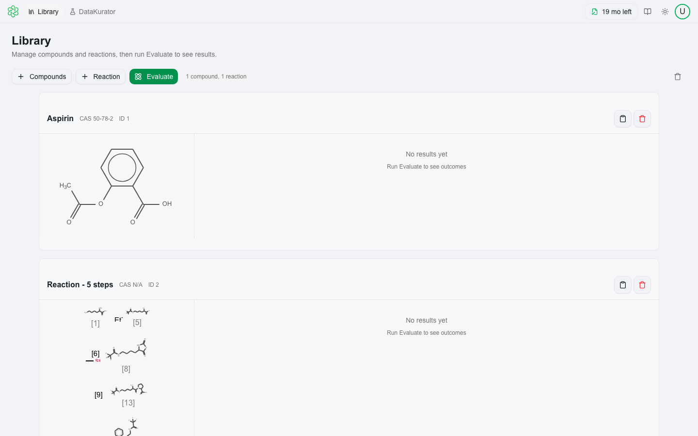

# Loading Reactions

⚗️ QSAR Flex can load and visualize chemical reactions alongside compounds in your library. Click **+ Reaction** in the Library toolbar to open the **Reaction Input** dialog. If the library is empty, use the **Add Reaction** button on the empty-state card instead — or run **Add a reaction** from the command bar (⌘K / Ctrl+K).

---

## ✏️ Reaction Smiles

The **Reaction Smiles** tab is the default view. Use this to type or paste reaction SMILES directly.

<figure><picture>
  <source media="(prefers-color-scheme: dark)" srcset=".gitbook/assets/reactions-smiles-tab-dark.png">
  
</picture></figure>

**Reaction SMILES format:** `reactants>>products` — use `.` to separate multiple reactants or products. You can also give agents in a middle segment, `reactants>agents>products`, separated by `.` in the same way. Recognised agents are drawn as short labels on the arrow rather than as structures. Each non-blank line is one step, so a multi-step route is entered as one reaction SMILES per line.

Example:
```
CC(=O)Cl.OCC>>CC(=O)OCC.Cl
```

1. Paste your reaction SMILES into the text field.
2. Click **Visualise** to render the reaction diagram inline. Click it again to hide the preview, or click **Reset** to clear the form.

<figure><picture>
  <source media="(prefers-color-scheme: dark)" srcset=".gitbook/assets/reactions-smiles-result-dark.png">
  
</picture></figure>

The reaction diagram shows the reactants and products with 2D structure depictions. Multi-step reactions are displayed as a sequence.

3. Click **Submit** to add the reaction to your Library.

---

## 📄 Reaction Files

Switch to the **Reaction Files** tab to load reactions from `.rxn` files — the MDL RXN format used by ChemDraw, Marvin, and other chemistry tools. Only `.rxn` files are accepted here; anything else is rejected with a message.

<figure><picture>
  <source media="(prefers-color-scheme: dark)" srcset=".gitbook/assets/reactions-files-tab-dark.png">
  
</picture></figure>

1. Drag & drop one or more `.rxn` files into the upload area, or click to browse. Select **multiple files at once** for a multi-step synthesis — the files are combined into a single multi-step reaction.
2. The file names appear once selected. The files are not read until you click **Visualise** or **Submit**. Use the trash button next to a file to remove it before submitting.

<figure><picture>
  <source media="(prefers-color-scheme: dark)" srcset=".gitbook/assets/reactions-rxn-uploaded-dark.png">
  
</picture></figure>

3. Click **Visualise** to render all reaction steps together.

<figure><picture>
  <source media="(prefers-color-scheme: dark)" srcset=".gitbook/assets/reactions-rxn-visualized-dark.png">
  
</picture></figure>

4. Click **Submit** to add the reaction to your Library.

---

## 🖱️ Drop .rxn files straight onto the Library

You do not need the dialog at all. Drop `.rxn` files anywhere on the Library page and they are added directly as reactions. Files are sorted by extension, so a mixed drop of structure files and `.rxn` files adds compounds and reactions in one go — no importer to choose.


Reactions added this way — and reactions submitted from the dialog — are auto-named **Reaction - N steps** after the number of steps they contain. Multiple `.rxn` files dropped together become one multi-step reaction.


---

## 📚 Reactions in the Library

Once submitted, the reaction appears in the Library alongside your compounds as its own card.

<figure><picture>
  <source media="(prefers-color-scheme: dark)" srcset=".gitbook/assets/library-with-reaction-dark.png">
  
</picture></figure>

A reaction card mirrors a compound card:

- The header shows the entry number, the reaction name, a copy-SMILES button and a delete button. Reactions carry no CAS, so — unlike a compound card — there is no CAS chip.
- The left pane is a thumbnail of the reaction scheme. Click it to open the scheme in a wide dialog — much larger than the one a single structure gets — that keeps each step at its natural size and scrolls, so multi-step routes stay readable instead of being squeezed to fit.
- The right pane is the results table with **Module** and **Outcome** columns. Before you run an evaluation it reads **Ready to evaluate** / **Run Evaluate to see outcomes**. After an evaluation, click an outcome to open its report. Reactions are evaluated by the **N-Nitrosation** module only — any other module ticked in the same run comes back as **N/A** on the reaction row, while the compounds in that run are unaffected.

You can freely mix compounds and reactions in the same library — they show up as separate cards.

---

## 🔬 Next Steps

With reactions in your library, click **Evaluate** to run analysis modules.

- [Evaluation](evaluation.md) — run prediction modules on your library
- [Loading Compounds](product-guide/loading-compounds.md) — add compounds alongside reactions
