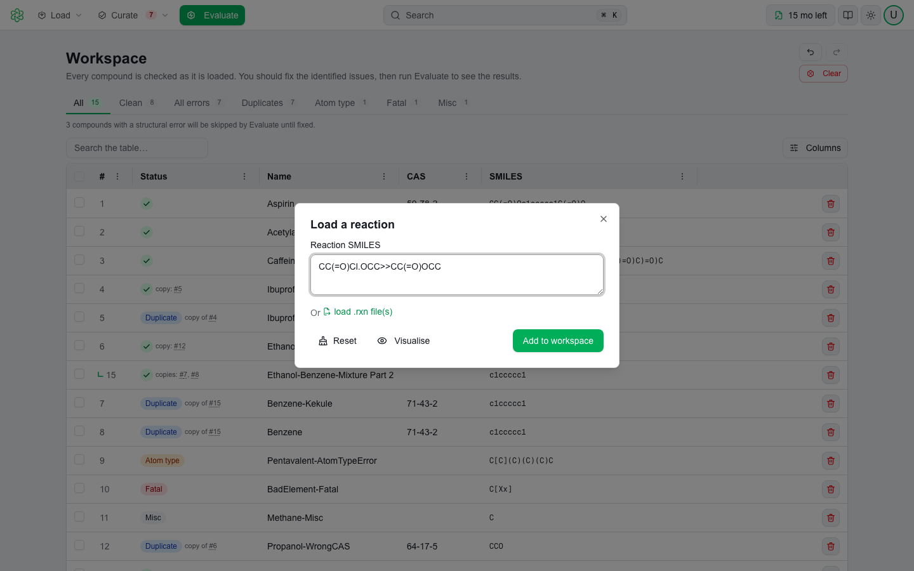
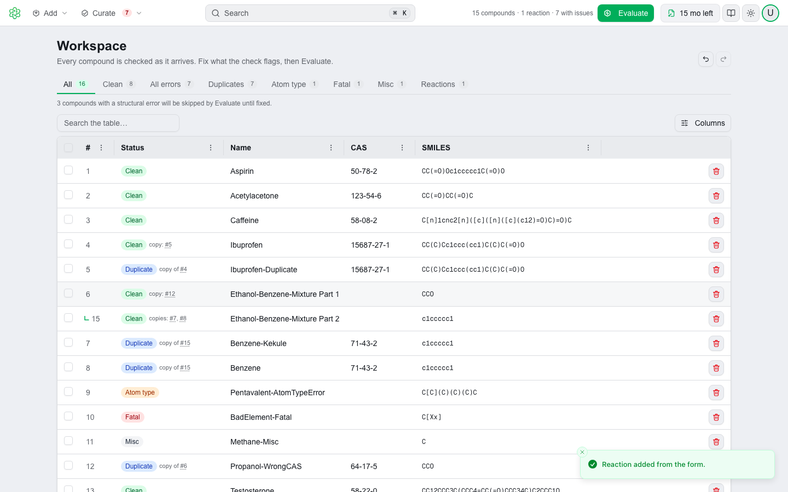
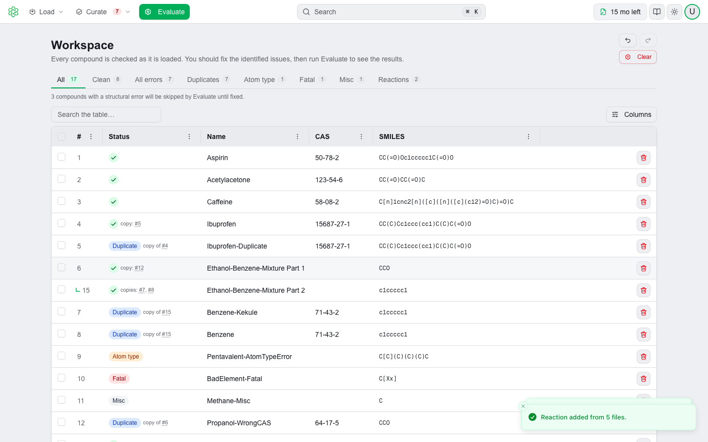
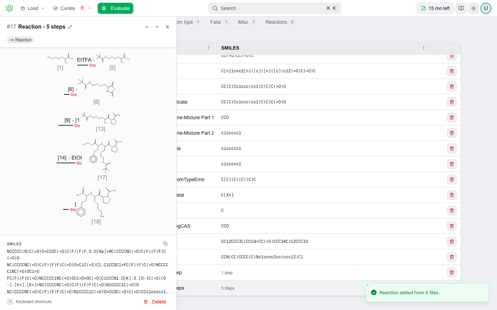

# Loading Reactions

⚗️ QSAR Flex can load and visualize chemical reactions alongside compounds in the workspace. There are three ways in:

- **Load ▾ → Load a reaction…** — the **Load a reaction** dialog, for reaction SMILES, with a *load .rxn file(s)* link for files. On an empty workspace, **Load a reaction** on the card opens the same dialog, and so does **Load a reaction** in the command bar (⌘K / Ctrl+K).
- **Load reactions from a file** in the command bar, or ⌘ ⇧ O / Ctrl + Shift + O — the file picker for `.rxn` files straight away.
- **Drag and drop** — drop `.rxn` files anywhere on the page.

---

## ✏️ Loading a reaction

**Load ▾ → Load a reaction…** opens the **Load a reaction** dialog, a text box for reaction SMILES with the file route under it.

**Reaction SMILES format:** `reactants>>products` — use `.` to separate multiple reactants or products. You can also give agents in a middle segment, `reactants>agents>products`, separated by `.` in the same way. Recognised agents are drawn as short labels on the arrow rather than as structures. Each non-blank line is one step, so a multi-step route is entered as one reaction SMILES per line.

Example:

```
CC(=O)Cl.OCC>>CC(=O)OCC.Cl
```

<figure><picture>
  <source media="(prefers-color-scheme: dark)" srcset=".gitbook/assets/reactions-dialog-dark.png">
  
</picture></figure>

1. Paste your reaction SMILES into the text box.
2. Click **Visualise** to draw the scheme inline and check it. **Reset** clears the box.
3. Click **Add to workspace**. The reaction appears in the table as its own row.

<figure><picture>
  <source media="(prefers-color-scheme: dark)" srcset=".gitbook/assets/reactions-smiles-result-dark.png">
  
</picture></figure>

---

## 📄 From .rxn files

The *load .rxn file(s)* link in the **Load a reaction** dialog — or **Load reactions from a file** in the command bar — opens the file picker for `.rxn` files, the MDL RXN format used by ChemDraw, Marvin and other chemistry tools. Pick **several files at once** for a multi-step synthesis: the files are combined into a single multi-step reaction, named after its step count.

<figure><picture>
  <source media="(prefers-color-scheme: dark)" srcset=".gitbook/assets/reactions-rxn-uploaded-dark.png">
  
</picture></figure>

Click the row to see the route. Each step is drawn with its reactants and products, at its natural size.

<figure><picture>
  <source media="(prefers-color-scheme: dark)" srcset=".gitbook/assets/reactions-rxn-visualized-dark.png">
  
</picture></figure>

---

## 🖱️ Drop .rxn files straight onto the page

You do not need the dialog at all. Drop `.rxn` files anywhere on the page and they are added directly as reactions. Files are sorted by extension, so a mixed drop of structure files and `.rxn` files adds compounds and reactions in one go — no importer to choose.


Reactions added this way — and reactions added from the dialog — are auto-named **Reaction - N steps** after the number of steps they contain. Multiple `.rxn` files loaded together become one multi-step reaction.


---

## 📚 Reactions in the workspace

Once submitted, the reaction appears in the table alongside your compounds as its own row.

- The row wears a **Reaction** badge in place of a curation verdict — reactions are not curated — and shows its step count in place of a SMILES. Reactions carry no CAS.
- Click the row to open it in the panel: the reaction scheme, drawn large enough to read, with every step listed under it as reaction SMILES. Multi-step routes keep each step at its natural size.
- The **Reactions** chip above the table shows only the reactions.
- After an evaluation, the **Results** column lists the module and the panel lists the reaction's outcomes, each a link to its report. Reactions are evaluated by the **N-Nitrosation** module only — any other module ticked in the same run comes back as **N/A** on the reaction row, while the compounds in that run are unaffected.

You can freely mix compounds and reactions in the same workspace. **One Step Cure** and the other curation tools leave reactions where they are.

---

## 🔬 Next Steps

With reactions in the workspace, click **Evaluate** to run analysis modules.

- [Evaluation](evaluation.md) — run prediction modules on the workspace
- [Loading Compounds](product-guide/loading-compounds.md) — add compounds alongside reactions
