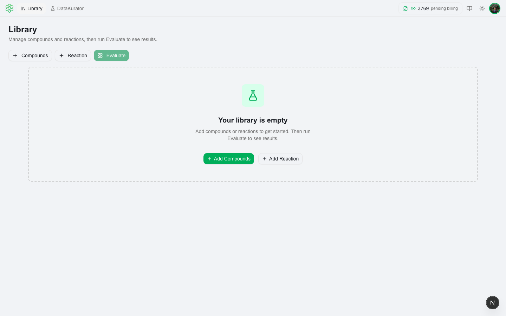
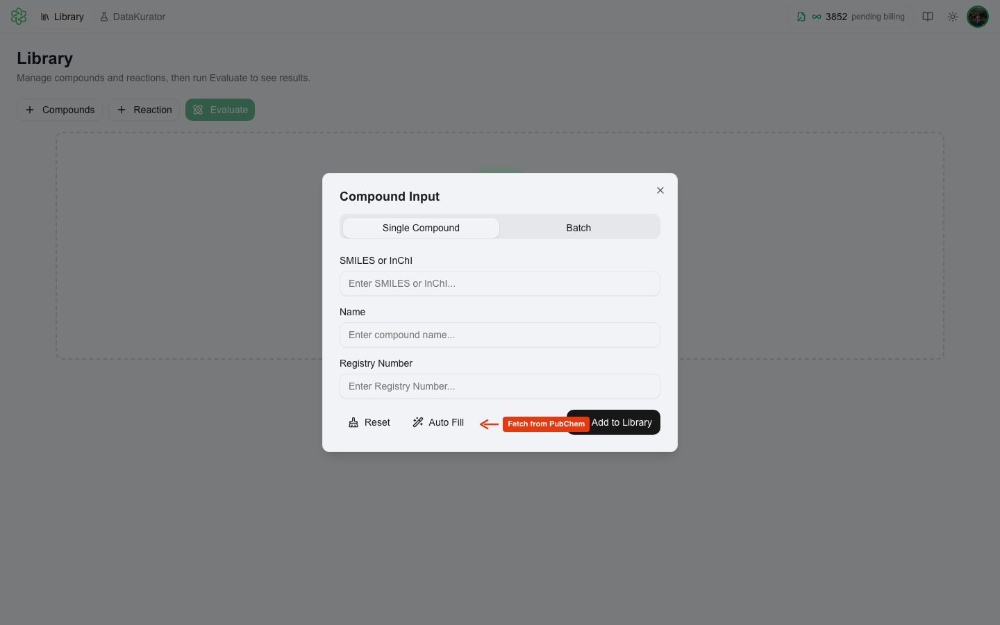
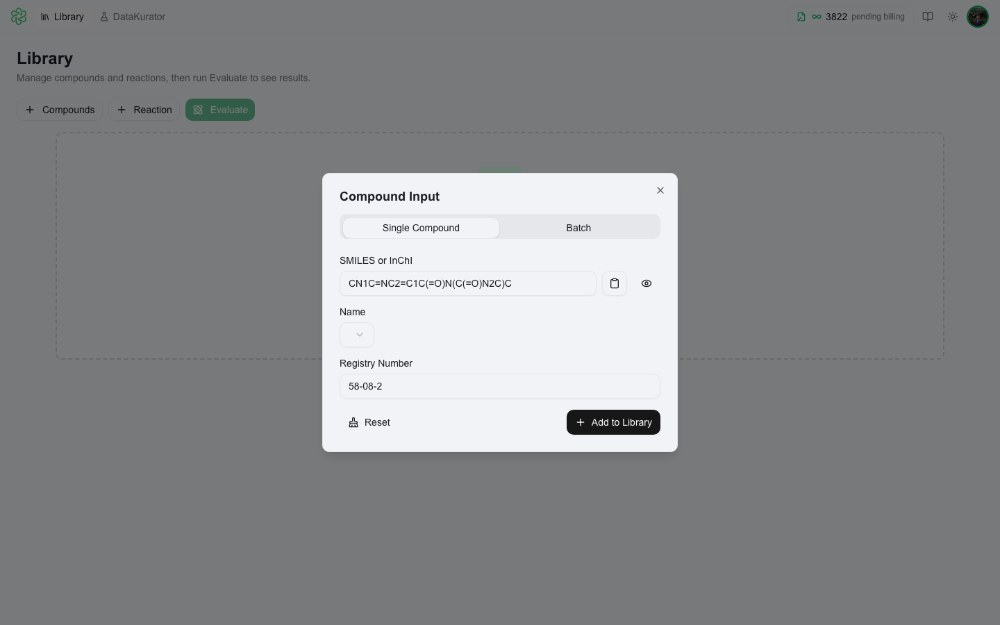
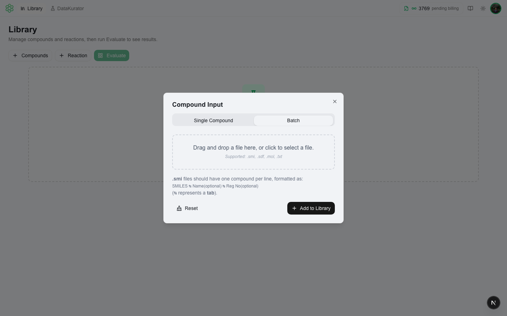
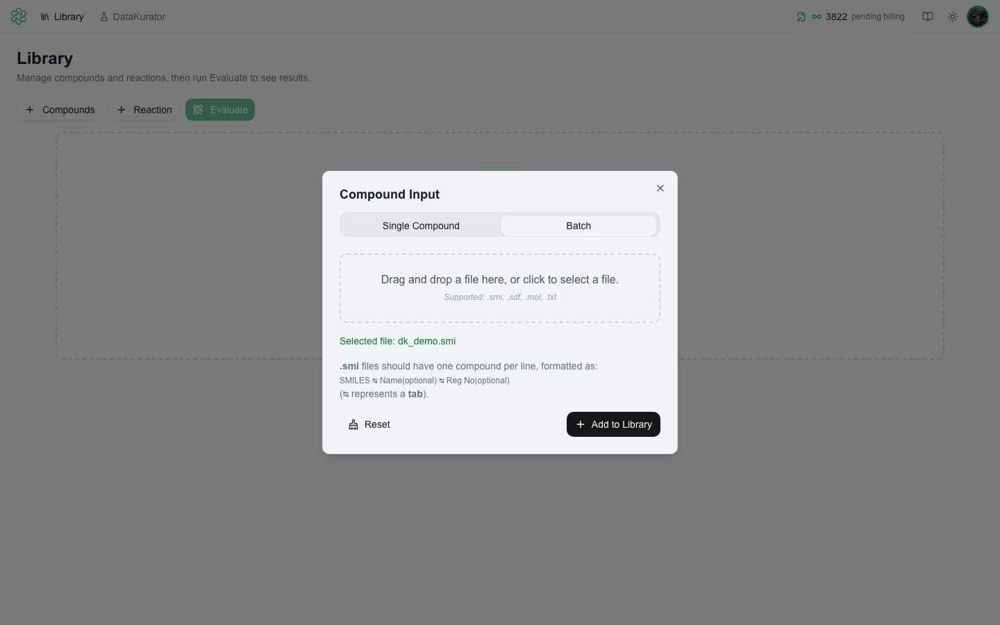
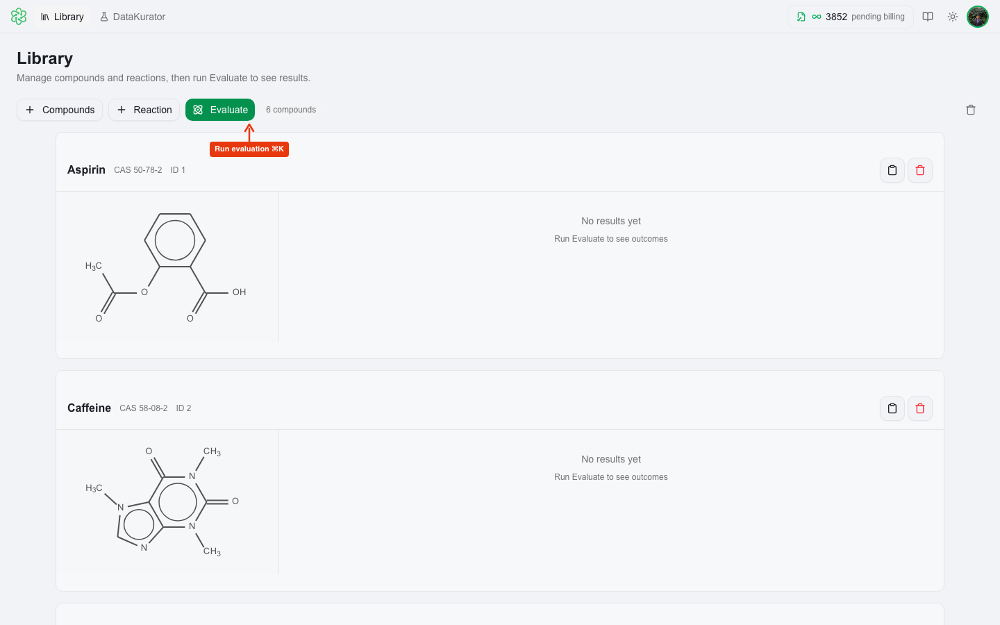
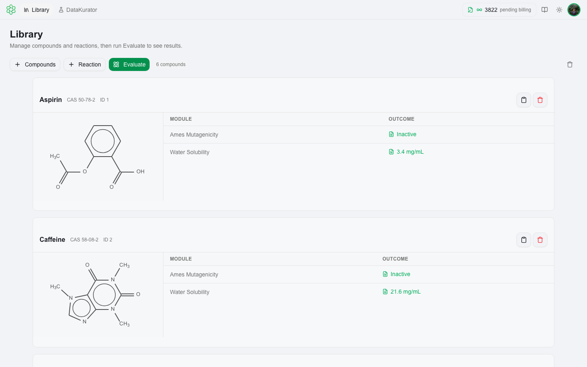

# Loading Compounds

Compounds are managed in the **Library** on the main screen. Click **+ Compounds** to open the compound input dialog.

---

## ➕ Single Compound

The **Single Compound** tab is active by default.

1. Enter a **compound name**, **CAS number**, or **SMILES** — any one field is enough to start.
2. Click **Auto Fill** to have QSARFlex fetch missing details (name, CAS, SMILES) from PubChem automatically.
3. Review the populated fields and the structure preview.
4. Click **Add to Library**.

**Auto Fill** uses the value you typed to search PubChem. It works best with an exact compound name, CAS number, or valid SMILES string. After Auto Fill completes, review the results — PubChem data is generally reliable but you can edit any field before adding.

> If you enter a SMILES string directly and the structure has issues, you'll see a warning. You can still add the compound and fix it in [DataKurator](../datakurator.md) later.

---

## 📂 Batch Upload

Switch to the **Batch** tab to upload a file containing multiple compounds.

**Supported formats:**

| Format | Extension | Notes |
|---|---|---|
| SMILES | `.smi`, `.smiles`, `.txt` | One compound per line; optional name and CAS columns |
| SDF / MOL | `.sdf`, `.mol` | Standard structure-data file |
| CSV | `.csv` | Must include a SMILES column |

Drag & drop the file into the upload area or click to browse. A preview of the detected compounds is shown before import.

Click **Add to Library** to import all compounds.

> **Structural issues detected?** If your file contains mixtures, aromaticity errors, or other structural problems, QSARFlex will prompt you with two options:
> - **Add Anyway** — load the compounds as-is
> - **Fix in DataKurator** — send the file directly to [DataKurator](../datakurator.md) for curation before importing

---

## 📋 Library View

All compounds appear in the Library as cards — one card per compound.

Each card shows:
- Compound name, CAS number, and SMILES
- A 2D structure preview
- Evaluation results (if the compound has been evaluated) — one row per module

Click any evaluation result value to generate and view the full HTML report for that compound and module.

Click the **trash icon** on a card to remove a compound. Use **Clear Library** (the trash button in the toolbar, visible when the library has items) to remove all entries at once.

---

## Next Steps

- [DataKurator](../datakurator.md) — validate and clean your compounds before evaluation
- [Evaluation](../evaluation.md) — run prediction modules on your library
