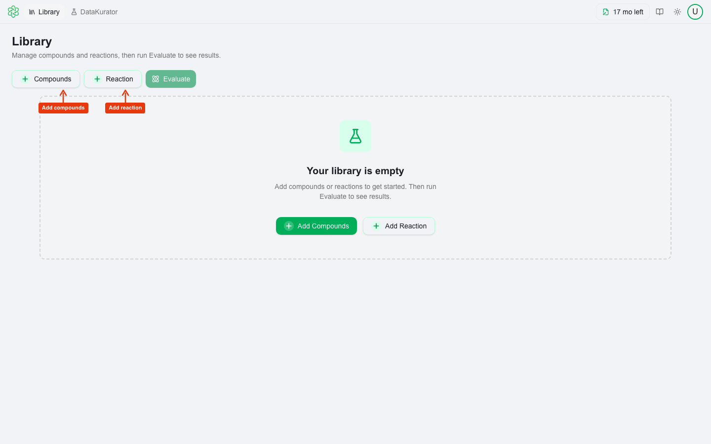
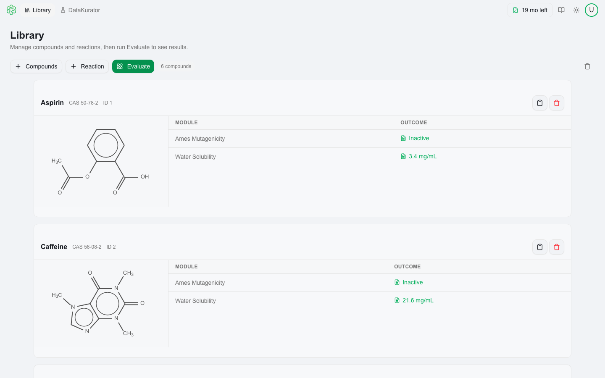

# Loading Compounds

Compounds are managed in the **Library** on the main screen. There are three ways to add them:

- The **Compound Input** dialog — click **+ Compounds** in the toolbar, or **Add Compounds** on the empty-library card.
- **Drag and drop** — drop structure files anywhere on the Library page.
- **Paste** — press **⌘+V** (macOS) or **Ctrl+V** (Windows) with SMILES text or files on the clipboard.

While the library is empty, the toolbar is hidden. The empty-state card carries the **Add Compounds** and **Add Reaction** buttons instead, along with a reminder that you can also drop files or paste SMILES.

<figure><picture>
  <source media="(prefers-color-scheme: dark)" srcset="../.gitbook/assets/library-empty-dark.png">
  
</picture></figure>

---

## ➕ Single Compound

The **Compound Input** dialog has two tabs — **Single Compound** and **Batch**. Single Compound is active by default and has three fields:

- **SMILES or InChI**
- **Name**
- **Registry Number**

<figure><picture>
  <source media="(prefers-color-scheme: dark)" srcset="../.gitbook/assets/add-compound-dark.png">
  
</picture></figure>

1. Enter any one of the three fields — one is enough for Auto Fill.
2. Click **Auto Fill** to look the compound up in PubChem. Fields you left blank are filled in; anything you typed yourself is kept.
3. Review the result. If PubChem returned several names, the **Name** field becomes a dropdown of alternatives to choose from.
4. Click **Add to Library**.

A structure in the **SMILES or InChI** field gains a copy button that puts the SMILES on the clipboard. For a valid SMILES you also get an eye icon that shows or hides a 2D structure preview; it is not offered for InChI input. **Reset** clears the form. Adding to the library requires a SMILES or InChI — a name or registry number alone is enough for Auto Fill, but not for adding.

<figure><picture>
  <source media="(prefers-color-scheme: dark)" srcset="../.gitbook/assets/add-compound-autofill-dark.png">
  
</picture></figure>


**Auto Fill** works best with an exact compound name, CAS registry number, or valid SMILES string. PubChem data is generally reliable, but review the result — you can edit any field before adding.


---

## 📂 Batch Upload

Switch to the **Batch** tab to upload a file containing multiple compounds. Drag and drop a file into the upload area, or click it to browse. One file at a time — to import several files at once, drop them onto the Library page instead (see below).

<figure><picture>
  <source media="(prefers-color-scheme: dark)" srcset="../.gitbook/assets/batch-upload-dark.png">
  
</picture></figure>

**Supported file types:**

| Format | Extensions | Notes |
|---|---|---|
| SMILES / delimited text | `.smi`, `.smiles`, `.txt`, `.csv`, `.tsv`, `.tab`, `.dat` | One compound per line |
| SDF / MOL | `.sdf`, `.mol` | Standard structure-data file |

`.smi` files should have one compound per line, formatted as `SMILES ↹ Name(optional) ↹ Reg No(optional)`, where `↹` is a tab.

<figure><picture>
  <source media="(prefers-color-scheme: dark)" srcset="../.gitbook/assets/batch-upload-with-file-dark.png">
  
</picture></figure>

Click **Add to Library** to import all compounds. A progress bar shows while the file is parsed and analyzed.

---

## 🖐️ Drag & Drop and Paste

You do not need the dialog at all:

- **Drop files anywhere on the Library page.** While you drag, an overlay appears: *"Drop to add to your library"*. Files are routed by extension — compound files and `.rxn` reaction files can be dropped together in one selection, and each goes to the right importer automatically. Unsupported files are skipped with a message.
- **Paste with ⌘+V / Ctrl+V.** Pasted SMILES text (or files on the clipboard) goes through exactly the same parser as an uploaded file. A paste is ignored while you are typing in a text field or while a dialog is open.

Reactions added by drop or paste are named automatically ("Reaction - N steps"); see [Loading Reactions](../loading-reactions.md).

---

## ⚠️ Curation Check

Every compound you add — single, batch, drop, or paste — is silently checked for structural problems first. This check does not contact PubChem. If issues are found (mixtures, aromaticity errors, atom-type problems, duplicates, and so on), a **Curation issues detected** dialog reports how many compounds are affected, with a badge breakdown per issue type, and offers two choices:

- **Add Anyway** — load the compounds as-is.
- **Fix in DataKurator** — hand the whole set to [DataKurator](../datakurator.md) for curation before importing.


In the web application the curation check runs on the QSAR Flex service, as do structure depiction, evaluation, and report generation. Your structures are sent with each request and are not kept afterwards.


---

## 📋 Library View

All compounds appear in the Library as cards — one card per compound.

<figure><picture>
  <source media="(prefers-color-scheme: dark)" srcset="../.gitbook/assets/library-compounds-dark.png">
  
</picture></figure>

Each card has:

- A header with the compound's library number and name, its CAS number, a copy-SMILES button, and a delete (trash) button. The number is assigned when the compound is added and stays with it — it is not renumbered when other compounds are deleted.
- A 2D structure preview — click it to zoom.
- A results table with **Module** and **Outcome** columns, one row per evaluated module. Before evaluation the card reads *"Ready to evaluate"*; an outcome that was not produced shows as *N/A*.

<figure><picture>
  <source media="(prefers-color-scheme: dark)" srcset="../.gitbook/assets/library-with-results-dark.png">
  
</picture></figure>

Click any outcome value to open the full report for that compound and module.

Once the library has items, the toolbar appears above the cards: **+ Compounds**, **+ Reaction**, the green **Evaluate** button, a count of what is loaded, and a right-aligned **Clear all** button.

- The **trash icon** on a card removes that compound after a confirmation — its evaluation results are deleted with it.
- **Clear all** empties the entire library after a confirmation that names exactly what will be deleted. There is no undo, and re-evaluating consumes tests again.

---

## Next Steps

- [DataKurator](../datakurator.md) — validate and clean your compounds before evaluation
- [Evaluation](../evaluation.md) — run prediction modules on your library
