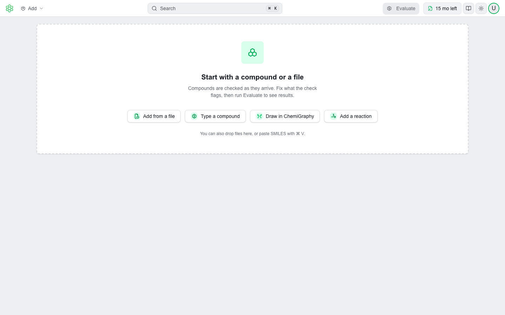
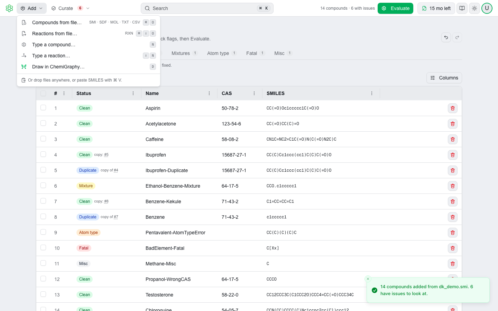
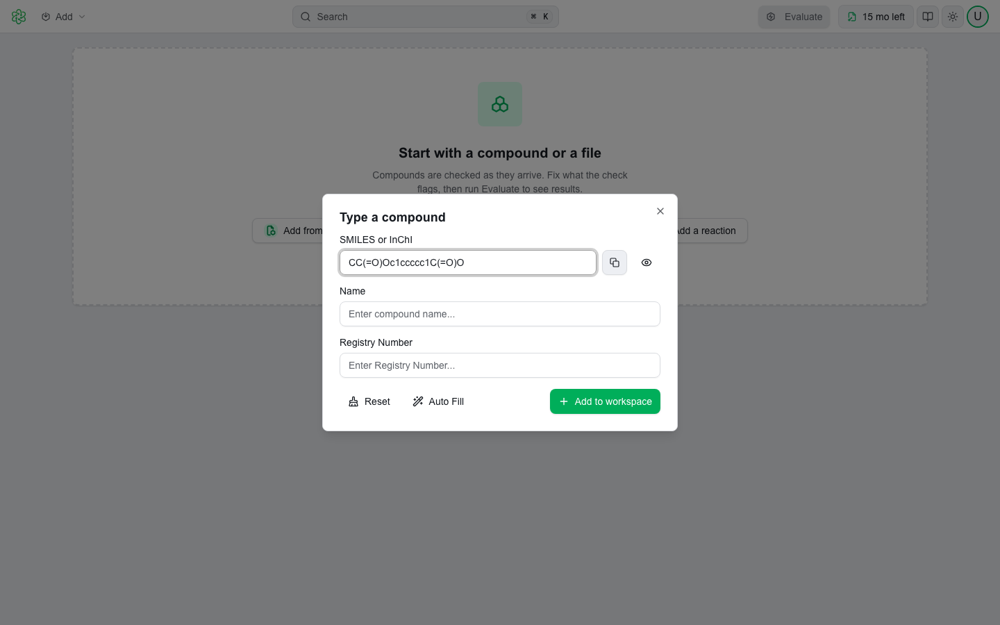
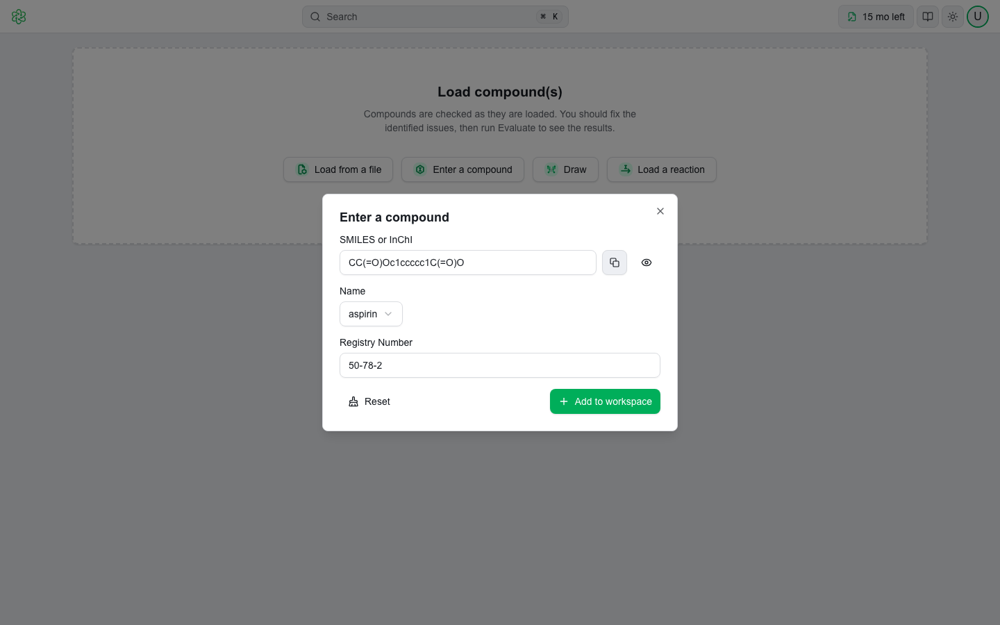

# Loading Compounds

Compounds live in the **workspace**, the table on the main screen. There are five ways in, and all of them end the same way: the compounds are added to the table and checked, and each row wears its curation verdict.

- **Add ▾ → Compounds from file…** — the file picker. Several files at once.
- **Add ▾ → Type a compound…** — the **Type a compound** dialog, for one compound by SMILES, InChI, name or registry number.
- **Add ▾ → Draw in ChemiGraphy…** — the structure editor. See [Drawing Structures](../structure-editor.md).
- **Drag and drop** — drop files anywhere on the page.
- **Paste** — press **⌘+V** (macOS) or **Ctrl+V** (Windows) with SMILES text or files on the clipboard.

While the workspace is empty, the page is a single card with the same routes as buttons — **Add from a file**, **Type a compound**, **Draw in ChemiGraphy**, **Add a reaction** — and a reminder that you can also drop files or paste SMILES.

<figure><picture>
  <source media="(prefers-color-scheme: dark)" srcset="../.gitbook/assets/workspace-empty-dark.png">
  
</picture></figure>

---

## 📂 From a file

**Add ▾ → Compounds from file…** opens the file picker. Pick one file or several; they are read together and added in one step.

<figure><picture>
  <source media="(prefers-color-scheme: dark)" srcset="../.gitbook/assets/workspace-add-menu-dark.png">
  
</picture></figure>

**Supported file types:**

| Format | Extensions | Notes |
|---|---|---|
| SMILES / delimited text | `.smi`, `.smiles`, `.txt`, `.csv`, `.tsv`, `.tab`, `.dat` | One compound per line |
| SDF / MOL | `.sdf`, `.mol` | Standard structure-data file |

`.smi` files should have one compound per line, formatted as `SMILES ↹ Name(optional) ↹ Reg No(optional)`, where `↹` is a tab.

While the files are read and the rows checked, an overlay names the phase — **Reading the files**, then **Checking the structures** — with a **Cancel** button. When it finishes, the toast counts what arrived against where it came from: *14 compounds added from mydata.smi. 6 have issues to look at.* Check that number against what you expected — the parser returns the compounds it could read and does not report the rows it skipped, so the count is your only signal that a row was dropped.

Loading into a workspace that already has compounds **appends**. The new rows are numbered after the existing ones, and the whole set is checked again, so a duplicate is found whether its twin came from this file or an earlier one.

---

## ➕ Typing a compound

**Add ▾ → Type a compound…** opens the **Type a compound** dialog. It has three fields:

- **SMILES or InChI**
- **Name**
- **Registry Number**

<figure><picture>
  <source media="(prefers-color-scheme: dark)" srcset="../.gitbook/assets/add-compound-dark.png">
  
</picture></figure>

1. Enter any one of the three fields — one is enough for Auto Fill.
2. Click **Auto Fill** to look the compound up in PubChem. Fields you left blank are filled in; anything you typed yourself is kept.
3. Review the result. If PubChem returned several names, the **Name** field becomes a dropdown of alternatives to choose from.
4. Click **Add to workspace**.

<figure><picture>
  <source media="(prefers-color-scheme: dark)" srcset="../.gitbook/assets/add-compound-autofill-dark.png">
  
</picture></figure>

A structure in the **SMILES or InChI** field gains a copy button that puts the SMILES on the clipboard. For a valid SMILES you also get an eye icon that shows or hides a 2D structure preview; it is not offered for InChI input. **Reset** clears the form. Adding requires a SMILES or InChI — a name or registry number alone is enough for Auto Fill, but not for adding.


**Auto Fill** is the one place that queries PubChem as soon as you press it: it sends what you typed to PubChem at NCBI. Its data is generally reliable, but review the result — you can edit any field before adding.


For many compounds at once, use **Add ▾ → Compounds from file…**, or drop the file onto the page.

---

## 🖐️ Drag & Drop and Paste

You do not need a menu at all:

- **Drop files anywhere on the page.** While you drag, an overlay appears: *Drop to add to the workspace*. Files are routed by extension — compound files and `.rxn` reaction files can be dropped together in one selection, and each goes to the right importer automatically. Unsupported files are skipped with a message.
- **Paste with ⌘+V / Ctrl+V.** Pasted SMILES text (or files on the clipboard) goes through exactly the same parser as a file. A paste is ignored while you are typing in a text field or while a dialog is open; the row panel does not count as a dialog, so you can paste with a row open.

Reactions added by drop or paste are named automatically (*Reaction - N steps*); see [Loading Reactions](../loading-reactions.md). On the Account pages a drop or a paste does nothing.

---

## ✅ The check

Every compound you add — file, dialog, drop, paste or drawing — is checked for structural problems as it arrives, and the answer goes on the row as a badge: **Clean**, or **Mixture**, **Duplicate**, **Atom type**, **Fatal** and so on. The check does not contact PubChem. Nothing is held back: a set with issues is added with its issues visible, and the toast says how many rows need looking at.

<figure><picture>
  <source media="(prefers-color-scheme: dark)" srcset="../.gitbook/assets/workspace-table-dark.png">
  
</picture></figure>

What the badges mean, and how to fix what they flag, is on [Curating Compounds](../curation.md).


In the web application the check runs on the QSAR Flex service, as do structure depiction, evaluation and report generation. Your structures are sent with each request and are not kept afterwards.


---

## 📋 The table

Each compound is a row: its number, its badge with the check's detail beside it, its name, CAS and SMILES, and a trash button. The number is assigned when the compound is added and stays with it — rows are not renumbered when others are deleted.

<figure><picture>
  <source media="(prefers-color-scheme: dark)" srcset="../.gitbook/assets/workspace-table-dark.png">
  
</picture></figure>

- Click a row to open it in the **panel** on the left: the structure large, every field, the row's history and its evaluation results. Everything you can do to a row — edit the structure in ChemiGraphy, edit the SMILES, rename, generate tautomers, look it up in PubChem, pick the components of a mixture, delete — is there, each with a single-key shortcut. Press **?** for the list.
- The **trash** button removes the row after a confirmation. Deleting is a step you can undo.
- The chips above the table — **All**, **Clean**, **All errors**, **Duplicates**, **Mixtures** and so on — filter to one verdict; **Search the table** filters by any text; **Columns** hides and shows columns.

Once an evaluation has run, a **Results** column joins the table; see [Evaluation](../evaluation.md).

**Curate ▾ → Clear workspace…** empties the whole workspace after a confirmation that names exactly what will be deleted. That is the one action undo cannot reverse, and re-evaluating consumes tests again.

---

## Next Steps

- [Curating Compounds](../curation.md) — fix what the check flags
- [Drawing Structures](../structure-editor.md) — draw a compound, or correct one
- [Evaluation](../evaluation.md) — run prediction modules on the workspace
