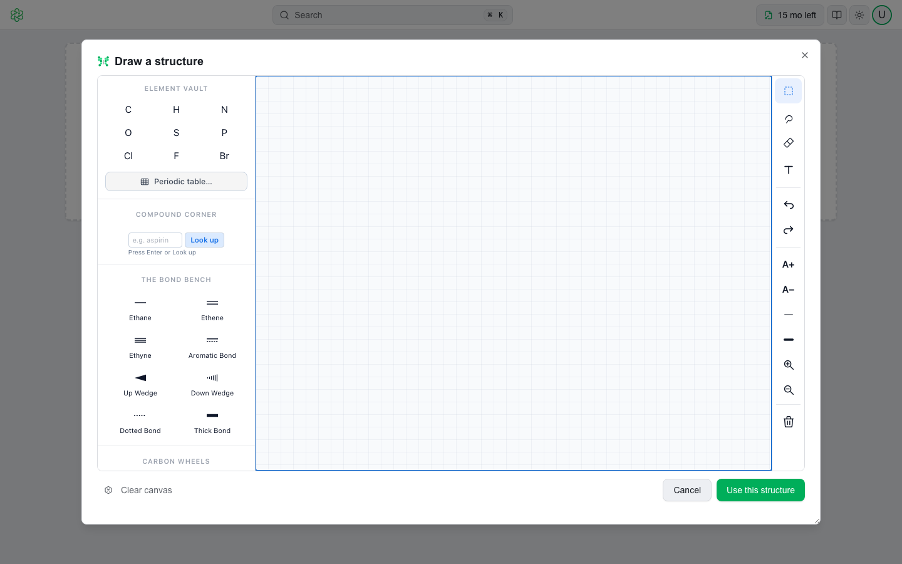
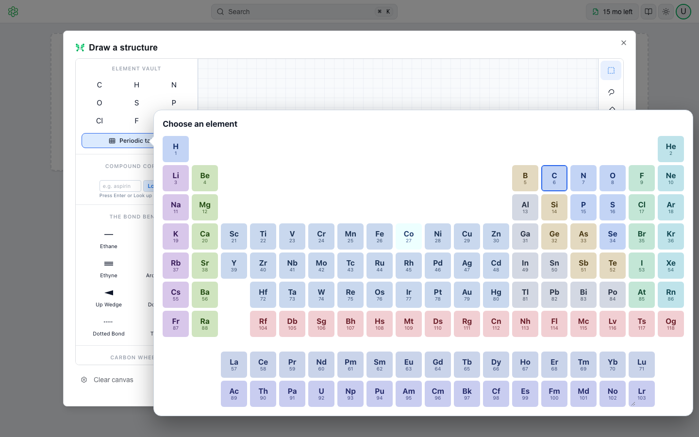

# Drawing Structures

✏️ QSAR Flex draws structures in **ChemiGraphy**, MultiCASE's structure editor, opened in a dialog inside the workspace. Use it to add a compound you would rather draw than type, or to correct one that is already loaded.

There are two ways in:

- **Load ▾ → Draw…** (or **Draw** on the empty workspace, or **D** with the table focused) opens an empty canvas under the title **Draw a structure**. **Use this structure** adds what you drew as a new compound.
- **Edit structure** — in the panel, or **E** on the row — opens the canvas on that compound under the title **Edit the structure — &lt;name&gt;**. **Use this structure** replaces its SMILES.

<figure><picture>
  <source media="(prefers-color-scheme: dark)" srcset=".gitbook/assets/editor-new-dark.png">
  
</picture></figure>

---

## The dialog

The editor fills the dialog: the palettes on the left, the canvas in the middle, the tools on the right — select, lasso, erase, text, undo and redo, label size, bond width, zoom, clear, and the canvas theme. It is the ChemiGraphy editor, with its file menu and settings left out: a structure drawn here is handed to the workspace and nowhere else.

Down the left, from the top:

- **Element Vault** — nine quick elements (C, H, N, O, S, P, Cl, F, Br) and a **Periodic table…** button. The button opens the whole table beside the panel, coloured by category and with atomic numbers; the element the next click will place is outlined. One click arms an element and closes the table. An element chosen there has no button of its own, so the **Periodic table…** button wears it as a badge — *Si* — until you pick another.
<figure><picture>
  <source media="(prefers-color-scheme: dark)" srcset=".gitbook/assets/editor-periodic-table-dark.png">
  
</picture></figure>

- **Compound Corner** — type a name, press **Look up**, and the compound is placed on the canvas from PubChem. This is the one lookup the editor makes; see [Where the editor runs](#where-the-editor-runs).
- **The Bond Bench** and **Carbon Wheels** — bond orders and wedges, and ring templates.

Two things are worth knowing before you start:

- **Escape belongs to the editor.** It cancels the bond being drawn, drops the selection, closes a popover — it does not close the dialog. Nor does clicking outside it: a drag that ends past the dialog's edge is not a request to throw the drawing away. The dialog closes on **Cancel**, the **✕**, or **Use this structure**.
- **The editor's undo is its own.** ⌘ Z inside the dialog undoes a stroke on the canvas; the workspace's history is untouched until you use the structure.

While the editor starts, the canvas reads *Starting the editor…*. The first open fetches the editor once; later opens are immediate.

---

## Editing an existing compound

<figure><picture>
  <source media="(prefers-color-scheme: dark)" srcset=".gitbook/assets/editor-edit-dark.png">
  
</picture></figure>

The canvas opens on the compound **as QSAR Flex reads it**: the engine that checks and evaluates your compounds reads the SMILES and hands the editor the atoms and bonds. What you see is the molecule QSAR Flex thinks the compound is — which is the one worth correcting.

On the way back the same engine reads the drawing and writes the SMILES, so the string that reaches the workspace is one the engine produced from atoms and bonds it read itself. That is why the SMILES may be spelled differently from what you typed — a benzene ring comes back Kekulé, `C1=CC=CC=C1` — without being a different molecule.

What happens when you press **Use this structure**:

| The drawing is | What happens |
|---|---|
| The same molecule you opened | Nothing. *The structure is unchanged.* The verdict and the evaluation results stand. |
| A different molecule | The row's SMILES is replaced and the check runs again at once, over the whole set, so the row comes back wearing its new verdict rather than waiting for a Re-check. Its evaluation results, which belonged to the old structure, are cleared. The step is named *Edit structure — &lt;name&gt;* and can be undone. |
| Empty | *Nothing has been drawn yet.* The dialog stays open. |

A compound whose SMILES the engine cannot read — a row the check calls **Fatal** — opens on an empty canvas with a note: *QSAR Flex could not read this compound's SMILES, so the canvas starts empty. Draw the structure and use it to replace the SMILES.*


Stereochemistry travels through the editor only as it is drawn. A compound that arrives with chiral tags in its SMILES is drawn without wedges; if you change it and use the structure, the SMILES that comes back has no stereo marks unless you drew them with the wedge bonds. Leaving the structure as it is keeps the original SMILES, tags included.


---

## Drawing a new compound

**Use this structure** on a new drawing adds it to the workspace as a row with no name, checked like any other — the toast reads *1 compound added from a drawing.* The row is added without opening its panel; click it when you want it. A row without a name offers **Add a name** under its title in the panel, and the name itself is the rename control from then on; a CAS number can be added the same way. The canvas does not look up what you draw: the only lookup the editor makes is **Compound Corner**, and only when you press **Look up**.

---

## Where the editor runs

The canvas you draw on is in your browser, but the drawing itself is kept by an editing session on the same side as the chemistry:

| Deployment | Where the session lives |
|---|---|
| 🌐 **Web app** | On the QSAR Flex service. Opening the editor starts a session (`POST /sketcher/start`), each stroke is relayed to it (`/sketcher/message`), **Use this structure** asks it for the SMILES (`/sketcher/smiles`), and closing the dialog ends it (`/sketcher/end`). A session left open is discarded after 30 minutes. The structure you open on is sent with the start request; nothing is kept after the session ends. |
| 💻 **Desktop** | Inside the app, in-process. Nothing leaves the workstation. |

See [Security](security.md) for the full data-handling picture.
