# Getting Support

The support portal at [support.multicase.com](https://support.multicase.com) is now the single channel for all QSAR Flex support. It uses the same MultiCASE account you sign in to QSAR Flex with — no separate registration.

If you run into an issue, have a question, or need help with anything related to QSAR Flex, open a support ticket there. Our team — or your distributor — will respond directly in the ticket thread.

The portal is a separate website, opened in a browser. QSAR Flex has no ticket form of its own: the book icon in the navbar opens this documentation, and support is raised at the portal.


The portal replaces email support. Please open a ticket for all new requests so nothing falls through the cracks.


---

## 1. Sign In

Go to [support.multicase.com](https://support.multicase.com) and click **Sign in with Cognito**. Use the same MultiCASE account credentials you use for QSAR Flex.

<figure><picture>
  <source media="(prefers-color-scheme: dark)" srcset=".gitbook/assets/support/support-signin-dark.png">
  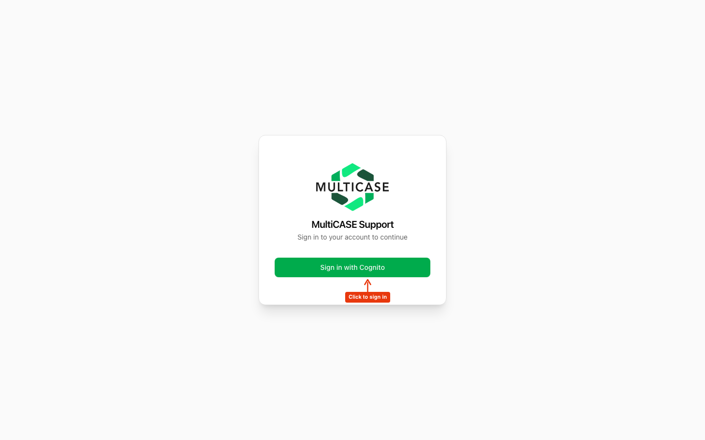
</picture></figure>

You will be redirected to the MultiCASE login page. Enter your **email address** first, then your **password** on the next screen.

<figure>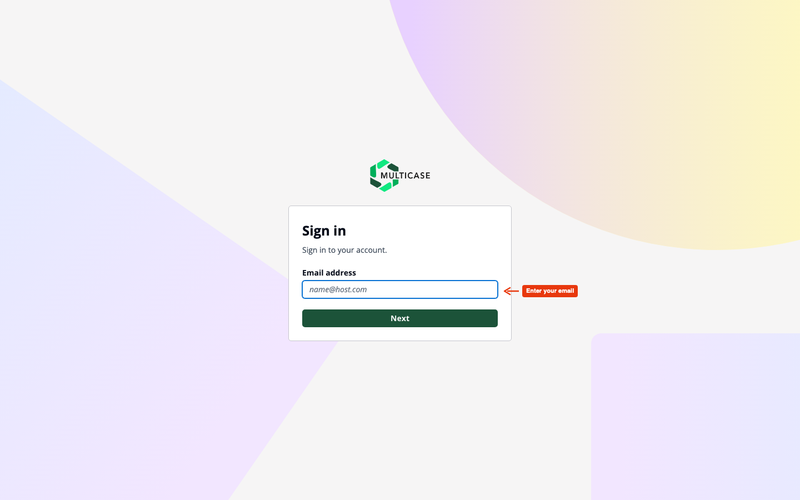</figure>

<figure>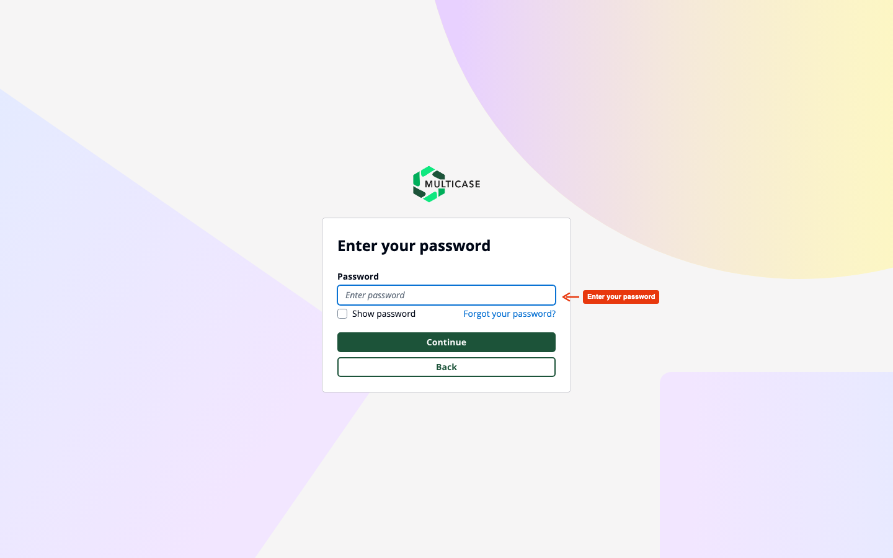</figure>

---

## 2. The Support Dashboard

After signing in you land on the dashboard. It shows a summary of your open, in-progress, and resolved tickets at a glance, along with recent activity.

<figure><picture>
  <source media="(prefers-color-scheme: dark)" srcset=".gitbook/assets/support/support-dashboard-dark.png">
  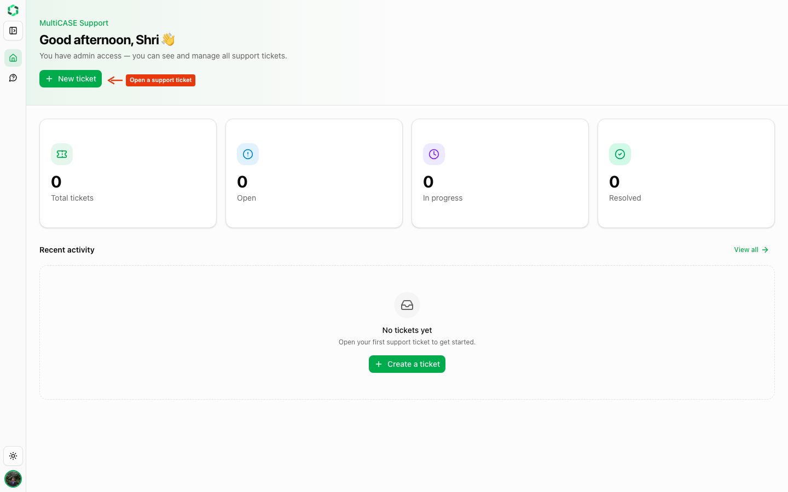
</picture></figure>

---

## 3. Open a New Ticket

Click **New ticket** — either from the dashboard or from the **Tickets** page in the sidebar.

<figure>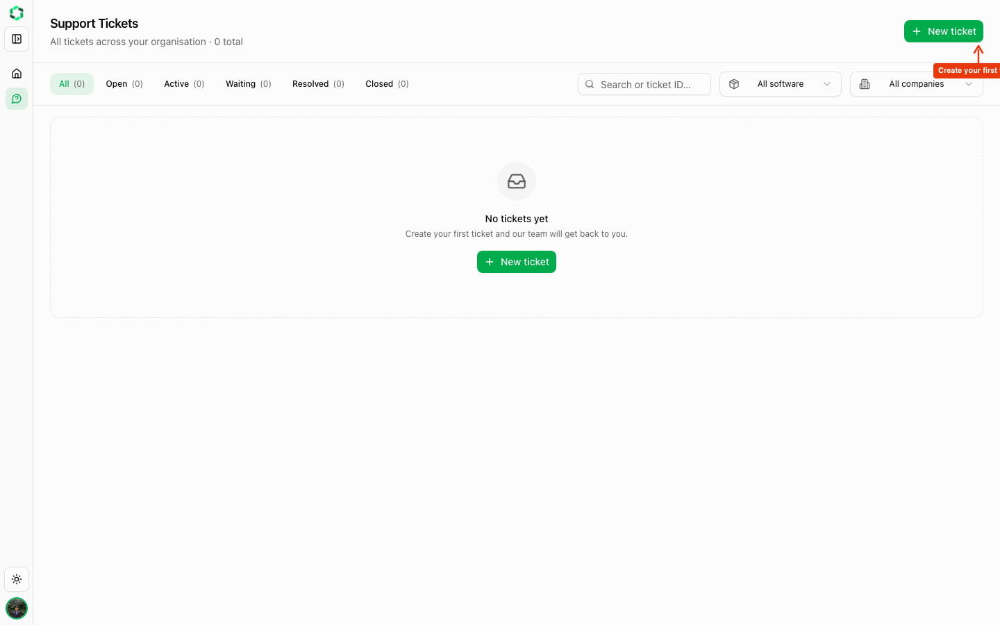</figure>

The **Create support ticket** dialog opens. Fill in the three required fields:

| Field | What to enter |
|---|---|
| **Software** | Select the product you need help with (e.g. QSAR Flex) |
| **Subject** | A short, clear summary of the issue |
| **Description** | Full details — steps to reproduce, what you expected, what happened |

You can also set **Platform** and **Version**. Both are optional, and the portal pre-fills them for you when it can.

<figure><picture>
  <source media="(prefers-color-scheme: dark)" srcset=".gitbook/assets/support/support-new-ticket-empty-dark.png">
  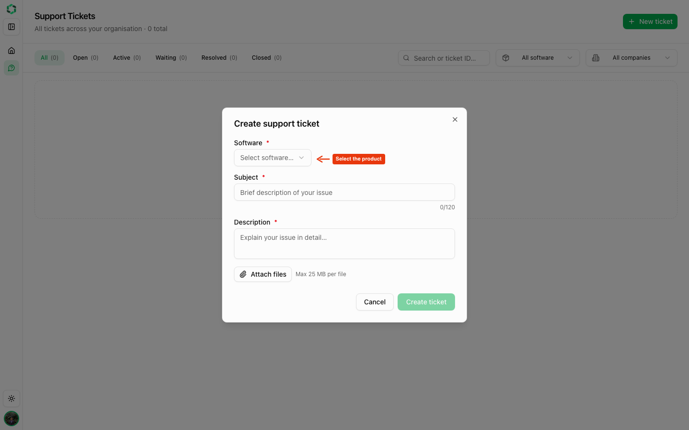
</picture></figure>

Select the affected product from the dropdown first:

<figure><picture>
  <source media="(prefers-color-scheme: dark)" srcset=".gitbook/assets/support/support-new-ticket-software-dark.png">
  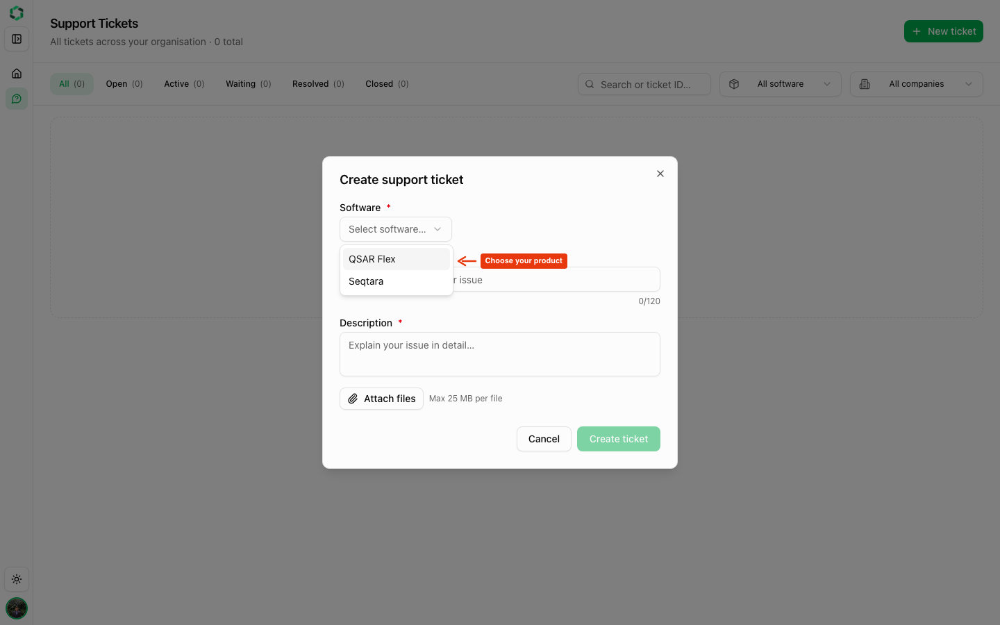
</picture></figure>

Then fill in the subject and a detailed description. You can also **attach files** — log files, screenshots, or input data — up to 25 MB each.

<figure><picture>
  <source media="(prefers-color-scheme: dark)" srcset=".gitbook/assets/support/support-new-ticket-filled-dark.png">
  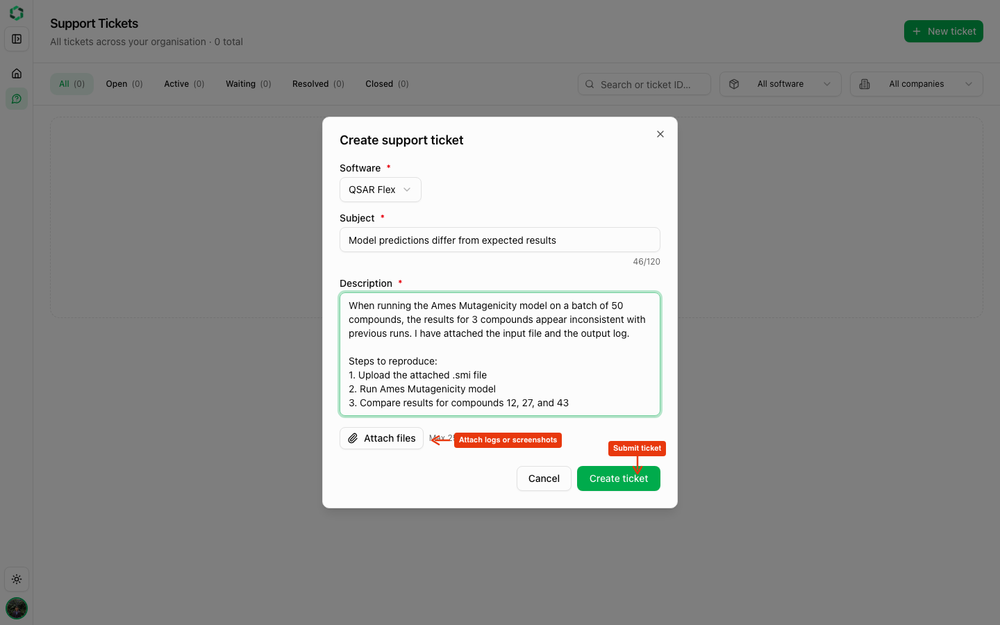
</picture></figure>

Click **Create ticket** to submit. You will see it appear in your ticket list immediately.

---

## 4. Track Your Tickets

The **Tickets** page lists all your support requests. Use the status tabs to filter by **Open**, **Active**, **Waiting**, **Resolved**, or **Closed**. You can also search by keyword or ticket ID.

<figure><picture>
  <source media="(prefers-color-scheme: dark)" srcset=".gitbook/assets/support/support-tickets-list-dark.png">
  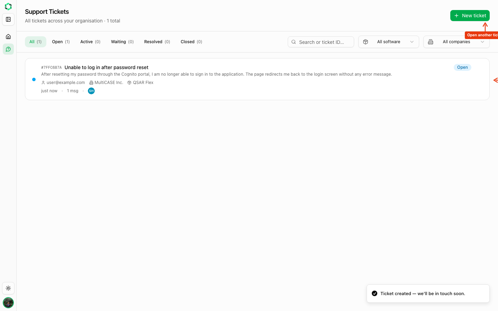
</picture></figure>

<figure><picture>
  <source media="(prefers-color-scheme: dark)" srcset=".gitbook/assets/support/support-tickets-filters-dark.png">
  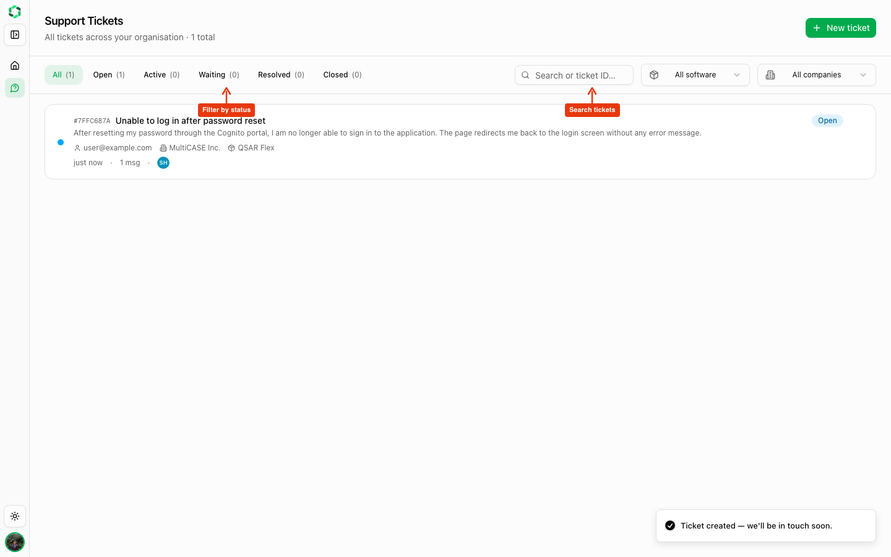
</picture></figure>

---

## 5. Reply to a Ticket

Click any ticket to open the full conversation thread. You can read replies from the support team, see attachments, and track the current status.

<figure><picture>
  <source media="(prefers-color-scheme: dark)" srcset=".gitbook/assets/support/support-ticket-detail-dark.png">
  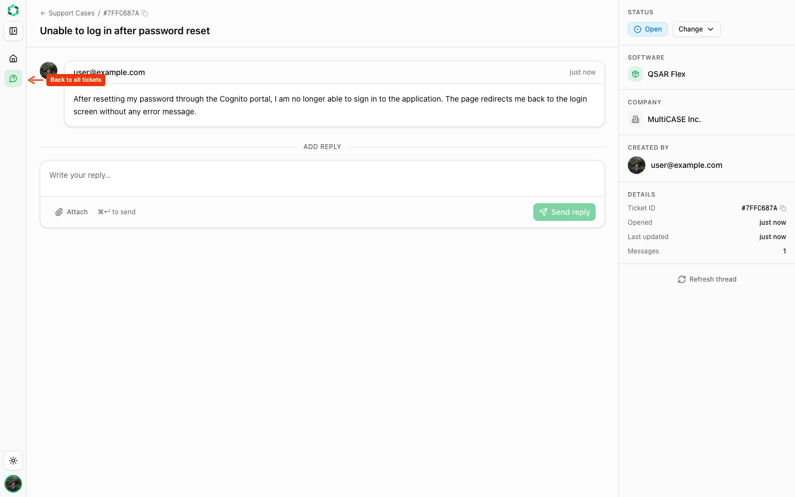
</picture></figure>

When the status shows **Waiting on You**, the support team has replied and is waiting for more information. Type your response in the reply box at the bottom and click **Send reply**.

<figure><picture>
  <source media="(prefers-color-scheme: dark)" srcset=".gitbook/assets/support/support-ticket-reply-dark.png">
  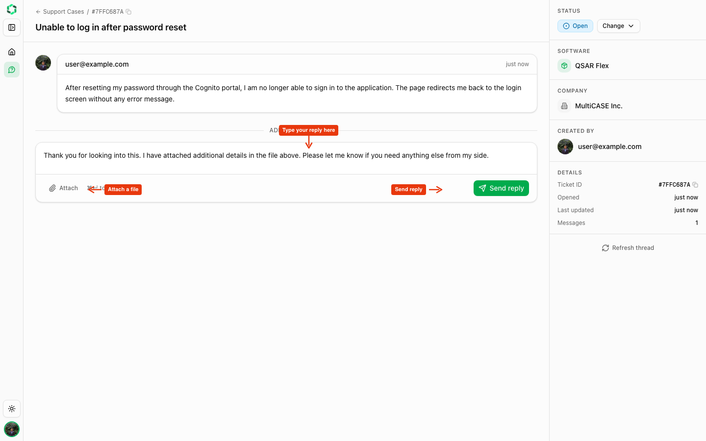
</picture></figure>

You can attach additional files to any reply the same way as when creating the ticket.

---

## Ticket Statuses

Each ticket carries a status badge, visible in the ticket list and under **Status** in the details panel beside the ticket thread.

<figure><picture>
  <source media="(prefers-color-scheme: dark)" srcset=".gitbook/assets/support/support-ticket-status-dark.png">
  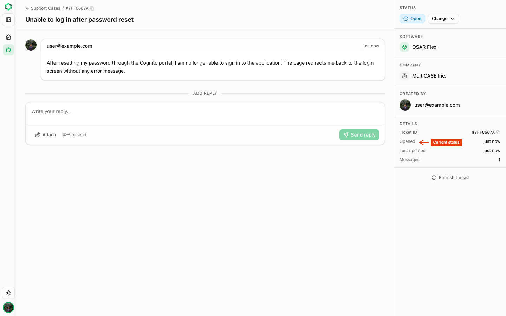
</picture></figure>

| Status | Meaning |
|---|---|
| **Open** | Ticket received, awaiting a first response |
| **In Progress** | Being actively worked on — the **Active** filter tab shows these tickets |
| **Waiting on You** | Support team has replied and needs your input |
| **Resolved** | Issue has been fixed or answered |
| **Closed** | Ticket finished — it stays in your list, and a new reply reopens it |
