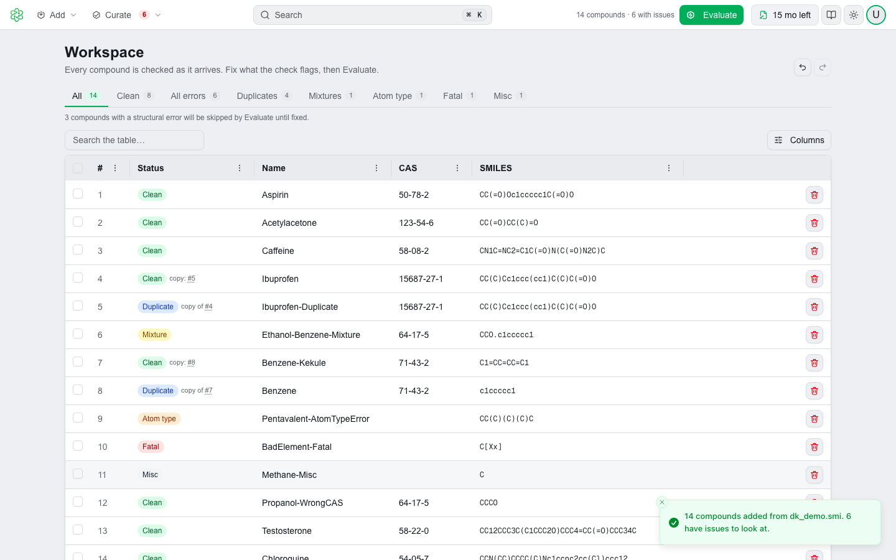
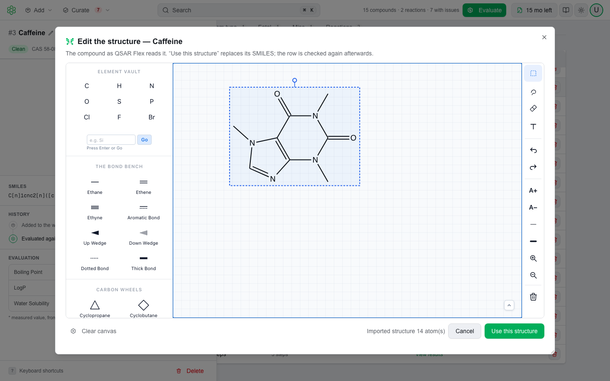

# What's New in 4.0

QSAR Flex 4.0 replaces the interface. The models, the endpoints and the numbers they produce are unchanged — a compound you evaluated in 3.x returns the same result in 4.0.

Most readers are coming from the **QSAR Flex 3.x desktop for Windows**, a WinForms program with menus, toolbars and an interface of its own that never ran the web interface. 4.0 does not rearrange that interface; it replaces it. The application you install now wraps the interface QSAR Flex runs in the browser, in a native window for Windows and, for the first time, macOS. Nothing carries over visually, so read the sections below as a description of a new application rather than a list of things that moved.

| | |
|---|---|
| **Interface** | Entirely new. One navbar, a command bar, light and dark themes. |
| **Platform** | Windows and macOS. The Apple Silicon build is new in 4.0. |
| **Workspace** | One table for loading, curating and evaluating. Drop files, paste SMILES, fix rows in place. |
| **ChemiGraphy** | MultiCASE's structure editor, inside QSAR Flex: draw a compound, or correct one, without leaving the workspace. |
| **Curation** | Every compound is checked as it arrives; One Step Cure, tautomers and PubChem verification act on the same rows, with named undo. |
| **Licensing** | An Account page, and per-license activity you can read back. |
| **Support** | A portal at support.multicase.com, replacing email. |
| **Chemistry** | Unchanged. No data migration, no license re-issue. |

---

## QSAR Flex runs on macOS

Until 4.0 the desktop was Windows only. There is now a native **Apple Silicon** build for macOS 12 Monterey or later, signed by Apple and notarized. It installs by dragging it to Applications and needs no administrator rights.

It is the same application as the Windows one — the same interface, the same modules, the same reports — and it is covered by the license you already hold. Windows remains 64-bit.

Both builds evaluate on your own machine, as 3.x did. On first run the application downloads its encrypted model files and a reference database, about 4.0 GB. Neither the desktop nor the web app works offline: each needs an internet connection at launch to sign in and check your license, and again at every evaluation.

See [Installing on macOS](install-mac.md) and [Installing on Windows](install-win.md).

---

## One bar, one workspace

**The navbar.** A single 48-pixel bar runs across the top of the window and carries everything. There are no menus above it and no toolbars below it. Page content starts immediately underneath.

**Add, Curate, Evaluate.** On the left of the bar, next to the logo, **Add ▾** holds every way of bringing compounds and reactions in, and **Curate ▾** holds every way of fixing them. **Evaluate**, the one filled button, sits on the right beside the count of what the workspace holds. Nothing moves between screens: loading, curating and evaluating happen on the same table.

**A command bar.** In the center of the navbar is a **Search** control with a **⌘K** / **Ctrl+K** key cap and the tooltip *Find any action by name*. Press the shortcut from anywhere in the app — except while you are typing in a text field — and it opens. It is the fastest way to reach a control you cannot see, and it is worth learning first if you are new to this interface.

The command bar lists every action in five groups:

| Group | Commands |
|---|---|
| **Add** | Add compounds from a file · Add reactions from a file · Type a compound · Draw a structure in ChemiGraphy · Type a reaction |
| **Curate** | One Step Cure · Re-check all compounds · Download curated structures · Open the history log · Undo · Redo · Clear the workspace |
| **Workspace** | Evaluate |
| **Go to** | Workspace · Account and license |
| **QSAR Flex** | Switch to dark mode (or light mode) · Match my system appearance · Keyboard shortcuts · User guide · Sign out |

Every command is offered from every page. Commands that cannot run right now are still listed — grayed, with the reason on the row (*Nothing in the workspace*, *No compounds loaded*) — so you never have to guess whether a command exists. Each row also names where the control lives: *Add menu*, *Curate menu*, *Menu bar*, *Top right*.

**A license status chip.** The right side of the navbar carries a persistent chip showing the state of your license: tests remaining for a pay-per-test license, **Unlimited** for an on-demand subscription, time left or **Expired** for a dated subscription. It turns amber when a pay-per-test license drops below 10 remaining tests. Clicking it takes you straight to your license. It also distinguishes **License unavailable** (the license service could not be reached) from **No active license** (there genuinely isn't one), so a transient outage does not look like a licensing problem.

**A Documentation button.** Next to the chip, the book icon opens this documentation space away from the page you are on — a new browser tab in the web app, your default browser on the macOS build, a separate window on the Windows build.

**Light and dark themes.** The theme control offers **Light**, **Dark** and **System**. The trigger shows the theme you are actually seeing; the menu shows the setting. You can also flip themes from the command bar.

See [The QSAR Flex Window](interface.md).

---

## The workspace

The workspace is the table on the main screen. It holds the compounds and reactions you are working on, it is where they are checked, and it is where you evaluate.

<figure><picture>
  <source media="(prefers-color-scheme: dark)" srcset=".gitbook/assets/workspace-table-dark.png">
  
</picture></figure>

**Drag and drop, or paste.** There is no dialog to open first. Drop files anywhere on the page, or paste SMILES from the clipboard with **⌘+V** / **Ctrl+V**. While you drag, a full-screen overlay confirms the target: *Drop to add to the workspace*.

**Compounds and reactions are routed for you.** The file extension decides which importer runs. `.rxn` files become reactions; `.smi`, `.smiles`, `.txt`, `.csv`, `.tsv`, `.tab`, `.dat`, `.sdf` and `.mol` become compounds. Drop a mixed selection and both are added in one go. Anything else raises an explicit message rather than failing quietly.

**Every compound is checked as it arrives.** The check reads each structure and puts its verdict on the row as a badge — **Clean**, or **Mixture**, **Duplicate**, **Atom type**, **Fatal** — and the chips above the table filter to one verdict at a time. Nothing is held back: a set with issues is added with its issues visible, and the toast says how many rows need looking at.

**One panel for one row.** Click a row and it opens in a panel on the left: the structure drawn large, the check's finding and what to do about it, the SMILES, the row's history, and its evaluation results once it has any. The table stays live beside it; **↑** and **↓** move the panel to the next row, **Esc** closes it. Every action on a row — edit the structure or the SMILES, rename, tautomers, PubChem, pick the components of a mixture, delete — is in the panel, each with a single-key shortcut.

**Empty states that tell you what to do.** An empty workspace shows one card, *Start with a compound or a file*, with **Add from a file**, **Type a compound**, **Draw in ChemiGraphy** and **Add a reaction**, and the line *You can also drop files here, or paste SMILES with ⌘ V.* On Windows that line reads *Ctrl + V*.

**Results stay on the rows.** After a run the table gains a **Results** column — *View results* opens the row's panel on its outcomes, one per module, and a module's row in the panel opens its report. Structures in the panel and in every report are drawn by ChemiGraphy, in the current theme.

See [Loading Compounds](product-guide/loading-compounds.md), [Loading Reactions](loading-reactions.md) and [Evaluation](evaluation.md).

---

## ChemiGraphy, inside QSAR Flex


**New in 4.0.** ChemiGraphy, MultiCASE's chemical structure editor, is built into QSAR Flex. Draw a compound instead of typing its SMILES, or open a compound the check flagged and correct it on the canvas. What you draw is read by the same engine that checks and evaluates your compounds, so the structure that reaches the table is exactly the one QSAR Flex will score.


<figure><picture>
  <source media="(prefers-color-scheme: dark)" srcset=".gitbook/assets/editor-edit-dark.png">
  
</picture></figure>

**Two ways in.** **Add ▾ → Draw in ChemiGraphy…** opens an empty canvas, and **Use this structure** adds what you drew as a new compound, checked like any other. **Edit structure**, in a row's panel, opens the canvas on that compound *as QSAR Flex reads it*; **Use this structure** replaces its SMILES, and the row is checked again.

**The whole editor.** The element and bond palettes, the ring library, the lookup by name, arrows, selection and lasso, erase, text, undo and redo, label size, bond width and zoom — the ChemiGraphy editor, with only its file menu and settings left out, because a structure drawn here is handed to the workspace and nowhere else.

**Escape belongs to the editor.** It cancels the bond being drawn, drops the selection, closes a popover — it does not close the dialog, and nor does clicking outside it. The dialog closes on **Cancel**, the **✕**, or **Use this structure**, so a drag that ends past the edge never throws a drawing away.

**One renderer, everywhere.** ChemiGraphy also draws every structure QSAR Flex shows — the panel, the tautomer viewer, the component picker, and every report. A molecule looks the same on screen, in the report and in the PDF you print from it.

See [Drawing Structures](structure-editor.md).

---

## Curation, on the same rows

**One check, the same everywhere.** Every structure goes through a single structural check, and its answer is the badge. Duplicates are grouped on the checked structure with stereo ignored. The web app and the desktop apps give the same result for the same set.

**Fix a row where it is.** The panel edits the SMILES or the name, opens ChemiGraphy on the structure, splits a mixture into the components you keep, and looks a compound up in PubChem. An edited row becomes **Not checked** until the next check, and its old results are cleared, because they belonged to the old structure.

**Tautomers, per row.** **Tautomers** generates up to 200 tautomers of the row's structure, lists them beside the parent with their structures, compares any one of them with a click, and adopts it with **Use tautomer**.

**One Step Cure is a single dialog.** Bulk correction is one dialog with four counted decisions — **Mixtures/Salts**, **Duplicates**, **Atom type errors** and **Other errors** — plus a **More curation steps** section: verify structures against PubChem, remove chiral tags, neutralize negative charges, neutralize positive charge on nitrogen. One Step Cure works on the molecule, not the text: mixtures are split on the molecular graph, the largest part is the one with the most heavy atoms, and charges are neutralized by the chemistry engine.

**PubChem is opt-in and explicit.** It is skipped by the check, and any lookup — batch or single row — asks first, in a dialog titled *Send data to PubChem?* that names exactly what will leave your machine and where it goes.

**Real undo and redo.** Every step is named — *Undo One Step Cure*, *Undo Edit SMILES — Aspirin*, *Undo Evaluate 14 items* — and the Curate menu, ⌘ Z / Ctrl + Z and the command bar all step through the same history. Deletes, renames, SMILES edits, splits, PubChem lookups, re-checks, One Step Cure and evaluation runs are all reversible. **Clear workspace** is the one action that is not.

**Change summaries.** A bulk run finishes in a summary listing what changed and what needs attention, filterable by **All** / **Changed** / **Needs attention**, and opened on **Needs attention** when there is anything there.

**Long runs are legible and cancelable.** Loading, checking, One Step Cure and evaluation run behind a progress overlay that names the phase it is in. All can be canceled, and canceling says what was left alone.


**Where curation runs.** In the web app, the check and the corrections run on the QSAR Flex service over HTTPS; structures are not persisted after the request. The desktop app curates in the application process, so structures do not leave the machine during curation. See [Security](security.md).


See [Curating Compounds](curation.md).

---

## License and account

**A full Account page.** It opens with the heading **Account** and a vertical tab rail: **Profile**, **Security**, **License**, and **Team** for company admins. The tab is in the URL, so you can link straight to a section.

**License activity and billing history.** Each license has its own activity page, reached from **View activity** on the license card. It lists every test run against that license — ID, User, License, Tests used, Modules used, Activity time, Billed, Invoice reference — so an admin can see where the tests went and what has been invoiced, which is what an invoice reconciles against. Before the first run it reads *Activity appears here after the first test*.

**The license card.** The **License** tab shows software, coverage and license type in a hero row, then **License details** (software, status, coverage, number of users, type, on-demand) and **Validity & usage** (valid period, total tests, remaining tests — shown in red at zero, modules, and the selected-module list where a license covers specific modules), plus assigned users and any expired licenses.

**Enterprise administration.** Company admins assign and remove seats and create users themselves, without involving MultiCASE. Enterprise users who are not company admins see an explicit **View only** badge on the license card, and the editing actions are hidden rather than shown-and-then-refused.

See [Access & Licensing](fundamentals/access-and-licensing.md) and [Enterprise User Management](license-management/enterprise-user-management.md).

---

## Support

Support has moved to the portal at [support.multicase.com](https://support.multicase.com). Sign in with the same MultiCASE account you use for QSAR Flex — there is no separate login — and open a ticket for anything: access, licensing, bundles, seats, bugs or questions. Replies come back in the ticket thread.

The portal is a separate website, opened in a browser. QSAR Flex has no ticket form of its own: the book icon in the navbar opens this documentation, and support is raised at the portal.

Use the portal instead of emailing support or info at multicase.com. See [Getting Support](support.md).

---

## You also have a web application

The interface in 4.0 is the one QSAR Flex runs in the browser, and your license covers it. Sign in at [qsarflex.multicase.com](https://qsarflex.multicase.com) with the same account: nothing to install and nothing to download, and it stays current on its own. It suits people who move between machines, or a colleague who needs occasional access without a deployment.

Two differences are worth knowing:

- The web app **sends your structures to MultiCASE** to be evaluated. The desktop evaluates them on your own machine and sends none.
- **Surrogate Search** and **Cross Similarity** are desktop-only, because they read across the whole reference database rather than fetching one record.

If structures may not leave your network, stay on the desktop. See [Product Overview](product-overview.md) and [Security](security.md).

---

## What has not changed

- **The models.** The same statistical models, expert alerts, read-across and rule-based methods, with the same applicability-domain and uncertainty handling.
- **The endpoints.** The module catalog and its bundles are unchanged. See the [Model Catalog](fundamentals/model-catalog.md).
- **The scientific results.** Predictions, reports and their supporting evidence are produced by the same engine. 4.0 changed the interface around it, not the chemistry.
- **The license types.** Coverage is still Individual or Enterprise; the types are still Subscription, On-Demand Subscription and Pay-Per-Test, with module and bundle entitlements and enterprise seats managed by a company admin. What changed is where you see them.
- **Sign-in and data.** Still your MultiCASE account, still the same account across QSAR Flex and the support portal. There is no data migration and no license re-issue.
